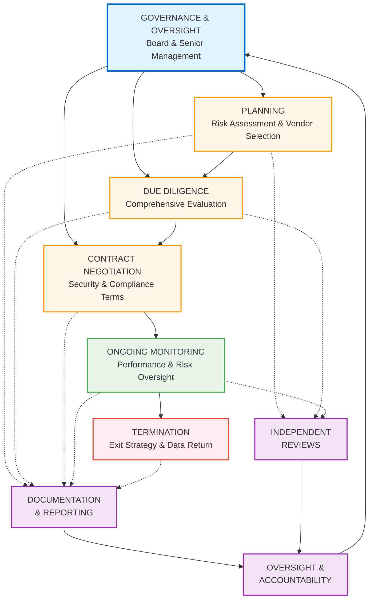

# FFIEC IT Handbook to SIG & NIST CSF 2.0
## Comprehensive Third-Party Risk Management Mapping
## By Mehmet Yilmaz (cablepull), all rights reserved
## Executive Summary

This document provides a unified mapping of the **Federal Financial Institutions Examination Council (FFIEC) IT Examination Handbook** requirements for third-party risk management to both the **Standardized Information Gathering (SIG)** questionnaire and **NIST Cybersecurity Framework (CSF) 2.0**.

### Applicable Regulatory Context
- **Primary Audience**: U.S. Financial Institutions (banks, credit unions, financial services)
- **Regulatory Authority**: FFIEC member agencies (OCC, FRB, FDIC, NCUA, CFPB)
- **Key Guidance**: Interagency Guidance on Third-Party Relationships: Risk Management (June 2023)

### Key FFIEC IT Handbooks for Third-Party Risk

1. **Outsourcing Technology Services** - Primary guidance on third-party relationships
2. **Information Security** - Section II.C.20: Oversight of Third-Party Service Providers
3. **Business Continuity Planning** - Appendix J: Strengthening Resilience of Outsourced Technology
4. **Management** - Section III.C.8: Third-Party Management
5. **Architecture, Infrastructure, and Operations (AIO)** - Third-party infrastructure considerations
6. **Audit** - Third-Party Reviews of Technology Service Providers
7. **Supervision of Technology Service Providers** - TSP examination standards

---

## FFIEC Third-Party Risk Management Lifecycle

The FFIEC framework organizes third-party risk management into these core lifecycle stages:



---

## Section 1: Governance & Oversight

### FFIEC Requirements

The board of directors must hold senior management responsible for ensuring appropriate oversight of third-party relationships. Managing third-party relationships is an enterprise-wide governance issue, not just a technology issue.

| FFIEC Requirement | NIST CSF 2.0 | SIG Core Domains | SIG Lite | Implementation Details |
|-------------------|--------------|------------------|----------|------------------------|
| Board oversight of third-party risk strategy | GV.OC-01, GV.OC-02, GV.RM-01, GV.RR-01 | Governance, Third-Party Management | Governance & Risk Management | Board receives quarterly TPRM reports with vendor risk dashboard |
| Senior management accountability | GV.RR-01, GV.RR-02, GV.OV-01 | Governance, Human Resources | Organizational Roles | CISO/CRO responsible for TPRM program |
| Enterprise-wide TPRM policy | GV.PO-01, GV.PO-02, GV.SC-01 | Policy & Governance, Third-Party Management | Policy Framework | Comprehensive vendor risk policy covering all lifecycle stages |
| Risk appetite for third parties | GV.RM-02, GV.SC-04 | Risk Management, Third-Party Management | Risk Tolerance | Tiered risk tolerance by vendor criticality |
| Integration with ERM | GV.RM-03, GV.SC-03 | Governance, Risk Management | Enterprise Risk Integration | TPRM risks escalated to enterprise risk committee |
| Resource allocation for TPRM | GV.RR-03 | Governance | Resource Management | Dedicated TPRM team and budget |
| TPRM program performance metrics | GV.OV-03 | Third-Party Management | Performance Monitoring | KPIs: vendor assessment completion rate, critical findings, SLA compliance |

---

## Section 2: Planning

### FFIEC Requirements

Management should assess whether each third-party relationship supports the institution's overall objectives and strategic plans, and evaluate prospective providers based on the scope and importance of services.

| FFIEC Requirement | NIST CSF 2.0 | SIG Core Domains | SIG Lite | Implementation Details |
|-------------------|--------------|------------------|----------|------------------------|
| Business need justification | GV.OC-01, GV.SC-06 | Third-Party Management, Governance | Business Requirements | Business case document for each vendor engagement |
| Risk assessment methodology | GV.RM-06, ID.RA-05, GV.SC-04 | Risk Management, Third-Party Management | Risk Assessment Methodology | Inherent risk scoring: data sensitivity × criticality × regulatory impact |
| Vendor criticality classification | GV.SC-04, ID.AM-04, ID.AM-05 | Third-Party Management | Vendor Classification | Critical/High/Medium/Low based on materiality matrix |
| Service scope definition | GV.SC-05, GV.OC-05 | Third-Party Management | Service Definition | Detailed scope of services document |
| Data classification and handling | ID.AM-07, PR.DS-01 | Data Governance & Privacy | Data Classification | Vendor access to CUI, PII, PHI cataloged |
| Regulatory compliance requirements | GV.OC-03, GV.SC-05 | Compliance, Third-Party Management | Compliance Requirements | Vendor must comply with GLBA, FCRA, Reg E, etc. |
| Alternative provider evaluation | GV.SC-06 | Third-Party Management | Vendor Selection | At least 3 vendor options evaluated for critical services |
| Exit strategy planning | GV.SC-10 | Third-Party Management | Exit Strategy | Documented plan for vendor transition/termination |

---

## Section 3: Due Diligence

### FFIEC Requirements

Banking organizations must conduct appropriate due diligence in selecting third-party service providers, including evaluating financial stability, service commitment, information security programs, business continuity capabilities, and subcontractor management.

### 3.1 Financial & Operational Due Diligence

| FFIEC Requirement | NIST CSF 2.0 | SIG Core Domains | SIG Lite | Implementation Details |
|-------------------|--------------|------------------|----------|------------------------|
| Financial stability assessment | ID.RA-10, GV.SC-06 | Third-Party Management, Risk Management | Financial Viability | Annual audited financials, credit rating, Dun & Bradstreet report |
| Business viability review | ID.RA-10, GV.SC-06 | Third-Party Management | Business Stability | Years in business, customer base, market position |
| Service delivery capability | GV.SC-06, ID.RA-10 | Third-Party Management | Service Capabilities | Site visits, reference checks, pilot testing |
| Geographic location risks | GV.SC-06 | Third-Party Management | Location Risk | Foreign-based provider additional due diligence (Appendix C) |
| Legal and regulatory standing | GV.OC-03, GV.SC-06 | Compliance, Third-Party Management | Legal Compliance | Litigation history, regulatory actions, sanctions screening |
| Insurance coverage verification | ID.RA-10, GV.SC-06 | Third-Party Management, Risk Management | Insurance Requirements | Cyber liability, E&O, general liability minimum coverages |
| Management experience and expertise | GV.SC-06, ID.RA-10 | Human Resources, Third-Party Management | Management Qualifications | Executive team backgrounds, turnover rates |
| Industry reputation assessment | ID.RA-10 | Third-Party Management | Reputation | Industry awards, peer recognition, complaint history |

### 3.2 Information Security Due Diligence

| FFIEC Requirement | NIST CSF 2.0 | SIG Core Domains | SIG Lite | Implementation Details |
|-------------------|--------------|------------------|----------|------------------------|
| Information security program assessment | PR.AA-01 through PR.IR-04 | Information Security, Security Awareness | Security Program | SIG Core assessment or equivalent questionnaire |
| Security certifications review | ID.RA-10, PR.PS-01 | Information Security, Compliance | Certifications | SOC 2 Type II, ISO 27001, PCI-DSS as applicable |
| Access control mechanisms | PR.AA-01 through PR.AA-06 | Identity & Access Management | Access Controls | MFA, least privilege, privileged access management |
| Data protection measures | PR.DS-01, PR.DS-02, PR.DS-10 | Data Governance & Privacy, Cryptography | Data Protection | Encryption at rest/in transit (AES-256, TLS 1.2+) |
| Network security controls | PR.IR-01, DE.CM-01 | Network Security | Network Security | Firewalls, IDS/IPS, network segmentation |
| Vulnerability management program | ID.RA-01, PR.PS-02 | Vulnerability & Patch Management | Vulnerability Management | Patch SLAs: Critical (7 days), High (30 days) |
| Penetration testing results | ID.IM-02, ID.RA-08 | Security Testing & Assessment | Security Testing | Annual penetration tests by independent firm |
| Security incident history | RS.AN-03, ID.RA-03 | Incident Management, Risk Management | Incident History | Past 3 years breach disclosure, root cause analysis |
| Physical security measures | PR.AA-06, PR.IR-02 | Physical & Environmental Security | Physical Security | Data center physical access controls, surveillance |
| Personnel security practices | GV.RR-04, PR.AT-01 | Human Resources Security | Personnel Security | Background checks, security training, termination procedures |

### 3.3 Business Continuity & Disaster Recovery Due Diligence

| FFIEC Requirement | NIST CSF 2.0 | SIG Core Domains | SIG Lite | Implementation Details |
|-------------------|--------------|------------------|----------|------------------------|
| BCP/DR plan review | RC.RP-01, ID.IM-04 | Business Continuity, Disaster Recovery | Business Continuity | BCP documentation, last update date, board approval |
| Recovery time objectives (RTO) | RC.RP-02, PR.IR-03 | Business Continuity | Recovery Objectives | RTO ≤ 4 hours for critical systems |
| Recovery point objectives (RPO) | RC.RP-02, PR.DS-11 | Business Continuity, Backup Management | Recovery Objectives | RPO ≤ 1 hour for critical data |
| Backup procedures and testing | PR.DS-11, RC.RP-03 | Business Continuity, Backup Management | Backup & Recovery | Monthly backup tests, annual full DR test |
| Alternate site capabilities | PR.IR-03, RC.RP-01 | Business Continuity | Disaster Recovery | Geographic diversity (>100 miles), hot site |
| BCP testing frequency and results | ID.IM-02, RC.RP-01 | Business Continuity | BCP Testing | Annual tests required for critical services |
| Crisis communication plan | RC.CO-03, RC.CO-04, RS.CO-02 | Business Continuity | Communications | Vendor notification procedures within 2 hours |
| Dependency on subcontractors | GV.SC-07, ID.AM-04 | Third-Party Management | Subcontractor Risk | Fourth-party risk assessment for critical dependencies |

### 3.4 Compliance & Legal Due Diligence

| FFIEC Requirement | NIST CSF 2.0 | SIG Core Domains | SIG Lite | Implementation Details |
|-------------------|--------------|------------------|----------|------------------------|
| Regulatory compliance verification | GV.OC-03, GV.SC-05 | Compliance | Regulatory Compliance | Bank Secrecy Act, GLBA, FCRA, state laws |
| Data privacy compliance | GV.OC-03, PR.DS-01 | Data Governance & Privacy | Privacy Compliance | GDPR, CCPA, state privacy laws if applicable |
| Industry-specific compliance | GV.OC-03 | Compliance | Industry Standards | PCI-DSS for payment processors, HIPAA for health data |
| Audit rights and access | GV.SC-05, GV.OV-02 | Third-Party Management, Audit | Right to Audit | On-site inspection rights, audit report access |
| Data ownership and usage rights | GV.SC-05, PR.DS-01 | Data Governance & Privacy | Data Rights | Customer data remains bank property, use restrictions |
| Intellectual property protection | GV.SC-05 | Third-Party Management | IP Protection | Proprietary information protection clauses |
| Liability and indemnification | GV.SC-05 | Third-Party Management | Liability | Breach notification liability, cyber insurance requirements |

---

## Section 4: Contract Negotiation

### FFIEC Requirements

Management should negotiate clear and comprehensive contracts with appropriate terms that meet the institution's requirements.

| FFIEC Requirement | NIST CSF 2.0 | SIG Core Domains | SIG Lite | Implementation Details |
|-------------------|--------------|------------------|----------|------------------------|
| **Service Level Agreements (SLAs)** |
| Performance metrics and standards | GV.SC-05, PR.IR-04 | Third-Party Management | SLAs | System availability: 99.9%, Response time: <2 sec |
| Service availability requirements | PR.IR-04, GV.SC-05 | Capacity & Performance Management | Availability | Scheduled maintenance windows, uptime guarantees |
| Response time commitments | GV.SC-05 | Third-Party Management | Performance Standards | Critical incidents: <1 hour, Standard: <4 hours |
| Remedies for non-performance | GV.SC-05 | Third-Party Management | SLA Remedies | Service credits, termination rights for repeated failures |
| **Security & Compliance** |
| Security control requirements | GV.SC-05, PR.AA-01 through PR.IR-04 | Information Security | Security Requirements | Mandatory security controls baseline (e.g., CIS Controls) |
| Compliance obligations | GV.OC-03, GV.SC-05 | Compliance, Third-Party Management | Compliance Obligations | Adherence to all applicable financial regulations |
| Right to audit clauses | GV.SC-05, GV.OV-02 | Third-Party Management | Audit Rights | Annual right to audit, access to SOC 2 reports |
| Security breach notification | RS.CO-02, GV.SC-08 | Incident Management | Breach Notification | 24-hour notification for confirmed breaches |
| Incident response coordination | RS.MA-01, GV.SC-08 | Incident Management | Incident Response | Joint incident response procedures, escalation paths |
| **Business Continuity** |
| BCP/DR requirements | RC.RP-01, GV.SC-05 | Business Continuity | BC Requirements | RTO/RPO commitments, annual DR test participation |
| Service continuity obligations | PR.IR-03, GV.SC-05 | Business Continuity | Service Continuity | Backup data center, failover procedures |
| Testing participation requirements | RC.RP-01, ID.IM-02 | Business Continuity | BC Testing | Bank participation in annual BC/DR tests |
| **Data Management** |
| Data ownership provisions | GV.SC-05, PR.DS-01 | Data Governance & Privacy | Data Ownership | Bank owns all customer data |
| Data location restrictions | PR.DS-01, GV.SC-05 | Data Governance & Privacy | Data Location | Data must remain in U.S. or approved jurisdictions |
| Data return/destruction | GV.SC-10, PR.DS-01 | Data Governance & Privacy | Data Disposal | 30 days return upon termination, certified destruction |
| Encryption requirements | PR.DS-01, PR.DS-02 | Cryptography | Encryption | AES-256 at rest, TLS 1.2+ in transit |
| **Subcontracting** |
| Subcontractor approval rights | GV.SC-05, GV.SC-07 | Third-Party Management | Subcontractors | Prior written approval for critical subcontractors |
| Subcontractor oversight requirements | GV.SC-07, ID.AM-04 | Third-Party Management | Fourth-Party Risk | Vendor responsible for subcontractor security compliance |
| Flow-down of security requirements | GV.SC-05, GV.SC-07 | Third-Party Management | Subcontractor Security | Security requirements apply to all subcontractors |
| **Termination** |
| Termination for cause provisions | GV.SC-10 | Third-Party Management | Termination Rights | Immediate termination for material breach |
| Termination assistance services | GV.SC-10 | Third-Party Management | Transition Services | 90-day transition assistance at termination |
| Data return procedures | GV.SC-10, PR.DS-01 | Data Governance & Privacy | Data Return | All data returned in usable format within 30 days |
| Post-termination obligations | GV.SC-10 | Third-Party Management | Post-Termination | Confidentiality survives termination indefinitely |

---

## Section 5: Ongoing Monitoring

### FFIEC Requirements

Consistent with the bank's risk-management practices, bank management must conduct ongoing monitoring of third parties to ensure that the third party continues to manage the risks and abide by contractual terms.

### 5.1 Performance Monitoring

| FFIEC Requirement | NIST CSF 2.0 | SIG Core Domains | SIG Lite | Implementation Details |
|-------------------|--------------|------------------|----------|------------------------|
| SLA compliance tracking | GV.SC-07, GV.OV-03 | Third-Party Management | Performance Monitoring | Monthly SLA scorecards, quarterly reviews |
| Service quality assessment | GV.SC-07, GV.OV-03 | Third-Party Management | Service Quality | Customer satisfaction surveys, complaint tracking |
| Operational metrics review | GV.SC-07 | Operations Management, Third-Party Management | Operational Metrics | Transaction volumes, error rates, response times |
| Capacity and scalability monitoring | PR.IR-04, GV.SC-07 | Capacity & Performance Management | Capacity Monitoring | Resource utilization trends, growth projections |
| Change management oversight | ID.RA-07, GV.SC-07 | Change Management | Change Control | Vendor change notification requirements, impact assessment |
| Customer complaint monitoring | GV.SC-07 | Third-Party Management | Customer Feedback | Complaints related to vendor services tracked |

### 5.2 Security & Compliance Monitoring

| FFIEC Requirement | NIST CSF 2.0 | SIG Core Domains | SIG Lite | Implementation Details |
|-------------------|--------------|------------------|----------|------------------------|
| Security control effectiveness | DE.CM-01 through DE.CM-09, GV.SC-07 | Security Monitoring & Logging | Security Monitoring | Quarterly security control attestations |
| Vulnerability and patch management | ID.RA-01, PR.PS-02, GV.SC-07 | Vulnerability & Patch Management | Patch Management | Monthly vulnerability scan reports, patch compliance |
| Security assessment reviews | ID.IM-02, GV.SC-07 | Security Testing & Assessment | Security Assessments | Annual penetration tests, quarterly vulnerability scans |
| SOC report review | GV.SC-07, GV.OV-02 | Third-Party Management, Audit | SOC Reports | Annual SOC 2 Type II review, exception analysis |
| Certification maintenance | GV.SC-07 | Compliance | Certifications | ISO 27001, PCI-DSS recertification tracking |
| Security incident tracking | RS.MA-02, RS.CO-02, GV.SC-07 | Incident Management | Incident Tracking | Vendor incident log review, trend analysis |
| Regulatory compliance monitoring | GV.OC-03, GV.SC-07 | Compliance | Compliance Monitoring | Annual compliance attestations, regulatory exam results |
| Access review and recertification | PR.AA-05, GV.SC-07 | Identity & Access Management | Access Reviews | Quarterly vendor access reviews, annual recertification |
| Data handling compliance | PR.DS-01, GV.SC-07 | Data Governance & Privacy | Data Handling | Data processing agreement compliance audits |

### 5.3 Financial & Operational Monitoring

| FFIEC Requirement | NIST CSF 2.0 | SIG Core Domains | SIG Lite | Implementation Details |
|-------------------|--------------|------------------|----------|------------------------|
| Financial condition review | ID.RA-10, GV.SC-07 | Third-Party Management, Risk Management | Financial Monitoring | Annual financial statement review for critical vendors |
| Insurance coverage verification | GV.SC-07 | Third-Party Management | Insurance | Annual certificate of insurance updates |
| Key personnel changes | GV.SC-07 | Third-Party Management | Personnel Changes | Notification of executive changes, account manager changes |
| Business strategy changes | ID.RA-07, GV.SC-07 | Third-Party Management, Risk Management | Strategy Changes | M&A activity, product line changes, market exit |
| Subcontractor changes | GV.SC-07, ID.AM-04 | Third-Party Management | Subcontractor Changes | Prior approval for new material subcontractors |
| Geographic/location changes | GV.SC-07 | Third-Party Management | Location Changes | Data center relocations, offshore operations |
| Regulatory actions or findings | GV.SC-07, GV.OC-03 | Compliance, Third-Party Management | Regulatory Status | Monitoring for consent orders, enforcement actions |
| Reputation and media monitoring | GV.SC-07 | Third-Party Management | Reputation | News alerts for vendor mentions, social media monitoring |

### 5.4 Business Continuity Monitoring

| FFIEC Requirement | NIST CSF 2.0 | SIG Core Domains | SIG Lite | Implementation Details |
|-------------------|--------------|------------------|----------|------------------------|
| BCP maintenance and updates | RC.RP-01, ID.IM-04, GV.SC-07 | Business Continuity | BCP Maintenance | Annual BCP plan updates, review for material changes |
| BCP testing participation | RC.RP-01, ID.IM-02, GV.SC-07 | Business Continuity | BCP Testing | Annual participation in vendor DR test |
| Backup verification | PR.DS-11, RC.RP-03, GV.SC-07 | Backup Management | Backup Verification | Quarterly backup success rate reports |
| Incident recovery performance | RC.RP-02, RC.RP-05, GV.SC-07 | Business Continuity | Recovery Performance | RTO/RPO achievement tracking during incidents |

### 5.5 Reassessment Schedule

| Vendor Risk Tier | FFIEC Recommendation | NIST CSF | SIG Assessment | SOC Report | Compliance Review |
|------------------|---------------------|----------|----------------|------------|-------------------|
| **Critical** | Continuous monitoring | GV.SC-07, DE.CM-06 | SIG Core - Annual | SOC 2 Type II - Annual | Quarterly |
| **High** | Quarterly reviews | GV.SC-07 | SIG Core - Annual | SOC 2 Type II - Annual | Semi-annual |
| **Medium** | Semi-annual reviews | GV.SC-07 | SIG Lite - Annual | SOC 2 - Annual | Annual |
| **Low** | Annual reviews | GV.SC-07 | SIG Lite - Biennial | Not required | Annual |

---

## Section 6: Termination

### FFIEC Requirements

Organizations should have appropriate contingency plans to ensure continued access to critical information, maintain service continuity, and resume business functions in the event of unexpected disruptions or restrictions in service.

| FFIEC Requirement | NIST CSF 2.0 | SIG Core Domains | SIG Lite | Implementation Details |
|-------------------|--------------|------------------|----------|------------------------|
| **Termination Planning** |
| Exit strategy development | GV.SC-10, ID.IM-04 | Third-Party Management, Business Continuity | Exit Strategy | Exit plan developed at contract inception |
| Alternative provider identification | GV.SC-10 | Third-Party Management | Alternatives | Backup vendors identified for critical services |
| Transition timeline planning | GV.SC-10 | Third-Party Management | Transition Plan | 90-180 day transition period for critical services |
| Knowledge transfer procedures | GV.SC-10 | Third-Party Management | Knowledge Transfer | Documentation, training, system handover procedures |
| **Data Management at Termination** |
| Complete data return | GV.SC-10, PR.DS-01 | Data Governance & Privacy | Data Return | All customer data returned in usable format |
| Data destruction certification | GV.SC-10, PR.DS-01 | Data Governance & Privacy | Data Destruction | Certified secure deletion from vendor systems |
| Data retention compliance | GV.SC-10, GV.OC-03 | Data Governance & Privacy, Compliance | Data Retention | Compliance with regulatory retention requirements |
| Backup data verification | GV.SC-10, RC.RP-03 | Backup Management | Backup Verification | Verification of data completeness and integrity |
| **Service Continuity** |
| Continuity during transition | GV.SC-10, RC.RP-02 | Business Continuity | Service Continuity | No service disruption during vendor transition |
| Customer communication plan | RC.CO-03, RC.CO-04 | Business Continuity | Communications | Customer notification about service changes |
| Post-termination support | GV.SC-10 | Third-Party Management | Transition Support | Vendor assistance during transition period |
| **Legal & Compliance** |
| Contract close-out procedures | GV.SC-10 | Third-Party Management | Contract Closeout | Final invoicing, settlement of disputes |
| Confidentiality obligations | GV.SC-10 | Third-Party Management | Post-Termination | Confidentiality survives termination |
| Access revocation | PR.AA-05, GV.SC-10 | Identity & Access Management | Access Termination | Immediate revocation of all system access |
| Final audit and assessment | GV.SC-10, GV.OV-02 | Third-Party Management, Audit | Final Audit | Final security assessment before complete exit |

---

## Section 7: Documentation & Reporting

### FFIEC Requirements

Appropriate documentation typically includes a copy of the contract, supporting legal opinions, due diligence reports, audits, financial statements, performance reports, and other critical information.

| FFIEC Requirement | NIST CSF 2.0 | SIG Core Domains | SIG Lite | Implementation Details |
|-------------------|--------------|------------------|----------|------------------------|
| **Documentation Requirements** |
| Vendor inventory/registry | ID.AM-04, GV.SC-04 | Third-Party Management | Vendor Inventory | Centralized vendor database with criticality ratings |
| Risk assessment documentation | ID.RA-05, ID.RA-06, GV.SC-06 | Risk Management, Third-Party Management | Risk Documentation | Initial and ongoing risk assessments on file |
| Due diligence reports | GV.SC-06, ID.RA-10 | Third-Party Management | Due Diligence | Comprehensive due diligence documentation |
| Contract and amendments | GV.SC-05 | Third-Party Management | Contracts | Executed contracts with all amendments |
| SLA and performance reports | GV.SC-07, GV.OV-03 | Third-Party Management | Performance Reports | Monthly/quarterly SLA compliance reports |
| Security assessments and audits | GV.SC-07, GV.OV-02 | Third-Party Management, Audit | Security Reports | SOC reports, penetration tests, assessments |
| Compliance certifications | GV.OC-03, GV.SC-07 | Compliance | Certifications | ISO 27001, PCI-DSS, SOC 2 certificates |
| Incident reports | RS.AN-06, RS.AN-07 | Incident Management | Incident Documentation | Security incident records and investigations |
| BCP/DR documentation | RC.RP-01, ID.IM-04 | Business Continuity | BCP Documentation | BCP plans, test results, after-action reports |
| Change management records | ID.RA-07 | Change Management | Change Records | Vendor change requests and approvals |
| **Reporting Requirements** |
| Board reporting on TPRM | GV.OV-01, GV.RR-01 | Governance, Third-Party Management | Board Reports | Quarterly board presentations on vendor risk |
| Risk committee reporting | GV.OV-01, GV.RM-03 | Governance, Risk Management | Risk Committee | Monthly risk committee vendor updates |
| Regulatory examination support | GV.OV-02 | Third-Party Management, Audit | Exam Documentation | Documentation readily available for examiners |
| Management information systems (MIS) | GV.OV-03, GV.SC-07 | Third-Party Management | MIS Reports | Vendor risk dashboards, KPIs, trend analysis |
| Audit trail maintenance | RS.AN-06 | Third-Party Management, Audit | Audit Trails | Complete audit trail of vendor oversight activities |

---

## Section 8: Independent Reviews & Audits

### FFIEC Requirements

Independent reviews provide valuable assurance that third-party service providers maintain appropriate controls. Financial institutions should review results of independent audits of IT controls at third-party providers.

| FFIEC Requirement | NIST CSF 2.0 | SIG Core Domains | SIG Lite | Implementation Details |
|-------------------|--------------|------------------|----------|------------------------|
| **Internal Audit Activities** |
| Third-party audit program | GV.OV-02 | Audit, Third-Party Management | Internal Audit | Risk-based TPRM audit schedule |
| Vendor control testing | GV.OV-02, PR.PS-04 | Audit | Control Testing | Sample-based testing of vendor controls |
| Contract compliance audits | GV.SC-07, GV.OV-02 | Third-Party Management, Audit | Contract Compliance | Annual contract compliance reviews |
| Data access audits | PR.AA-05, GV.OV-02 | Identity & Access Management, Audit | Access Audits | Quarterly vendor access reviews |
| **External Audit & Attestation** |
| SOC 1/SOC 2 report review | GV.SC-07, GV.OV-02 | Third-Party Management, Audit | SOC Reports | Annual SOC 2 Type II review mandatory for critical vendors |
| SOC report exception analysis | GV.SC-07 | Audit | Exception Analysis | Management response required for all exceptions |
| ISO 27001 certification review | GV.SC-07 | Compliance, Information Security | ISO Certification | Annual certification verification |
| PCI-DSS attestations | GV.OC-03, GV.SC-07 | Compliance | PCI Compliance | Quarterly attestations for payment processors |
| Independent penetration testing | ID.IM-02, ID.RA-08 | Security Testing & Assessment | Penetration Testing | Annual independent penetration test results |
| Vulnerability assessments | ID.RA-01, GV.SC-07 | Vulnerability & Patch Management | Vulnerability Assessment | Quarterly vulnerability scan reports |
| **Right to Audit** |
| On-site inspection rights | GV.SC-05, GV.OV-02 | Third-Party Management | Audit Rights | Contractual right to on-site audits with notice |
| Remote audit capabilities | GV.OV-02 | Audit | Remote Audit | Virtual audit rights for routine reviews |
| Regulatory examination cooperation | GV.OV-02 | Third-Party Management | Regulatory Access | Vendor cooperation with regulatory examinations |
| Third-party auditor access | GV.SC-05, GV.OV-02 | Audit | Independent Auditor | Bank may engage independent auditors |

---

## Section 9: Information Security Standards (Interagency Guidelines)

### FFIEC Requirements

The Information Security Standards require financial institutions to ensure third-party service providers implement appropriate measures designed to meet security requirements.

| FFIEC Security Standard | NIST CSF 2.0 | SIG Core Domains | SIG Lite | Implementation Details |
|-------------------------|--------------|------------------|----------|------------------------|
| **Risk Assessment** |
| Comprehensive risk assessment | ID.RA-01 through ID.RA-10 | Risk Management | Risk Assessment | Annual vendor risk assessment covering all domains |
| Risk-based security controls | PR.AA-01 through PR.IR-04 | Information Security | Security Controls | Controls commensurate with risk level |
| **Access Controls** |
| User identification & authentication | PR.AA-01, PR.AA-03 | Identity & Access Management | IAM | Unique user IDs, strong authentication (MFA) |
| Access rights administration | PR.AA-05 | Identity & Access Management | Access Management | Least privilege, role-based access control |
| Access monitoring and review | DE.CM-03, PR.AA-05 | Identity & Access Management | Access Monitoring | Quarterly access reviews, continuous monitoring |
| **Physical Security** |
| Physical access controls | PR.AA-06 | Physical Security | Physical Access | Badge access, mantrap, visitor logs |
| Environmental controls | PR.IR-02 | Physical & Environmental Security | Environmental | Fire suppression, HVAC, power redundancy |
| **System Security** |
| Security awareness training | PR.AT-01, PR.AT-02 | Security Awareness | Security Training | Annual security awareness training for all users |
| System hardening | PR.PS-01 | Asset & Configuration Management | System Hardening | CIS benchmarks, security configuration baselines |
| Change management | ID.RA-07 | Change Management | Change Control | Formal change approval and testing process |
| Monitoring and testing | DE.CM-01 through DE.CM-09 | Security Monitoring & Logging | Monitoring | 24/7 security monitoring, SIEM |
| **Data Security** |
| Encryption in transit | PR.DS-02 | Cryptography | Encryption | TLS 1.2 or higher for all data transmission |
| Encryption at rest | PR.DS-01 | Cryptography | Encryption | AES-256 encryption for sensitive data storage |
| Data classification | ID.AM-07, PR.DS-01 | Data Governance & Privacy | Data Classification | CUI, PII, PHI classification and handling |
| Data disposal | GV.SC-10, PR.DS-01 | Data Governance & Privacy | Data Disposal | NIST 800-88 media sanitization standards |
| **Incident Response** |
| Incident response plan | RS.MA-01, ID.IM-04 | Incident Management | Incident Response | Documented IR plan, annual testing |
| Incident detection | DE.AE-02 through DE.AE-08 | Security Operations | Detection | Anomaly detection, threat intelligence |
| Incident reporting | RS.CO-02, RS.CO-03 | Incident Management | Reporting | 24-hour breach notification to bank |
| **Business Continuity** |
| Business continuity plan | RC.RP-01 | Business Continuity | BCP | Comprehensive BCP covering all critical services |
| Disaster recovery capabilities | RC.RP-02, RC.RP-03 | Disaster Recovery | DR | Hot site, RTO ≤4 hours, RPO ≤1 hour |
| BCP testing | ID.IM-02, RC.RP-01 | Business Continuity | BCP Testing | Annual full DR test with bank participation |

---

## Section 10: Special Considerations

### 10.1 Foreign-Based Third-Party Service Providers (Appendix C)

| FFIEC Requirement | NIST CSF 2.0 | SIG Core Domains | SIG Lite | Implementation Details |
|-------------------|--------------|------------------|----------|------------------------|
| Enhanced due diligence | GV.SC-06, ID.RA-10 | Third-Party Management, Risk Management | Enhanced Due Diligence | Additional legal, regulatory, and country risk analysis |
| Legal and regulatory assessment | GV.OC-03, GV.SC-06 | Compliance | Foreign Legal | Foreign law applicability, data sovereignty, privacy laws |
| Cross-border data transfer | PR.DS-02, GV.OC-03 | Data Governance & Privacy | Data Transfer | GDPR adequacy decisions, Standard Contractual Clauses |
| Language and cultural considerations | GV.SC-06 | Third-Party Management | Cultural Risk | Translation requirements, business practice differences |
| Political and economic stability | ID.RA-03, GV.SC-06 | Risk Management | Country Risk | Geopolitical risk assessment, sanctions compliance |
| Access to records and examinations | GV.OV-02, GV.SC-05 | Third-Party Management, Audit | Foreign Audit Rights | U.S. regulatory examination access provisions |
| Contingency for service disruption | RC.RP-01, GV.SC-10 | Business Continuity | Contingency | Enhanced contingency planning for foreign providers |

### 10.2 Cloud Services Considerations

| FFIEC Requirement | NIST CSF 2.0 | SIG Core Domains | SIG Lite | Implementation Details |
|-------------------|--------------|------------------|----------|------------------------|
| Cloud service model assessment | GV.SC-06 | Cloud Services | Cloud Model | IaaS, PaaS, SaaS risk considerations |
| Multi-tenancy risks | PR.IR-01, ID.RA-04 | Cloud Services, Network Security | Multi-Tenancy | Tenant isolation, data segregation controls |
| Data location and residency | PR.DS-01, GV.OC-03 | Data Governance & Privacy, Cloud Services | Data Residency | Geographic data storage restrictions |
| Cloud provider security controls | PR.PS-01, PR.IR-01 | Cloud Services, Information Security | Cloud Security | CSA STAR, FedRAMP certification |
| Shared responsibility model | GV.SC-05, GV.RR-02 | Cloud Services | Shared Responsibility | Clearly defined bank vs. provider responsibilities |
| Cloud portability and exit strategy | GV.SC-10 | Cloud Services | Cloud Exit | Data portability, vendor lock-in mitigation |

### 10.3 Payment Processors & FinTech Partnerships

| FFIEC Requirement | NIST CSF 2.0 | SIG Core Domains | SIG Lite | Implementation Details |
|-------------------|--------------|------------------|----------|------------------------|
| Payment security standards | GV.OC-03, PR.DS-01 | Compliance | PCI-DSS | PCI-DSS Level 1 compliance for payment processors |
| Transaction monitoring | DE.CM-01, DE.AE-02 | Security Monitoring & Logging | Transaction Monitoring | Real-time fraud detection and prevention |
| Consumer protection compliance | GV.OC-03 | Compliance | Consumer Protection | Reg E, Reg Z, UDAAP compliance |
| Settlement and reconciliation | GV.SC-07 | Third-Party Management | Settlement | Daily reconciliation procedures |
| Merchant vetting (for processors) | GV.SC-06 | Third-Party Management | Merchant Due Diligence | KYC/KYB for merchant clients |
| Chargeback and dispute handling | GV.SC-05 | Third-Party Management | Dispute Resolution | Chargeback rights and remedies |

### 10.4 Artificial Intelligence & Emerging Technologies

| FFIEC Consideration | NIST CSF 2.0 | SIG Core Domains | SIG Lite | Implementation Details |
|---------------------|--------------|------------------|----------|------------------------|
| AI model governance | GV.RM-01, GV.RR-02 | Artificial Intelligence, Governance | AI Governance | AI risk management framework (NIST AI RMF) |
| Algorithm transparency | GV.OC-02, ID.RA-05 | Artificial Intelligence | Model Explainability | Explainable AI, model documentation |
| Bias and fairness testing | ID.IM-02 | Artificial Intelligence | Bias Testing | Fair lending, disparate impact testing |
| Data quality and integrity | PR.DS-01, ID.AM-07 | Artificial Intelligence, Data Governance | Data Quality | Training data validation and lineage |
| Model monitoring and performance | DE.CM-09, GV.SC-07 | Artificial Intelligence | Model Monitoring | Continuous model performance monitoring |

---

## Section 11: Risk Categories & Assessment

### FFIEC Risk Category Framework

| Risk Category | FFIEC Description | NIST CSF 2.0 Focus | SIG Core Domains | Assessment Criteria |
|---------------|-------------------|-------------------|------------------|---------------------|
| **Strategic Risk** | Risk to earnings or capital from adverse business decisions | GV.OC-01, GV.RM-01 | Governance, Third-Party Management | Business alignment, vendor viability, competitive positioning |
| **Reputation Risk** | Risk to earnings or capital from negative public opinion | GV.OC-02, GV.RM-07 | Governance, Risk Management | Brand impact, service quality, incident history |
| **Compliance Risk** | Risk from violations of laws, rules, or regulations | GV.OC-03, GV.PO-01 | Compliance | Regulatory compliance, audit findings, certifications |
| **Transaction Risk** | Risk from fraud, error, or inability to deliver products/services | PR.DS-01, DE.AE-02 | Operations Management, Security Operations | Transaction accuracy, fraud prevention, error rates |
| **Credit Risk** | Risk from counterparty default | ID.RA-10 | Third-Party Management, Risk Management | Financial stability, creditworthiness |
| **Market Risk** | Risk from market price changes | ID.RA-03 | Risk Management | Market volatility impact on vendor |
| **Liquidity Risk** | Risk of inability to meet obligations | ID.RA-10 | Third-Party Management | Vendor financial liquidity |
| **Price Risk** | Risk from pricing volatility | GV.SC-05 | Third-Party Management | Contract pricing terms, cost escalation |
| **Foreign Currency Risk** | Risk from exchange rate fluctuations | ID.RA-03 | Risk Management | Foreign vendor payment terms |
| **Operational Risk** | Risk from inadequate processes, people, systems | PR.PS-01 through PR.IR-04 | Operations Management, Information Security | Process controls, system availability, change management |

---

## Section 12: FFIEC to SIG Domain Detailed Mapping

### Comprehensive Domain Cross-Reference

| FFIEC IT Handbook Section | SIG Core Domains | SIG Lite Equivalent | NIST CSF 2.0 Functions |
|---------------------------|------------------|---------------------|------------------------|
| **Outsourcing Technology Services** | Third-Party Management, Governance, Risk Management | TPRM Program, Governance | GV.SC (all), GV.OC, GV.RM |
| Planning | Third-Party Management, Risk Management | Vendor Selection, Risk Assessment | GV.SC-04, GV.SC-06, ID.RA-10 |
| Due Diligence | Third-Party Management, Information Security, Business Continuity | Due Diligence, Security Assessment | GV.SC-06, ID.RA-10, All PROTECT |
| Contract Negotiation | Third-Party Management, Compliance | Contract Management | GV.SC-05 |
| Ongoing Monitoring | Third-Party Management, Security Monitoring & Logging | Ongoing Monitoring | GV.SC-07, DE.CM-06 |
| Termination | Third-Party Management, Data Governance | Vendor Exit | GV.SC-10 |
| **Information Security** | Information Security (all domains) | Security Program | All PROTECT, DETECT |
| Governance | Governance, Security Awareness | Security Governance | GV.OC, GV.RM, GV.RR |
| Risk Assessment | Risk Management, Threat Management | Risk Assessment | ID.RA (all) |
| Security Controls | Identity & Access Management, Network Security, Cryptography | Security Controls | PR.AA through PR.IR |
| Monitoring | Security Monitoring & Logging, Security Operations | Security Monitoring | DE.CM, DE.AE |
| Incident Response | Incident Management | Incident Response | RS (all) |
| **Business Continuity Planning** | Business Continuity, Disaster Recovery | Business Continuity | RC (all), PR.IR-03 |
| BCP Development | Business Continuity | BCP Program | RC.RP-01, ID.IM-04 |
| Resilience Testing | Business Continuity | BC Testing | RC.RP-01, ID.IM-02 |
| Appendix J (Outsourced Services) | Third-Party Management, Business Continuity | Vendor BC Requirements | GV.SC-05, GV.SC-08, RC.RP-01 |
| **Management** | Governance, Human Resources, Policy & Governance | Management Framework | GV (all) |
| IT Governance | Governance | Governance Structure | GV.RR, GV.OV |
| Strategic Planning | Governance, Third-Party Management | Strategic Planning | GV.RM, GV.OC |
| Risk Management | Risk Management | Risk Management | ID.RA, GV.RM |
| Third-Party Management | Third-Party Management | TPRM | GV.SC (all) |
| **Architecture, Infrastructure, Operations** | Asset & Configuration Management, Operations Management | Infrastructure Management | ID.AM, PR.PS, PR.IR |
| Enterprise Architecture | Asset & Configuration Management | Architecture | ID.AM-02, ID.AM-03 |
| Infrastructure Management | Operations Management, Capacity Management | Infrastructure | PR.IR (all) |
| Operations | Operations Management | IT Operations | PR.PS, DE.CM |
| **Audit** | Audit | Internal Audit | GV.OV-02 |
| IT Audit Function | Audit | Audit Program | GV.OV-02 |
| Third-Party TSP Reviews | Audit, Third-Party Management | Vendor Audits | GV.SC-07, GV.OV-02 |

---

## Section 13: Implementation Roadmap

### Phase 1: Foundation (Months 1-3)

| Activity | FFIEC Alignment | NIST CSF | SIG | Deliverable |
|----------|----------------|----------|-----|-------------|
| Establish governance structure | Management Booklet | GV.RR-01, GV.RR-02 | Governance | TPRM governance charter, roles defined |
| Develop TPRM policy | Outsourcing, Management | GV.PO-01, GV.SC-01 | Policy Framework | Board-approved TPRM policy |
| Define risk appetite | Management Booklet | GV.RM-02, GV.SC-04 | Risk Tolerance | Risk appetite statement for vendors |
| Create vendor inventory | Outsourcing | ID.AM-04, GV.SC-04 | Vendor Inventory | Complete vendor database with tiers |
| Establish vendor classification | Outsourcing | GV.SC-04, ID.AM-05 | Vendor Classification | Criticality tiering methodology |

### Phase 2: Assessment & Due Diligence (Months 4-6)

| Activity | FFIEC Alignment | NIST CSF | SIG | Deliverable |
|----------|----------------|----------|-----|-------------|
| Conduct initial risk assessments | Outsourcing | ID.RA-05, ID.RA-10 | Risk Assessment | Risk assessment for all critical vendors |
| Deploy SIG questionnaires | Information Security | GV.SC-06, All PROTECT | SIG Core/Lite | Completed SIG assessments |
| Perform due diligence reviews | Outsourcing | GV.SC-06, ID.RA-10 | Due Diligence | Due diligence reports for critical vendors |
| Review contracts | Outsourcing | GV.SC-05 | Contract Review | Contract gap analysis and remediation plan |
| Assess SOC reports | Audit | GV.SC-07, GV.OV-02 | SOC Reports | SOC report exception analysis |

### Phase 3: Contract & Control Enhancement (Months 7-9)

| Activity | FFIEC Alignment | NIST CSF | SIG | Deliverable |
|----------|----------------|----------|-----|-------------|
| Develop contract templates | Outsourcing | GV.SC-05 | Contract Standards | Standardized vendor contract templates |
| Negotiate enhanced terms | Outsourcing | GV.SC-05 | Contract Terms | Updated contracts with security requirements |
| Implement access controls | Information Security | PR.AA-05 | Access Management | Vendor access governance process |
| Establish incident response coordination | Information Security, Appendix J | RS.MA-01, GV.SC-08 | Incident Response | Joint incident response procedures |
| Define SLAs and KPIs | Outsourcing | GV.SC-05, GV.OV-03 | Performance Metrics | SLA framework and monitoring dashboard |

### Phase 4: Monitoring & Continuous Improvement (Months 10-12)

| Activity | FFIEC Alignment | NIST CSF | SIG | Deliverable |
|----------|----------------|----------|-----|-------------|
| Implement continuous monitoring | Outsourcing, Information Security | GV.SC-07, DE.CM-06 | Continuous Monitoring | Automated vendor risk monitoring |
| Establish reporting framework | Management | GV.OV-01, GV.OV-03 | Reporting | Board and management dashboards |
| Conduct BCP testing | Appendix J | RC.RP-01, ID.IM-02 | BCP Testing | Annual DR test with critical vendors |
| Perform internal audits | Audit | GV.OV-02 | Internal Audit | TPRM program audit |
| Reassessment scheduling | Outsourcing | GV.SC-07 | Reassessment | Annual reassessment calendar |

---

## Section 14: FFIEC Examination Preparation

### Examination Focus Areas

| FFIEC Focus Area | Examiner Questions | Required Documentation | NIST CSF Alignment | SIG Evidence |
|-----------------|-------------------|------------------------|-------------------|--------------|
| **Governance & Oversight** | "How does the board oversee third-party risk?" | Board minutes, TPRM reports, policy | GV.RR-01, GV.OV-01 | Governance documentation |
| **Risk Assessment** | "How do you assess vendor criticality and risk?" | Risk assessment methodology, vendor tiering | GV.SC-04, ID.RA-05 | SIG scores, risk matrices |
| **Due Diligence** | "What due diligence was performed before engagement?" | Due diligence reports, financial reviews, SOC reports | GV.SC-06, ID.RA-10 | SIG Core assessments, certifications |
| **Contracts** | "Do contracts include adequate security and audit rights?" | Executed contracts, amendments, SLAs | GV.SC-05 | Contract checklists, right-to-audit clauses |
| **Ongoing Monitoring** | "How do you monitor vendor performance and risk?" | Monitoring reports, SOC reviews, incident logs | GV.SC-07, DE.CM-06 | Quarterly vendor scorecards, SIG updates |
| **Incident Response** | "How are vendor incidents managed and reported?" | Incident response plan, vendor incidents, notifications | RS.MA-01, GV.SC-08 | Incident logs, breach notifications |
| **Business Continuity** | "Have you tested business continuity with critical vendors?" | BCP test results, DR plans, RTO/RPO verification | RC.RP-01, ID.IM-02 | Annual test reports, Appendix J compliance |
| **Information Security** | "What security controls do vendors maintain?" | Security assessments, penetration tests, vulnerability scans | All PROTECT, DETECT | SIG security domains, SOC 2 reports |
| **Subcontractors** | "How do you oversee fourth-party risks?" | Subcontractor list, risk assessments, approvals | GV.SC-07, ID.AM-04 | Subcontractor disclosures, assessments |
| **Termination** | "What is your vendor exit strategy?" | Exit plans, data return procedures, transition plans | GV.SC-10 | Termination procedures, data disposal certificates |

### Examination Documentation Checklist

#### Governance & Strategy Documents
- [ ] Board-approved TPRM policy
- [ ] Risk appetite statement for third parties
- [ ] TPRM program charter and governance structure
- [ ] Organizational chart showing TPRM roles
- [ ] Board/committee meeting minutes (TPRM agenda items)

#### Vendor Inventory & Classification
- [ ] Complete vendor inventory with criticality tiers
- [ ] Vendor classification methodology
- [ ] Critical vendor list with business impact analysis
- [ ] Vendor contact information and escalation paths

#### Risk Assessment & Due Diligence
- [ ] Risk assessment methodology and criteria
- [ ] Initial due diligence reports (all critical vendors)
- [ ] SIG Core/Lite completed assessments
- [ ] Financial stability reviews
- [ ] Security assessments (SOC 2, ISO 27001, PCI-DSS)
- [ ] Background checks and reference checks
- [ ] Business continuity reviews

#### Contracts & Agreements
- [ ] Executed vendor contracts with amendments
- [ ] Contract review checklist/template
- [ ] SLA definitions and performance metrics
- [ ] Right-to-audit clauses
- [ ] Security and compliance requirements
- [ ] Business continuity requirements
- [ ] Breach notification requirements
- [ ] Termination and data return provisions
- [ ] Subcontractor management provisions

#### Ongoing Monitoring
- [ ] Vendor performance scorecards (quarterly/annual)
- [ ] SOC report reviews and exception analyses
- [ ] Security incident logs involving vendors
- [ ] Compliance certification tracking
- [ ] Financial condition monitoring
- [ ] Service availability/downtime reports
- [ ] Change notification logs
- [ ] Access review reports

#### Business Continuity
- [ ] Vendor BCP/DR plans
- [ ] Annual BCP test results
- [ ] RTO/RPO documentation and achievement
- [ ] Incident recovery after-action reports
- [ ] Failover test results

#### Audit & Independent Reviews
- [ ] Internal audit reports on TPRM program
- [ ] Vendor audit schedules and results
- [ ] Independent security assessments
- [ ] Regulatory examination responses (prior exams)

#### Incident Management
- [ ] Vendor incident response procedures
- [ ] Vendor security incident log
- [ ] Breach notification documentation
- [ ] Root cause analyses
- [ ] Remediation tracking

#### Termination & Exit Management
- [ ] Vendor termination procedures
- [ ] Exit strategy documentation
- [ ] Data return/destruction certificates
- [ ] Post-termination access reviews
- [ ] Service transition documentation

---

## Section 15: Key Performance Indicators (KPIs)

### TPRM Program Effectiveness Metrics

| KPI Category | Metric | FFIEC Alignment | NIST CSF | Target | Measurement Frequency |
|--------------|--------|----------------|----------|--------|----------------------|
| **Governance** | Board reporting completion | Management | GV.OV-01 | 100% quarterly | Quarterly |
| | TPRM policy review | Management | GV.PO-02 | Annual | Annual |
| | Budget vs. actual spending | Management | GV.RR-03 | ±10% | Monthly |
| **Risk Assessment** | Vendor risk assessment completion | Outsourcing | GV.SC-07 | 100% annually | Monthly |
| | Critical vendor identification accuracy | Outsourcing | GV.SC-04 | 100% | Quarterly |
| | Risk assessment timeliness | Outsourcing | ID.RA-06 | <30 days for new vendors | Monthly |
| **Due Diligence** | Due diligence completion rate | Outsourcing | GV.SC-06 | 100% before contract | Monthly |
| | SOC report review completion | Audit | GV.OV-02 | 100% within 30 days | Monthly |
| | Security certification verification | Information Security | GV.SC-07 | 100% annually | Quarterly |
| **Contracting** | Contracts with required security clauses | Outsourcing | GV.SC-05 | 100% | Quarterly |
| | Right-to-audit clause inclusion | Outsourcing | GV.SC-05 | 100% for critical vendors | Quarterly |
| **Ongoing Monitoring** | SLA compliance rate | Outsourcing | GV.SC-07 | ≥95% | Monthly |
| | Vendor scorecard completion | Outsourcing | GV.OV-03 | 100% quarterly | Quarterly |
| | Security incident reporting within SLA | Information Security | RS.CO-02 | 100% | Monthly |
| | Critical finding remediation rate | Outsourcing | ID.RA-06 | ≥90% within 90 days | Monthly |
| **Business Continuity** | BCP test participation rate | Appendix J | RC.RP-01 | 100% for critical vendors | Annual |
| | RTO/RPO achievement rate | Appendix J | RC.RP-02 | 100% | Per incident |
| **Incident Response** | Mean time to vendor incident notification | Information Security | RS.CO-02 | <24 hours | Per incident |
| | Vendor-related incidents | Information Security | RS.MA-02 | Trending down | Monthly |
| **Compliance** | Regulatory examination findings | All | GV.OC-03 | Zero critical | Per exam |
| | Audit findings remediation | Audit | GV.OV-02 | 100% within agreed timeline | Quarterly |

---

## Section 16: FFIEC-Specific Compliance Matrix

### Regulatory Cross-Reference

| FFIEC Requirement Source | Requirement Description | Compliance Evidence | NIST CSF | SIG Domains |
|-------------------------|------------------------|---------------------|----------|-------------|
| **12 CFR Part 30, App. B (OCC)** | Interagency Guidelines Establishing Information Security Standards | |  |  |
| Section I | Implement comprehensive information security program | Security program documentation | All PROTECT | Information Security |
| Section II.A | Assess risk to customer information | Vendor risk assessments | ID.RA-05, GV.SC-04 | Risk Management |
| Section II.B | Design and implement safeguards | Security controls documentation | PR (all) | Information Security (all) |
| Section III.C.2.c | Oversee third-party service providers | TPRM program documentation | GV.SC (all) | Third-Party Management |
| **OCC Bulletin 2013-29** | Third-Party Relationships: Risk Management Guidance | |  |  |
| Planning | Pre-engagement planning and risk assessment | Due diligence reports | GV.SC-06 | Third-Party Management |
| Due Diligence | Comprehensive due diligence process | Due diligence checklist completed | GV.SC-06, ID.RA-10 | Third-Party Management |
| Contract | Risk-appropriate contract terms | Executed contracts with required clauses | GV.SC-05 | Third-Party Management |
| Monitoring | Ongoing monitoring of third-party performance | Quarterly scorecards, SOC reviews | GV.SC-07 | Third-Party Management |
| Termination | Termination and contingency planning | Exit strategy documentation | GV.SC-10 | Third-Party Management |
| **FRB SR 13-19** | Guidance on Managing Outsourcing Risk | |  |  |
| Risk Management | Risk-based third-party oversight | Risk-tiered monitoring approach | GV.SC-04, GV.SC-07 | Risk Management |
| Vendor Management | Vendor selection and monitoring | Vendor lifecycle documentation | GV.SC (all) | Third-Party Management |
| **FDIC FIL-44-2008** | Guidance for Managing Third-Party Risk | |  |  |
| Risk Assessment | Assess risks before entering relationship | Pre-contract risk assessment | GV.SC-06, ID.RA-10 | Risk Management |
| Board Oversight | Board oversight of material third parties | Board reports and minutes | GV.RR-01, GV.OV-01 | Governance |
| **Interagency Guidance (2023)** | Interagency Guidance on Third-Party Relationships: Risk Management | |  |  |
| Planning | Risk-based planning process | Planning documentation | GV.SC-06 | Third-Party Management |
| Due Diligence | Comprehensive due diligence | Due diligence reports | GV.SC-06, ID.RA-10 | Third-Party Management |
| Contract Negotiation | Appropriate contract provisions | Contract review documentation | GV.SC-05 | Third-Party Management |
| Ongoing Monitoring | Continuous monitoring program | Monitoring reports and dashboards | GV.SC-07 | Third-Party Management |
| Termination | Termination management | Exit procedures and documentation | GV.SC-10 | Third-Party Management |

---

## Section 17: Quick Reference: FFIEC Booklet Summaries

### Outsourcing Technology Services

**Purpose**: Primary guidance on managing third-party technology relationships

**Key Topics**:
- Planning and risk assessment
- Due diligence and vendor selection
- Contract negotiation
- Ongoing monitoring
- Termination
- Foreign-based providers (Appendix C)

**Primary NIST CSF**: GV.SC (all subcategories)
**Primary SIG Domains**: Third-Party Management

### Information Security

**Purpose**: Comprehensive information security program guidance including third-party oversight

**Key Topics**:
- Information security governance
- Risk assessment and management
- Security controls (access, network, data, etc.)
- Monitoring and testing
- Incident response
- Third-party service provider oversight (Section II.C.20)

**Primary NIST CSF**: All PROTECT and DETECT Functions
**Primary SIG Domains**: Information Security (all domains), Security Monitoring & Logging

### Business Continuity Planning

**Purpose**: Guidance on maintaining business resilience and continuity

**Key Topics**:
- BCP development and maintenance
- Business impact analysis
- Recovery strategies
- Testing and exercises
- **Appendix J: Strengthening Resilience of Outsourced Technology Services**
  - Due diligence for vendor resilience
  - Contract provisions for BCP
  - Testing with third parties
  - Cyber resilience considerations

**Primary NIST CSF**: RECOVER Function (all), PR.IR-03
**Primary SIG Domains**: Business Continuity, Disaster Recovery

### Management

**Purpose**: IT governance and management oversight

**Key Topics**:
- IT governance structure
- Strategic planning
- Risk management
- Resource management
- Third-party management (Section III.C.8)
- Performance measurement

**Primary NIST CSF**: GOVERN Function (all except GV.SC)
**Primary SIG Domains**: Governance, Risk Management, Policy & Governance

### Architecture, Infrastructure, and Operations (AIO)

**Purpose**: IT architecture, infrastructure management, and operations

**Key Topics**:
- Enterprise architecture
- Infrastructure management
- Cloud computing
- Virtualization
- Emerging technologies (AI/ML, IoT)
- Operations management
- Third-party infrastructure considerations

**Primary NIST CSF**: IDENTIFY (ID.AM), PROTECT (PR.PS, PR.IR)
**Primary SIG Domains**: Asset & Configuration Management, Operations Management, Cloud Services

### Audit

**Purpose**: IT audit function and independent reviews

**Key Topics**:
- IT audit program
- Audit planning and execution
- Internal control assessment
- Third-party reviews of TSPs
- Audit reporting

**Primary NIST CSF**: GV.OV-02
**Primary SIG Domains**: Audit

### Supervision of Technology Service Providers

**Purpose**: Guidance for examining technology service providers

**Key Topics**:
- TSP examination standards
- Risk assessment of TSPs
- Control evaluation
- Regulatory expectations for TSPs

**Primary NIST CSF**: GV.SC-07, GV.OV-02
**Primary SIG Domains**: Third-Party Management, Audit

---

## Section 18: Common Pitfalls & Best Practices

### Common FFIEC Third-Party Risk Management Pitfalls

| Pitfall | Impact | FFIEC Violation | Mitigation | NIST CSF | SIG Domain |
|---------|--------|-----------------|------------|----------|------------|
| **Inadequate Board Oversight** | Governance failure | Management Booklet | Quarterly board TPRM reports with key metrics | GV.RR-01, GV.OV-01 | Governance |
| **Incomplete Vendor Inventory** | Unknown risk exposure | Outsourcing | Centralized vendor repository, asset discovery | ID.AM-04, GV.SC-04 | Third-Party Management |
| **Missing Risk Assessments** | Uninformed risk decisions | Outsourcing, OCC 2013-29 | Risk-based assessment before engagement | GV.SC-06, ID.RA-10 | Risk Management |
| **Inadequate Contract Terms** | Lack of enforceability | Outsourcing | Standard contract template with security requirements | GV.SC-05 | Third-Party Management |
| **No Right to Audit** | Cannot verify controls | Outsourcing, Audit | Contractual audit rights for all vendors | GV.SC-05, GV.OV-02 | Third-Party Management |
| **Insufficient Ongoing Monitoring** | Degraded controls undetected | Outsourcing, OCC 2013-29 | Quarterly scorecards, annual SOC review | GV.SC-07 | Third-Party Management |
| **Lack of BCP Testing** | Recovery failure risk | Appendix J | Annual DR tests with critical vendors | RC.RP-01, ID.IM-02 | Business Continuity |
| **No Incident Response Coordination** | Delayed incident response | Information Security, Appendix J | Joint IR procedures, 24-hour notification | RS.MA-01, GV.SC-08 | Incident Management |
| **Inadequate Due Diligence** | High-risk vendor selection | Outsourcing, OCC 2013-29 | Comprehensive due diligence checklist | GV.SC-06, ID.RA-10 | Third-Party Management |
| **Poor Documentation** | Examination findings | All Booklets | Document repository with version control | All GV.OV | Documentation |
| **Ignoring Subcontractors** | Fourth-party risk | Outsourcing | Subcontractor disclosure and approval requirements | GV.SC-07, ID.AM-04 | Third-Party Management |
| **No Exit Strategy** | Vendor lock-in | Outsourcing | Exit plan at contract inception | GV.SC-10 | Third-Party Management |

### FFIEC Third-Party Risk Best Practices

| Best Practice | Business Value | Implementation | FFIEC Alignment | NIST CSF | SIG Domain |
|--------------|----------------|----------------|-----------------|----------|------------|
| **Centralized TPRM Platform** | Single source of truth | Vendor risk management software | All Booklets | GV.SC-07, ID.AM-04 | Third-Party Management |
| **Automated Monitoring** | Real-time risk awareness | Security rating services, threat intelligence | Information Security | DE.CM-06, GV.SC-07 | Security Monitoring |
| **Standardized Assessments** | Consistency and efficiency | SIG Core/Lite questionnaires | Information Security, Outsourcing | GV.SC-06, All PROTECT | All Security Domains |
| **Risk-Based Tiering** | Efficient resource allocation | Critical/High/Medium/Low classification | Outsourcing | GV.SC-04, ID.AM-05 | Risk Management |
| **Contract Templates** | Legal protection, efficiency | Pre-approved security clauses | Outsourcing | GV.SC-05 | Third-Party Management |
| **Vendor Portals** | Self-service documentation | Document collection and management | Outsourcing | GV.SC-07 | Third-Party Management |
| **Executive Dashboards** | Strategic visibility | KPI dashboards, risk heat maps | Management | GV.OV-01, GV.OV-03 | Governance |
| **Periodic Reassessments** | Current risk profile | Annual SIG, SOC reports | Outsourcing | GV.SC-07 | Third-Party Management |
| **Industry Collaboration** | Shared intelligence | Industry utilities, ISACs | Outsourcing (footnote) | ID.RA-02, DE.AE-07 | Threat Management |
| **Regulatory Exam Readiness** | Reduced findings | Mock exams, documentation reviews | All Booklets | GV.OV-02 | Audit |

---

## Section 19: Templates & Tools

### FFIEC-Aligned Assessment Templates

#### 1. Initial Vendor Risk Assessment

**Purpose**: Pre-engagement risk evaluation
**FFIEC Reference**: Outsourcing - Planning
**NIST CSF**: GV.SC-06, ID.RA-10
**SIG Domains**: Third-Party Management, Risk Management

**Key Assessment Criteria**:
- [ ] Service criticality (business impact if unavailable)
- [ ] Data sensitivity (CUI, PII, PHI classification)
- [ ] Regulatory applicability (GLBA, BSA, Reg E, etc.)
- [ ] System access requirements (network, privileged, data)
- [ ] Geographic location and data residency
- [ ] Financial stability indicators
- [ ] Industry reputation and references
- [ ] Initial security posture review
- [ ] Subcontractor dependencies
- [ ] Alternative provider availability

**Risk Scoring Formula**:
```
Inherent Risk Score = (Data Sensitivity × 40%) + 
                      (Service Criticality × 30%) + 
                      (Regulatory Impact × 20%) + 
                      (Access Requirements × 10%)

Risk Tier:
- Critical: Score ≥ 85
- High: Score 70-84
- Medium: Score 50-69
- Low: Score < 50
```

#### 2. Due Diligence Checklist

**Purpose**: Pre-contract comprehensive evaluation
**FFIEC Reference**: Outsourcing - Due Diligence, OCC 2013-29
**NIST CSF**: GV.SC-06, ID.RA-10
**SIG**: SIG Core/Lite Assessment

**Financial & Operational**:
- [ ] Audited financial statements (3 years)
- [ ] D&B report and credit rating
- [ ] Years in business and customer base size
- [ ] Management team experience
- [ ] Customer references (minimum 3)
- [ ] Litigation and regulatory history
- [ ] Insurance certificates (cyber, E&O, general liability)
- [ ] Business continuity plan review
- [ ] Site visit report

**Information Security**:
- [ ] SIG Core or SIG Lite completed
- [ ] SOC 2 Type II report (within 12 months)
- [ ] ISO 27001 or equivalent certification
- [ ] PCI-DSS (if applicable)
- [ ] Penetration test results (within 12 months)
- [ ] Vulnerability scan results
- [ ] Security incident history (3 years)
- [ ] Security training program documentation
- [ ] Disaster recovery test results

**Compliance & Legal**:
- [ ] Regulatory compliance attestations
- [ ] Privacy policy and data handling procedures
- [ ] Background check procedures
- [ ] Subcontractor list and management process
- [ ] Data ownership and usage rights clarification
- [ ] Intellectual property protections

**References**:
- [ ] Reference check forms completed (3 minimum)
- [ ] Customer satisfaction ratings
- [ ] Implementation timeline and success rate
- [ ] Support responsiveness evaluation

#### 3. Contract Review Checklist

**Purpose**: Ensure contracts meet FFIEC requirements
**FFIEC Reference**: Outsourcing - Contract Negotiation
**NIST CSF**: GV.SC-05
**SIG Domain**: Third-Party Management

**Essential Contract Provisions**:

**Service Level Agreements**:
- [ ] System availability SLA (minimum 99.9%)
- [ ] Response time commitments
- [ ] Support hours and escalation procedures
- [ ] Performance metrics and measurement
- [ ] Service credits for non-performance

**Security & Compliance**:
- [ ] Security control requirements (detailed appendix)
- [ ] Compliance with applicable laws and regulations
- [ ] Security breach notification (≤24 hours)
- [ ] Annual SOC 2 Type II requirement
- [ ] Encryption requirements (at rest and in transit)
- [ ] Security incident response coordination
- [ ] Vulnerability management and patching SLAs

**Audit & Access Rights**:
- [ ] Right to audit (on-site and remote)
- [ ] Right to audit frequency specified
- [ ] Regulatory examiner access rights
- [ ] Independent auditor access rights
- [ ] Access to audit reports and certifications

**Business Continuity**:
- [ ] RTO and RPO commitments
- [ ] Disaster recovery plan requirements
- [ ] Annual DR testing participation rights
- [ ] Incident notification procedures
- [ ] Service continuity guarantees

**Data Management**:
- [ ] Data ownership clearly stated (bank owns all data)
- [ ] Data location and residency restrictions
- [ ] Data use restrictions
- [ ] Data return procedures (format and timeline)
- [ ] Data destruction certification requirements
- [ ] Backup and retention requirements

**Subcontracting**:
- [ ] Prior written approval for subcontractors
- [ ] Subcontractor security requirements flow-down
- [ ] Vendor responsibility for subcontractor performance
- [ ] Subcontractor list disclosure requirements

**Termination**:
- [ ] Termination for cause provisions
- [ ] Termination for convenience (with notice period)
- [ ] Transition assistance services (minimum 90 days)
- [ ] Data return timeline (≤30 days)
- [ ] Post-termination confidentiality obligations
- [ ] Survival clauses

**Insurance & Liability**:
- [ ] Cyber liability insurance (minimum $X million)
- [ ] Errors and omissions insurance
- [ ] General liability insurance
- [ ] Indemnification provisions
- [ ] Limitation of liability appropriate to risk

**Miscellaneous**:
- [ ] Governing law and jurisdiction
- [ ] Dispute resolution procedures
- [ ] Change management notification requirements
- [ ] Assignment and sublicense restrictions
- [ ] Confidentiality and NDA provisions

#### 4. Ongoing Monitoring Scorecard

**Purpose**: Quarterly vendor performance evaluation
**FFIEC Reference**: Outsourcing - Ongoing Monitoring
**NIST CSF**: GV.SC-07, GV.OV-03
**SIG Domain**: Third-Party Management

**Scorecard Categories** (100 points total):

**Service Performance (30 points)**:
- SLA compliance: ___% (target ≥95%) - 10 points
- System availability: ___% (target ≥99.9%) - 10 points
- Support responsiveness: ___ avg hours (target <4) - 5 points
- Customer complaints: ___ count (target 0) - 5 points

**Security & Compliance (40 points)**:
- Security incidents: ___ count (target 0) - 10 points
- Critical vulnerability remediation: ___% within SLA - 10 points
- SOC 2 report status: Clean/Exceptions - 10 points
- Compliance attestations current: Yes/No - 10 points

**Financial & Operational (15 points)**:
- Financial condition: Stable/Warning/Concern - 5 points
- Key personnel changes: ___ count - 5 points
- Regulatory actions: ___ count (target 0) - 5 points

**Business Continuity (15 points)**:
- BCP testing completed: Yes/No - 5 points
- RTO/RPO achievement: ___% - 5 points
- Backup success rate: ___% (target 100%) - 5 points

**Overall Risk Rating**:
- 90-100: Low Risk (Green)
- 75-89: Medium Risk (Yellow)
- 60-74: High Risk (Orange)
- <60: Critical Risk (Red)

**Required Actions by Risk Level**:
- Green: Annual reassessment
- Yellow: Semi-annual reassessment, remediation plan
- Orange: Quarterly reassessment, active remediation, escalation
- Red: Monthly review, immediate remediation, consider exit

---

## Section 20: Glossary of FFIEC Terms

| FFIEC Term | Definition | NIST CSF Equivalent | SIG Domain |
|------------|------------|---------------------|------------|
| **Technology Service Provider (TSP)** | Third-party entity providing technology services to financial institutions | Third party | Third-Party Management |
| **Critical Activity** | Activity that could cause a significant disruption if unavailable | Critical asset/service | Third-Party Management, Business Continuity |
| **Bank Service Company Act (BSCA)** | Federal law authorizing examination of service providers to financial institutions | N/A - Regulatory | Compliance |
| **Information Security Standards** | Interagency guidelines (12 CFR Part 30, Appendix B and equivalents) | Information Security Program | Information Security |
| **RTO (Recovery Time Objective)** | Target time for service restoration after disruption | Recovery objective | Business Continuity |
| **RPO (Recovery Point Objective)** | Maximum acceptable data loss measured in time | Recovery objective | Business Continuity |
| **Subcontractor** | Entity engaged by primary vendor to provide services | Fourth party | Third-Party Management |
| **Material Change** | Significant change affecting risk profile or service delivery | Risk-impacting change | Risk Management, Change Management |
| **Independent Audit** | Audit performed by qualified independent party | Independent review | Audit |
| **Foreign-Based Provider** | Service provider whose operations are located outside the U.S. | International vendor | Third-Party Management |

---

## Appendix A: Risk Assessment Scoring Matrix

### Inherent Risk Scoring Model

#### Data Sensitivity Score (40% weight)

| Data Type | Score | Examples |
|-----------|-------|----------|
| Public | 1 | Marketing data, public website content |
| Internal | 2 | Internal policies, non-sensitive business data |
| Confidential | 3 | Financial data, strategic plans, employee data |
| Regulated | 4 | Customer PII, account information, transaction data |
| Highly Regulated | 5 | GLBA data, BSA data, health information (HIPAA) |

#### Service Criticality Score (30% weight)

| Criticality Level | Score | Criteria |
|------------------|-------|----------|
| Non-Critical | 1 | Non-customer facing, alternative readily available, >72 hour acceptable downtime |
| Low | 2 | Limited customer impact, manual workaround available, 48-72 hour acceptable downtime |
| Medium | 3 | Customer-facing, workaround possible but inefficient, 24-48 hour acceptable downtime |
| High | 4 | Critical customer service, difficult workaround, 4-24 hour acceptable downtime |
| Critical | 5 | Essential banking function, no acceptable workaround, <4 hour acceptable downtime |

#### Regulatory Impact Score (20% weight)

| Impact Level | Score | Criteria |
|--------------|-------|----------|
| None | 1 | No regulatory applicability |
| Low | 2 | General IT security requirements only |
| Medium | 3 | GLBA compliance required |
| High | 4 | GLBA + specialized regulations (BSA, Reg E, Fair Lending) |
| Critical | 5 | Multiple regulations + heightened scrutiny (e.g., payment processing, core banking) |

#### Access Requirements Score (10% weight)

| Access Level | Score | Description |
|-------------|-------|-------------|
| No Access | 1 | No access to bank systems or data |
| Limited | 2 | Read-only access to limited systems |
| Moderate | 3 | Read/write access to specific systems |
| Extensive | 4 | Privileged access or access to multiple systems |
| Administrative | 5 | Administrative/root access or access to core systems |

### Example Risk Calculation

**Scenario**: Cloud-based core banking system provider

- Data Sensitivity: Highly Regulated (5) × 40% = 2.0
- Service Criticality: Critical (5) × 30% = 1.5
- Regulatory Impact: Critical (5) × 20% = 1.0
- Access Requirements: Administrative (5) × 10% = 0.5

**Total Inherent Risk Score**: 5.0 (out of 5.0)
**Risk Tier**: Critical

---

## Appendix B: SIG to FFIEC Booklet Cross-Reference

### Complete SIG Domain Mapping

| SIG Core Domain (19-21 Domains) | Primary FFIEC Booklet | Secondary FFIEC References | NIST CSF 2.0 |
|--------------------------------|----------------------|---------------------------|--------------|
| Third-Party Management | Outsourcing Technology Services | Management (III.C.8) | GV.SC (all) |
| Governance & Risk Management | Management | All Booklets - Governance sections | GV.OC, GV.RM, GV.OV |
| Compliance | All Booklets | Information Security Standards | GV.OC-03, GV.PO |
| Human Resources Security | Management, Information Security | Outsourcing | GV.RR-04, PR.AT |
| Identity & Access Management | Information Security | AIO | PR.AA (all) |
| Data Governance & Privacy | Information Security | Outsourcing | PR.DS, ID.AM-07 |
| Asset & Configuration Management | AIO | Information Security | ID.AM-01, ID.AM-02, PR.PS-01 |
| Vulnerability & Patch Management | Information Security | AIO | ID.RA-01, PR.PS-02 |
| Network Security | Information Security | AIO | PR.IR-01, DE.CM-01 |
| Security Monitoring & Logging | Information Security | AIO | PR.PS-04, DE.CM, DE.AE |
| Incident Management | Information Security | BCP (Appendix J) | RS (all), RC (all) |
| Business Continuity & DR | Business Continuity Planning | Appendix J, Outsourcing | RC.RP, PR.IR-03 |
| Physical & Environmental Security | Information Security | AIO | PR.AA-06, PR.IR-02 |
| Application Security | Information Security | Development and Acquisition | PR.PS-06 |
| Endpoint Security | Information Security | AIO | PR.PS-05 |
| Cryptography | Information Security | Information Security Standards | PR.DS-01, PR.DS-02 |
| Threat & Vulnerability Management | Information Security | Risk Assessment | ID.RA-01, ID.RA-02, ID.RA-03 |
| Security Operations | Information Security | AIO | DE.AE-02, DE.AE-03 |
| Change Management | AIO | Information Security | ID.RA-07 |
| Cloud Services | AIO | Outsourcing, Information Security | PR.PS, PR.IR, GV.SC |
| Artificial Intelligence (2024+) | AIO | Emerging Technologies | GV.RM, All Functions |

---

## Document Control

**Version**: 2.0
**Last Updated**: October 2025
**Based On**:
- FFIEC IT Examination Handbook (Current as of 2024)
- Interagency Guidance on Third-Party Relationships: Risk Management (June 2023)
- NIST Cybersecurity Framework 2.0 (February 2024)
- Shared Assessments SIG 2024

**Maintenance Schedule**: Annual review or upon significant regulatory updates

**Document Owner**: Chief Information Security Officer / Chief Risk Officer

**Approval**: [Board Risk Committee] [Date]

---

## Additional Resources

### FFIEC Resources
- FFIEC IT Examination Handbook: https://ithandbook.ffiec.gov
- FFIEC Cybersecurity Assessment Tool: https://www.ffiec.gov/cyberassessmenttool.htm

### Regulatory Guidance
- OCC Bulletin 2013-29: Third-Party Relationships
- FRB SR 13-19: Managing Outsourcing Risk
- FDIC FIL-44-2008: Third Party Risk
- Interagency Guidance (2023): Third-Party Relationships

### Framework Resources
- NIST CSF 2.0: https://www.nist.gov/cyberframework
- Shared Assessments SIG: https://sharedassessments.org
- NIST SP 800-161r1: Cybersecurity Supply Chain Risk Management

### Industry Standards
- ISO 27001: Information Security Management
- SOC 2: Service Organization Controls
- PCI-DSS: Payment Card Industry Data Security Standard
- CIS Controls: Center for Internet Security Controls

---

**END OF DOCUMENT**