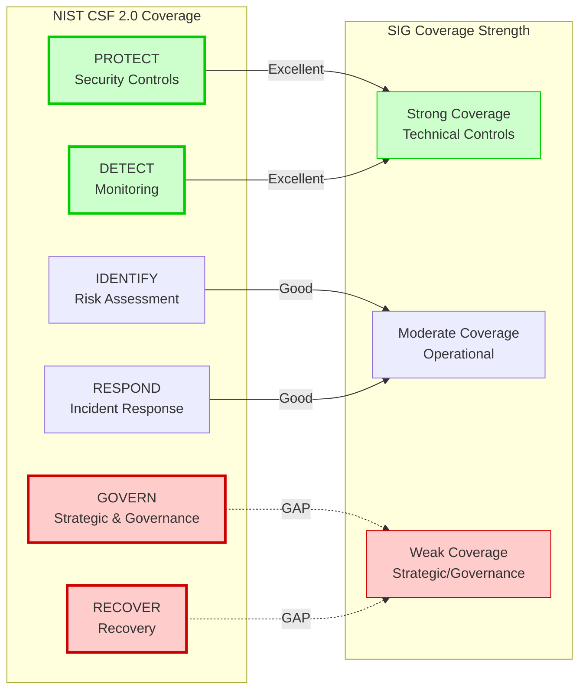
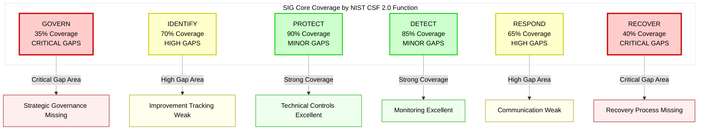

# SIG Core/Lite Gap Analysis vs NIST CSF 2.0
## Third-Party Risk Management Coverage Assessment
## By Mehmet Yilmaz (cablepull), all rights reserved
---

## Executive Summary

While SIG Core provides 855 questions across 19-21 risk domains and SIG Lite offers 126-128 questions for streamlined assessments, there are significant gaps when compared to the comprehensive third-party risk management approach outlined in NIST CSF 2.0, particularly in the new **GV.SC (Cybersecurity Supply Chain Risk Management)** category.

### Key Findings

**SIG Strengths:**
- Excellent **operational and technical control** coverage (PROTECT, DETECT functions)
- Deep dive into **information security domains** (IAM, Network, Data, etc.)
- Strong **compliance and audit** question sets
- Detailed **technical implementation** questions

**SIG Gaps:**
- Limited **strategic governance** and board-level oversight questions
- Weak **supply chain risk management lifecycle** coverage
- Insufficient **enterprise risk integration** guidance
- Minimal **incident recovery communication** requirements
- Lacks **continuous improvement** and lessons learned frameworks

---

## Gap Analysis Framework

---

## Section 1: GOVERN Function Gaps

### GV.SC - Cybersecurity Supply Chain Risk Management

NIST CSF 2.0 introduced a dedicated supply chain category with 10 subcategories. **This is the most significant gap area.**

| NIST CSF 2.0 Subcategory | SIG Core Coverage | SIG Lite Coverage | Gap Severity | What's Missing |
|--------------------------|-------------------|-------------------|--------------|----------------|
| **GV.SC-01: C-SCRM program, strategy, objectives, policies established** | Partial | Minimal | CRITICAL | • Formal TPRM program framework questions • Board-level TPRM strategy approval • TPRM objectives tied to business strategy • Integration with enterprise risk management • TPRM program maturity assessment |
| **GV.SC-02: Supplier roles, responsibilities, and authorities established** | Minimal | None | CRITICAL | • Vendor accountability framework • Escalation authority definitions • RACI matrix for vendor management • Internal stakeholder responsibilities • Cross-functional coordination model |
| **GV.SC-03: C-SCRM integrated into cybersecurity and ERM** | Minimal | None | CRITICAL | • ERM integration mechanisms • Risk aggregation methodologies • Cross-domain risk correlation • Executive risk reporting frameworks • Strategic risk decision-making process |
| **GV.SC-04: Suppliers prioritized by criticality** | Moderate | Minimal | HIGH | • Vendor tiering methodology • Criticality assessment criteria • Business impact analysis approach • Dynamic re-prioritization triggers • Resource allocation by tier |
| **GV.SC-05: Requirements in contracts and agreements** | Moderate | Minimal | HIGH | • Contract template requirements • Security clause standards • SLA performance metrics • Right-to-audit provisions • Breach notification timelines • Termination and exit clauses |
| **GV.SC-06: Planning and due diligence before relationships** | Good | Moderate | MEDIUM | • Due diligence process maturity • Risk-based scoping decisions • Alternative provider evaluation • Total cost of ownership analysis • Strategic alignment assessment |
| **GV.SC-07: Risks monitored over relationship course** | Good | Moderate | MEDIUM | • Continuous monitoring framework • Risk trend analysis • Performance degradation triggers • Reassessment scheduling logic • Vendor scorecard methodology |
| **GV.SC-08: Suppliers included in incident planning** | Moderate | Minimal | HIGH | • Joint incident response exercises • Communication protocols during incidents • Escalation procedures • Vendor incident coordination playbooks • Shared threat intelligence |
| **GV.SC-09: Practices monitored throughout lifecycle** | Moderate | Minimal | HIGH | • End-to-end lifecycle management • Technology refresh planning • EOL/EOS procedures • Continuous improvement tracking • Vendor maturity progression |
| **GV.SC-10: Provisions for post-relationship activities** | Minimal | None | CRITICAL | • Exit strategy planning • Data return/destruction procedures • Knowledge transfer requirements • Transition service agreements • Post-termination obligations • Vendor lock-in mitigation |

### GV.OC - Organizational Context (TPRM-Relevant Gaps)

| NIST CSF 2.0 Subcategory | Gap Description | Impact |
|--------------------------|-----------------|--------|
| **GV.OC-04: Critical capabilities stakeholders depend on** | SIG doesn't ask about stakeholder dependency mapping for vendor services | Cannot assess cascading impact of vendor failure |
| **GV.OC-05: Outcomes organization depends on** | Limited questions on critical vendor dependency identification | Incomplete business continuity planning |

### GV.RM - Risk Management Strategy (TPRM-Relevant Gaps)

| NIST CSF 2.0 Subcategory | Gap Description | Impact |
|--------------------------|-----------------|--------|
| **GV.RM-03: C-SCRM activities in ERM processes** | No questions on enterprise risk integration methodology | Siloed risk management, no holistic view |
| **GV.RM-05: Lines of communication for supplier risks** | Weak coverage of internal communication channels for vendor risks | Delayed risk escalation, poor coordination |
| **GV.RM-07: Strategic opportunities from positive risks** | SIG focuses on negative risks; no opportunity identification | Missed value creation from vendor relationships |

### GV.RR - Roles, Responsibilities, Authorities (TPRM Gaps)

| NIST CSF 2.0 Subcategory | Gap Description | Impact |
|--------------------------|-----------------|--------|
| **GV.RR-01: Leadership accountability and culture** | Limited board/C-suite accountability questions for TPRM | Weak governance oversight |
| **GV.RR-02: Roles, responsibilities communicated** | Minimal internal TPRM role definition questions | Unclear ownership and accountability |

### GV.OV - Oversight (TPRM Gaps)

| NIST CSF 2.0 Subcategory | Gap Description | Impact |
|--------------------------|-----------------|--------|
| **GV.OV-01: Strategy outcomes reviewed** | No questions on TPRM program performance reviews | No continuous improvement loop |
| **GV.OV-02: Strategy coverage assessed** | Weak program maturity assessment | Cannot measure TPRM effectiveness |
| **GV.OV-03: Performance evaluated** | Limited KPI/metrics framework questions | No data-driven program management |

---

## Section 2: IDENTIFY Function Gaps

### ID.IM - Improvement (Critical Gap)

| NIST CSF 2.0 Subcategory | SIG Core Coverage | SIG Lite Coverage | Gap Severity | What's Missing |
|--------------------------|-------------------|-------------------|--------------|----------------|
| **ID.IM-01: Improvements from evaluations** | Minimal | None | CRITICAL | • Lessons learned process • Assessment finding remediation tracking • Root cause analysis of vendor issues • Continuous improvement framework • Feedback loop mechanisms |
| **ID.IM-02: Improvements from testing** | Moderate | Minimal | HIGH | • Test failure analysis process • Testing program maturity • Post-test improvement planning • Exercise after-action reports |
| **ID.IM-03: Improvements from operations** | Minimal | None | CRITICAL | • Operational incident analysis • Performance degradation analysis • Service improvement initiatives • Vendor innovation adoption |
| **ID.IM-04: Plans maintained and improved** | Moderate | Minimal | HIGH | • Plan review frequency • Update triggers and criteria • Version control and change tracking • Stakeholder review process |

### ID.RA - Risk Assessment (Moderate Gaps)

| NIST CSF 2.0 Subcategory | Gap Description | Impact |
|--------------------------|-----------------|--------|
| **ID.RA-06: Risk responses tracked** | Limited risk treatment tracking and closure verification | Open risks may not be remediated |
| **ID.RA-07: Changes assessed for risk** | Weak change impact assessment process | Unassessed vendor changes create risk |

---

## Section 3: PROTECT Function Analysis

### Strong Coverage - Minimal Gaps

SIG Core and Lite have **excellent coverage** of the PROTECT function. This is SIG's core strength.

| NIST CSF 2.0 Category | SIG Coverage Quality | Notes |
|-----------------------|---------------------|-------|
| PR.AA - Identity & Access Management | Excellent (5/5) | Comprehensive IAM questions |
| PR.AT - Awareness & Training | Very Good (4/5) | Good training program questions |
| PR.DS - Data Security | Excellent (5/5) | Deep encryption and data protection coverage |
| PR.PS - Platform Security | Excellent (5/5) | Strong configuration, patching, SDLC questions |
| PR.IR - Infrastructure Resilience | Very Good (4/5) | Good resilience and capacity questions |

**Minor Gaps:**
- **PR.IR-03**: Lacks questions on resilience mechanisms during *adverse situations* (focus is on normal operations)
- **PR.DS-10**: Data-in-use protection (emerging area) has limited coverage

---

## Section 4: DETECT Function Analysis

### Strong Coverage - Minimal Gaps

SIG has **very good coverage** of detection capabilities.

| NIST CSF 2.0 Category | SIG Coverage Quality | Notes |
|-----------------------|---------------------|-------|
| DE.CM - Continuous Monitoring | Excellent (5/5) | Comprehensive monitoring questions |
| DE.AE - Adverse Event Analysis | Very Good (4/5) | Good event analysis coverage |

**Minor Gaps:**
- **DE.CM-06**: External service provider monitoring could be more specific to fourth-party risk
- **DE.AE-07**: Cyber threat intelligence integration with vendor context is light

---

## Section 5: RESPOND Function Gaps

### RS.MA - Incident Management (Moderate Gaps)

| NIST CSF 2.0 Subcategory | SIG Core Coverage | Gap Severity | What's Missing |
|--------------------------|-------------------|--------------|----------------|
| **RS.MA-01: IR plan executed with third parties** | Moderate | HIGH | • Joint IR plan testing • Third-party coordination procedures • Integrated playbooks • Communication protocols |
| **RS.MA-05: Recovery criteria applied** | Minimal | HIGH | • Decision criteria for recovery initiation • Recovery readiness assessment • Recovery prioritization methodology |

### RS.CO - Incident Response Communication (Significant Gaps)

| NIST CSF 2.0 Subcategory | SIG Core Coverage | SIG Lite Coverage | Gap Severity | What's Missing |
|--------------------------|-------------------|-------------------|--------------|----------------|
| **RS.CO-02: Stakeholders notified** | Moderate | Minimal | HIGH | • Notification timeline requirements • Stakeholder notification matrix • Communication templates • Escalation criteria |
| **RS.CO-03: Information shared** | Minimal | None | CRITICAL | • Information sharing agreements • Threat intelligence sharing • Lessons learned distribution • Cross-organizational coordination |

---

## Section 6: RECOVER Function Gaps

### Critical Gap Area

The RECOVER function has the **most significant gaps** in SIG coverage. Recovery is treated superficially.

### RC.RP - Recovery Plan Execution (Critical Gaps)

| NIST CSF 2.0 Subcategory | SIG Core Coverage | SIG Lite Coverage | Gap Severity | What's Missing |
|--------------------------|-------------------|-------------------|--------------|----------------|
| **RC.RP-01: Recovery plan executed** | Moderate | Minimal | HIGH | • Recovery plan activation procedures • Recovery team roles and responsibilities • Recovery coordination with vendors • Recovery plan testing with third parties |
| **RC.RP-02: Recovery actions performed** | Moderate | Minimal | HIGH | • Recovery action prioritization • Recovery sequencing • Vendor service restoration coordination • Recovery resource allocation |
| **RC.RP-03: Backup integrity verified** | Good | Moderate | MEDIUM | • Vendor backup verification process • Restoration testing procedures |
| **RC.RP-04: Post-incident norms established** | Minimal | None | CRITICAL | • "New normal" operational definition • Post-incident risk posture adjustment • Vendor relationship re-evaluation • Security control recalibration |
| **RC.RP-05: Restoration verified** | Moderate | Minimal | HIGH | • Service restoration validation criteria • Data integrity verification • Vendor SLA restoration confirmation • Normal operations confirmation |
| **RC.RP-06: Recovery completion declared** | Minimal | None | CRITICAL | • Recovery closure criteria • Documentation completion requirements • Lessons learned capture • After-action report requirements |

### RC.CO - Recovery Communication (Critical Gaps)

| NIST CSF 2.0 Subcategory | SIG Core Coverage | SIG Lite Coverage | Gap Severity | What's Missing |
|--------------------------|-------------------|-------------------|--------------|----------------|
| **RC.CO-03: Recovery progress communicated** | Minimal | None | CRITICAL | • Recovery status reporting • Stakeholder update frequency • Progress metrics and dashboards • Vendor coordination updates |
| **RC.CO-04: Public updates shared** | None | None | CRITICAL | • Public communication strategy • Media relations during recovery • Customer notification procedures • Regulatory reporting requirements |

---

## Section 7: Gap Summary by Severity

### Critical Gaps (Requires Supplemental Questions)

| Gap Area | NIST CSF Coverage | SIG Core | SIG Lite | Business Impact |
|----------|------------------|----------|----------|-----------------|
| **TPRM Program Governance** | GV.SC-01, GV.SC-02, GV.SC-03 | 20% | 5% | No strategic oversight, ad-hoc vendor management |
| **Vendor Exit Strategy** | GV.SC-10 | 15% | 0% | Vendor lock-in, no transition planning |
| **Continuous Improvement** | ID.IM-01, ID.IM-03 | 25% | 10% | Repeat failures, no learning from incidents |
| **Incident Communication** | RS.CO-03 | 30% | 10% | Poor stakeholder coordination during incidents |
| **Recovery Communication** | RC.CO-03, RC.CO-04 | 20% | 0% | Stakeholder confusion during recovery |
| **Post-Incident Posture** | RC.RP-04, RC.RP-06 | 25% | 5% | No closure process, unresolved issues |

### High Gaps (Should be Enhanced)

| Gap Area | NIST CSF Coverage | SIG Core | SIG Lite | Business Impact |
|----------|------------------|----------|----------|-----------------|
| **Vendor Criticality & Tiering** | GV.SC-04 | 50% | 25% | Inefficient resource allocation |
| **Contract Requirements** | GV.SC-05 | 55% | 30% | Inadequate contractual protections |
| **Incident Coordination** | GV.SC-08, RS.MA-01 | 50% | 25% | Delayed incident response |
| **Lifecycle Management** | GV.SC-09 | 45% | 20% | No end-to-end vendor oversight |
| **Risk Treatment Tracking** | ID.RA-06, ID.RA-07 | 40% | 20% | Open risks, untracked changes |
| **Recovery Execution** | RC.RP-01, RC.RP-02, RC.RP-05 | 50% | 30% | Incomplete recovery procedures |

### Medium Gaps (Minor Enhancement Needed)

| Gap Area | NIST CSF Coverage | SIG Core | SIG Lite | Business Impact |
|----------|------------------|----------|----------|-----------------|
| **Due Diligence Process** | GV.SC-06 | 75% | 50% | Due diligence lacks strategic elements |
| **Ongoing Monitoring** | GV.SC-07 | 70% | 45% | Monitoring lacks continuous improvement |
| **Backup Verification** | RC.RP-03 | 75% | 55% | Minor gaps in restoration testing |

---

## Section 8: Coverage Comparison Matrix

### Overall Function Coverage

| NIST CSF 2.0 Function | SIG Core Coverage | SIG Lite Coverage | Gap Analysis |
|-----------------------|-------------------|-------------------|--------------|
| **GOVERN** | 35% (Critical Gaps) | 15% (Critical Gaps) | Major strategic governance gaps, especially GV.SC |
| **IDENTIFY** | 70% (High Gaps) | 50% (High Gaps) | Good risk assessment, weak improvement tracking |
| **PROTECT** | 90% (Minor Gaps) | 75% (Minor Gaps) | Excellent control coverage, SIG's core strength |
| **DETECT** | 85% (Minor Gaps) | 70% (Minor Gaps) | Very good monitoring and analysis coverage |
| **RESPOND** | 65% (High Gaps) | 45% (High Gaps) | Good incident management, weak communication |
| **RECOVER** | 40% (Critical Gaps) | 20% (Critical Gaps) | Significant recovery and communication gaps |

### Coverage Visualization

---

## Section 9: Specific Question Gaps

### Missing Question Categories

#### 1. Strategic Governance Questions (GV.SC-01, GV.SC-02, GV.SC-03)

**What SIG Should Ask But Doesn't:**

- "Does your organization have a board-approved third-party risk management policy that defines program objectives, scope, and governance?"
- "How is TPRM integrated into your enterprise risk management (ERM) framework?"
- "What is your organization's risk appetite for third-party relationships, and how is it documented?"
- "Who is the executive sponsor for the TPRM program, and how often do they report to the board?"
- "Describe your TPRM program maturity model and current maturity level"
- "How are vendor risks aggregated and reported alongside other enterprise risks?"
- "What percentage of your operational budget is allocated to TPRM activities?"

#### 2. Vendor Lifecycle Management Questions (GV.SC-09, GV.SC-10)

**What SIG Should Ask But Doesn't:**

- "Describe your vendor lifecycle management process from onboarding to offboarding"
- "How do you manage end-of-life (EOL) and end-of-service (EOS) for vendor technologies?"
- "What is your process for developing and maintaining vendor exit strategies?"
- "How do you ensure knowledge transfer during vendor transitions?"
- "Describe your vendor lock-in mitigation strategies"
- "What are your data return and destruction procedures at contract termination?"
- "How long do post-termination confidentiality obligations last?"

#### 3. Continuous Improvement Questions (ID.IM-01, ID.IM-03)

**What SIG Should Ask But Doesn't:**

- "Describe your lessons learned process for vendor incidents and failures"
- "How do you track and implement improvements from vendor assessments?"
- "What metrics do you use to measure TPRM program effectiveness?"
- "How often do you review and update your TPRM policies and procedures?"
- "Describe your process for identifying and implementing TPRM best practices"
- "How do you capture and share vendor risk intelligence across your organization?"

#### 4. Recovery Communication Questions (RC.CO-03, RC.CO-04)

**What SIG Should Ask But Doesn't:**

- "Describe your stakeholder communication plan during vendor service recovery"
- "How do you provide recovery status updates to executives and the board?"
- "What is your public communication strategy during vendor-related incidents?"
- "How do you coordinate customer notifications when vendor services are impacted?"
- "Describe your media relations procedures during vendor service disruptions"
- "How do you report recovery progress to regulatory agencies?"

#### 5. Enterprise Risk Integration Questions (GV.RM-03, GV.SC-03)

**What SIG Should Ask But Doesn't:**

- "How does your TPRM program integrate with financial risk management?"
- "Describe how vendor risks are considered in strategic planning decisions"
- "How do you correlate vendor risks with other organizational risks (operational, reputational, compliance)?"
- "What is your process for vendor risk escalation to the enterprise risk committee?"
- "How are vendor concentration risks managed and reported?"

---

## Section 10: Recommended Supplemental Questions

### Critical Additions for SIG Core Enhancement

#### Governance & Strategy Module (15-20 Questions)

**GV.SC-01: Program Establishment**
1. Does your organization have a documented TPRM program charter approved by the board?
2. What are the documented objectives of your TPRM program?
3. How does your TPRM strategy align with business strategy?
4. Is there an executive-level TPRM steering committee? How often does it meet?

**GV.SC-02: Roles & Responsibilities**
5. Is there a documented RACI matrix for TPRM activities?
6. Who is the accountable executive for third-party risk?
7. How are TPRM responsibilities distributed across business units?

**GV.SC-03: ERM Integration**
8. How is TPRM integrated into your ERM framework?
9. How are vendor risks aggregated with enterprise risks?
10. What is the escalation path for critical vendor risks?

**GV.SC-04: Vendor Criticality**
11. Describe your vendor tiering/classification methodology
12. How often are vendor criticality ratings reviewed?
13. How do you determine criticality thresholds?

**GV.SC-10: Exit Strategy**
14. Do you develop exit strategies before engaging vendors?
15. What are your data return requirements at termination?
16. How do you mitigate vendor lock-in risks?

#### Improvement Module (8-10 Questions)

**ID.IM-01/03: Continuous Improvement**
17. Describe your lessons learned process for vendor incidents
18. How do you track remediation of vendor assessment findings?
19. What KPIs measure TPRM program performance?
20. How often is your TPRM program assessed for maturity?

#### Recovery & Communication Module (10-12 Questions)

**RC.RP-04/06: Post-Incident Management**
21. How do you define recovery completion criteria?
22. What is your after-action review process for vendor incidents?
23. How do you adjust security posture post-incident?

**RC.CO-03/04: Recovery Communication**
24. Describe your stakeholder communication plan during recovery
25. How do you provide recovery status updates?
26. What is your public disclosure strategy for vendor incidents?

### Critical Additions for SIG Lite Enhancement

For low-risk vendors, add **streamlined versions** of the most critical gaps:

1. "Is there an executive sponsor for vendor risk management?"
2. "Are vendors classified by criticality/risk tier?"
3. "Do contracts include security requirements and audit rights?"
4. "Is there a documented vendor exit strategy?"
5. "Are vendor incidents included in your incident response plan?"
6. "Do you conduct lessons learned after vendor incidents?"
7. "How do you communicate with stakeholders during vendor service disruptions?"

---

## Section 11: Practical Impact of Gaps

### Real-World Scenarios Where SIG Falls Short

#### Scenario 1: Board Asks "What's Our Vendor Risk Posture?"

**SIG Response Capability**: INSUFFICIENT

**What SIG Tells You:**
- Vendor has good security controls
- Vendor is compliant with standards
- Vendor has incident response capability

**What SIG Doesn't Tell You:**
- How critical is this vendor to business operations?
- How does this vendor risk compare to other enterprise risks?
- What is our aggregate exposure across all vendors?
- Are we over-concentrated with single vendors?
- What is our vendor risk appetite and tolerance?

**NIST CSF Gap**: GV.SC-01, GV.SC-03, GV.SC-04, GV.RM-02

---

#### Scenario 2: Major Vendor Has Data Breach

**SIG Response Capability**: PARTIAL

**What SIG Tells You:**
- Vendor's incident response procedures
- Vendor's notification requirements
- Vendor's forensics capabilities

**What SIG Doesn't Tell You:**
- Joint incident response coordination procedures
- Who to notify and when (stakeholder matrix)
- Public communication strategy
- Recovery communication plan
- Lessons learned capture process
- How to adjust risk posture post-incident

**NIST CSF Gap**: GV.SC-08, RS.CO-03, RC.CO-03, RC.CO-04, RC.RP-04, RC.RP-06

---

#### Scenario 3: Need to Exit Vendor Relationship

**SIG Response Capability**: INSUFFICIENT

**What SIG Tells You:**
- Vendor's data handling practices
- Vendor's backup procedures

**What SIG Doesn't Tell You:**
- Exit strategy planning and documentation
- Data return procedures and timelines
- Transition service agreements
- Knowledge transfer requirements
- Alternative vendor readiness
- Service continuity during transition
- Post-termination data destruction

**NIST CSF Gap**: GV.SC-10

---

#### Scenario 4: Auditor Asks "How Do You Improve Your TPRM Program?"

**SIG Response Capability**: INSUFFICIENT

**What SIG Tells You:**
- Vendor has testing programs
- Vendor updates documentation

**What SIG Doesn't Tell You:**
- Lessons learned from vendor incidents
- TPRM program maturity progression
- Assessment finding remediation tracking
- Continuous improvement initiatives
- TPRM performance metrics and trends
- Program effectiveness measurement

**NIST CSF Gap**: ID.IM-01, ID.IM-03, GV.OV-01, GV.OV-03

---

## Section 12: Mitigation Strategies

### Option 1: Augment SIG with Custom Questions

**Approach**: Add supplemental questions to SIG assessments

**Pros:**
- Maintains SIG standardization
- Targeted gap closure
- Cost-effective

**Cons:**
- Manual management of custom questions
- Difficult to benchmark
- Vendor confusion with non-standard questions

**Recommendation**: Add **30-40 custom questions** to SIG Core and **10-15** to SIG Lite focusing on:
- Governance & oversight (GV.SC-01, 02, 03)
- Exit strategy (GV.SC-10)
- Continuous improvement (ID.IM)
- Recovery communication (RC.CO-03, RC.CO-04)
- Enterprise risk integration (GV.RM-03)---

### Option 2: Adopt NIST CSF 2.0 as Primary TPRM Framework

**Approach**: Use NIST CSF 2.0 (specifically GV.SC categories) as the primary vendor risk assessment framework, supplementing with SIG for technical deep-dives

**Pros:**
- Comprehensive vendor lifecycle coverage
- Strategic governance and oversight built-in
- Aligned with enterprise risk management
- Better board-level communication
- Continuous improvement embedded
- Exit strategy and recovery planning included

**Cons:**
- Less detailed technical control questions
- Not standardized across vendors yet
- Requires customization for questionnaire format
- Learning curve for assessment teams
- Vendor unfamiliarity with CSF-based assessments

**Recommendation**: Use for **strategic/critical vendors** where governance and lifecycle management are paramount. Structure as:
- **Tier 1 (GOVERN)**: GV.SC-01 through GV.SC-10 (strategic governance)
- **Tier 2 (PROTECT/DETECT)**: SIG Core domains (technical controls)
- **Tier 3 (RESPOND/RECOVER)**: RS.CO, RC.CO, RC.RP (incident and recovery)

---

### Option 3: Hybrid Two-Framework Approach (RECOMMENDED)

**Approach**: Use NIST CSF 2.0 for TPRM program governance and lifecycle management + SIG for technical security assessments

**Implementation:**

#### Phase 1: TPRM Program Governance (NIST CSF 2.0)
**Scope**: Internal organizational capabilities
- GV.SC-01: TPRM program strategy and policies
- GV.SC-02: Internal roles and responsibilities
- GV.SC-03: Integration with ERM
- GV.SC-04: Vendor tiering methodology
- GV.RR-01: Board/executive accountability
- GV.OV-01: Program performance reviews
- GV.OV-03: TPRM metrics and KPIs

**Assessment Method**: Internal self-assessment against CSF maturity levels

#### Phase 2: Vendor Due Diligence (SIG + Supplemental)
**Scope**: Vendor capabilities assessment
- **SIG Core/Lite**: Technical security controls (PROTECT/DETECT)
- **Supplemental Questions** (30-40 questions):
  - Strategic governance alignment (10 questions)
  - Incident response coordination (5 questions)
  - Business continuity and recovery (8 questions)
  - Exit strategy and termination (7 questions)
  - Continuous improvement (5 questions)
  - Subcontractor management (5 questions)

**Assessment Method**: Vendor-completed SIG + supplemental questionnaire

#### Phase 3: Vendor Lifecycle Management (NIST CSF 2.0)
**Scope**: Ongoing vendor relationship management
- GV.SC-06: Pre-contract due diligence tracking
- GV.SC-07: Ongoing monitoring framework
- GV.SC-08: Incident coordination procedures
- GV.SC-09: Lifecycle stage management
- GV.SC-10: Exit strategy execution
- ID.IM-01, ID.IM-03: Continuous improvement tracking

**Assessment Method**: Internal process maturity assessment + vendor-specific tracking

**Pros:**
- Best of both worlds: governance + technical depth
- Clear separation of concerns
- Leverages existing SIG standardization
- Addresses all critical gaps
- Practical to implement

**Cons:**
- Multiple frameworks to manage
- Requires integration effort
- More complex training

**Recommendation**: **This is the optimal approach** for most organizations conducting TPRM. It addresses critical governance gaps while maintaining technical assessment rigor.

---

### Option 4: Integrated TPRM Platform Approach

**Approach**: Deploy vendor risk management platform that integrates multiple assessment frameworks

**Platform Capabilities:**
- Unified vendor inventory and tiering
- Multi-framework assessment support (SIG, CSF, custom)
- Automated continuous monitoring (security ratings, threat intel)
- Vendor lifecycle workflow management
- Risk scoring and aggregation
- Board/executive dashboards
- Integration with GRC/ERM systems

**Leading Platforms:**
- OneTrust Vendorpedia
- ServiceNow TPRM
- Prevalent
- BitSight Third-Party Risk Management
- SecurityScorecard
- RiskRecon
- Whistic

**Pros:**
- Centralized vendor risk data
- Real-time continuous monitoring
- Automated workflows and reminders
- Executive visibility
- Integration with security ratings
- Scales with vendor portfolio

**Cons:**
- Significant upfront investment ($50K-$500K+/year)
- Implementation time (3-6 months)
- Change management required
- Vendor dependency
- Ongoing licensing costs

**Recommendation**: For organizations with **100+ third parties** or mature TPRM programs. Combine with Option 3 (hybrid framework approach).

---

### Implementation Considerations

| Factor | Option 1: Augment SIG | Option 2: CSF Primary | Option 3: Hybrid (RECOMMENDED) | Option 4: Platform |
|--------|----------------------|----------------------|-------------------------------|-------------------|
| **Cost** | Low ($10K-$25K) | Low-Medium ($25K-$50K) | Medium ($50K-$100K) | High ($100K-$500K+) |
| **Timeline** | 1-2 months | 2-3 months | 3-6 months | 6-12 months |
| **Complexity** | Low | Medium | Medium-High | High |
| **Gap Coverage** | 60-70% of gaps | 80-85% of gaps | 90-95% of gaps | 95-100% of gaps |
| **Vendor Acceptance** | High (SIG familiar) | Low-Medium (CSF new) | High (SIG base) | High (standardized) |
| **Scalability** | Low | Medium | High | Very High |
| **Best For** | <50 vendors, budget-constrained | Strategic vendors only | 50-500 vendors, comprehensive TPRM | 500+ vendors, mature programs |

---

## Section 13: TPRM Program Recommendations

### Critical Priority Actions

#### Priority 1: Establish TPRM Program Governance (Immediate - Months 1-3)

**Gap Addressed**: GV.SC-01, GV.SC-02, GV.SC-03 (Critical Gaps)

**Actions:**
1. **Develop Board-Approved TPRM Policy**
   - Define program objectives and scope
   - Document risk appetite for vendor relationships
   - Establish governance structure and accountability
   - Define vendor risk tolerance thresholds
   - **Deliverable**: Board-approved TPRM program charter

2. **Assign Executive Accountability**
   - Designate Chief Risk Officer or CISO as TPRM executive sponsor
   - Create vendor risk committee (cross-functional)
   - Define RACI matrix for TPRM activities
   - Establish escalation paths for critical vendor risks
   - **Deliverable**: Documented roles and responsibilities

3. **Integrate TPRM with Enterprise Risk Management**
   - Include vendor risks in enterprise risk register
   - Establish vendor risk aggregation methodology
   - Define reporting to risk committee and board
   - Create vendor risk dashboard for executives
   - **Deliverable**: TPRM-ERM integration framework

**Success Metrics:**
- Board receives quarterly TPRM reports (100%)
- Vendor risks integrated in ERM register (100% of critical vendors)
- Executive sponsor identified and active

---

#### Priority 2: Implement Vendor Lifecycle Management (Months 4-6)

**Gap Addressed**: GV.SC-09, GV.SC-10 (Critical/High Gaps)

**Actions:**
1. **Document End-to-End Vendor Lifecycle**
   - Define stages: Planning → Due Diligence → Contracting → Monitoring → Termination
   - Create stage-gate approvals and criteria
   - Document handoffs between procurement, legal, IT, security
   - **Deliverable**: Vendor lifecycle management procedure

2. **Develop Vendor Exit Strategies**
   - Create exit strategy template
   - Require exit planning before critical vendor engagement
   - Identify alternative providers for critical services
   - Document vendor lock-in mitigation tactics
   - **Deliverable**: Exit strategy requirements and templates

3. **Establish Termination Procedures**
   - Data return requirements and timelines (30 days)
   - Certified data destruction requirements
   - Access revocation procedures
   - Knowledge transfer and transition assistance
   - Post-termination audit requirements
   - **Deliverable**: Vendor termination playbook

**Success Metrics:**
- 100% of new critical vendors have documented exit strategies
- Average vendor transition time: <90 days
- Zero data loss incidents during vendor transitions

---

#### Priority 3: Build Continuous Improvement into TPRM (Months 4-9)

**Gap Addressed**: ID.IM-01, ID.IM-03 (Critical Gaps)

**Actions:**
1. **Establish Lessons Learned Process**
   - After-action reviews for all vendor incidents
   - Root cause analysis for vendor failures
   - Quarterly TPRM program reviews
   - Annual vendor risk trends analysis
   - **Deliverable**: Lessons learned procedure and database

2. **Implement Assessment Finding Tracking**
   - Centralized tracking of vendor assessment gaps
   - Risk treatment plans with owners and deadlines
   - Automated remediation reminders
   - Quarterly remediation status reporting
   - **Deliverable**: Vendor finding remediation tracker

3. **Define TPRM Program Metrics**
   - Vendor assessment completion rates
   - Critical findings and remediation velocity
   - SLA compliance by vendor tier
   - Incident frequency and impact trends
   - Program maturity progression
   - **Deliverable**: TPRM KPI dashboard

**Success Metrics:**
- 100% of vendor incidents have documented lessons learned
- 90% of critical findings remediated within 90 days
- Quarterly TPRM metrics reported to executive leadership

---

#### Priority 4: Enhance Incident & Recovery Coordination (Months 6-9)

**Gap Addressed**: GV.SC-08, RS.CO-03, RC.CO-03, RC.CO-04 (Critical Gaps)

**Actions:**
1. **Develop Joint Incident Response Procedures**
   - Vendor notification requirements (2-hour discovery, 24-hour confirmation)
   - Escalation matrices for vendor incidents
   - Communication protocols during incidents
   - Vendor coordination playbooks
   - Annual incident response exercises with critical vendors
   - **Deliverable**: Vendor incident response playbook

2. **Create Recovery Communication Plan**
   - Stakeholder notification matrix (customers, executives, board, regulators)
   - Recovery status update templates and frequency
   - Public communication strategy for vendor incidents
   - Media relations procedures
   - Customer notification templates
   - **Deliverable**: Vendor recovery communication plan

3. **Define Post-Incident Procedures**
   - Recovery completion criteria
   - "New normal" risk posture assessment
   - Vendor relationship re-evaluation process
   - After-action report requirements
   - Regulatory reporting procedures
   - **Deliverable**: Post-incident vendor review procedure

**Success Metrics:**
- 100% of critical vendors participate in annual IR exercises
- <2 hours mean time to vendor incident notification
- Zero regulatory findings for inadequate vendor incident communication

---

#### Priority 5: Strengthen Vendor Contracts (Months 6-12)

**Gap Addressed**: GV.SC-05, GV.SC-08 (High Gaps)

**Actions:**
1. **Develop Vendor Contract Templates**
   - Security and compliance requirements appendix
   - Right-to-audit clauses (annual for critical vendors)
   - Breach notification requirements (24 hours)
   - Business continuity and DR requirements
   - Exit strategy and data return provisions
   - Subcontractor management clauses
   - **Deliverable**: Standard vendor contract templates

2. **Conduct Contract Remediation**
   - Gap analysis of existing critical vendor contracts
   - Prioritize contract amendments by risk tier
   - Negotiate enhanced terms during renewals
   - Document exceptions and compensating controls
   - **Deliverable**: Contract remediation plan and tracking

3. **Implement SLA Monitoring**
   - Define measurable performance metrics
   - Quarterly SLA compliance reporting
   - Service credits for non-performance
   - Contract renegotiation triggers
   - **Deliverable**: SLA monitoring framework

**Success Metrics:**
- 100% of new contracts include required security clauses
- 80% of critical vendor contracts remediated within 12 months
- 95% SLA compliance across critical vendor portfolio

---

### Quick Wins (First 90 Days)

| Action | Effort | Impact | Gap Addressed |
|--------|--------|--------|---------------|
| Create vendor inventory with criticality tiers | Low | High | GV.SC-04 - Foundation for risk-based approach |
| Draft TPRM policy for board approval | Medium | High | GV.SC-01 - Establishes program legitimacy |
| Identify critical vendors without exit strategies | Low | High | GV.SC-10 - Risk identification |
| Implement vendor incident notification procedure | Low | Medium | GV.SC-08, RS.CO-02 - Immediate risk reduction |
| Create executive TPRM dashboard (PowerPoint/Excel) | Low | High | GV.OV-01 - Executive visibility |
| Conduct SOC 2 report review for top 10 vendors | Medium | Medium | GV.SC-07 - Immediate control validation |
| Document vendor escalation matrix | Low | Medium | GV.RR-02 - Clear accountability |

---

### Long-Term Strategic Initiatives (12-24 Months)

| Initiative | Timeline | Investment | Expected Outcome |
|-----------|----------|------------|------------------|
| TPRM platform implementation | 12-18 months | $100K-$500K | Automated, scalable vendor risk management |
| Continuous monitoring integration (security ratings) | 6-12 months | $50K-$200K/year | Real-time vendor risk visibility |
| Vendor portal for self-service assessments | 9-12 months | $50K-$150K | Reduced assessment overhead, faster onboarding |
| Integration with procurement/contract systems | 12-18 months | $75K-$200K | Automated lifecycle management |
| Advanced analytics and ML for vendor risk prediction | 18-24 months | $100K-$300K | Proactive risk identification |

---

## Section 14: Implementation Roadmap

### Phase 1: Foundation (Months 1-3)

**Objective**: Establish TPRM program governance and baseline capabilities

| Week | Milestone | Deliverable | Owner |
|------|-----------|-------------|-------|
| 1-2 | Conduct current state assessment | TPRM gap analysis report | Risk Management |
| 3-4 | Develop TPRM policy and charter | Board-approved TPRM policy | CISO/CRO |
| 5-6 | Create vendor inventory and tiering | Complete vendor database with risk tiers | Procurement/IT |
| 7-8 | Define roles and governance structure | RACI matrix, vendor risk committee charter | Risk Management |
| 9-10 | Establish vendor risk appetite | Risk appetite statement | Risk Committee |
| 11-12 | Create executive dashboard | Monthly TPRM metrics dashboard | Risk Management |

**Resource Requirements:**
- Project Manager (0.5 FTE)
- Risk Manager (1.0 FTE)
- Legal/Compliance (0.25 FTE)
- IT/Security (0.5 FTE)

**Budget**: $25K-$50K (primarily internal labor)

---

### Phase 2: Assessment Enhancement (Months 4-6)

**Objective**: Enhance vendor assessment capabilities and close technical gaps

| Week | Milestone | Deliverable | Owner |
|------|-----------|-------------|-------|
| 13-14 | Develop supplemental SIG questions | 30-40 custom TPRM questions | Risk/Security |
| 15-16 | Create vendor lifecycle procedures | Lifecycle management procedure | Risk Management |
| 17-18 | Conduct risk assessments for critical vendors | Risk assessments for top 20 vendors | Risk Management |
| 19-20 | Review SOC 2 reports and conduct gap analysis | SOC 2 exception analysis reports | Internal Audit |
| 21-22 | Develop exit strategy templates | Exit strategy requirements and templates | Risk/Procurement |
| 23-24 | Establish continuous improvement tracking | Lessons learned database and process | Risk Management |

**Resource Requirements:**
- Risk Manager (1.0 FTE)
- Security Analyst (0.75 FTE)
- Vendor Management Specialist (1.0 FTE)
- Internal Audit (0.5 FTE)

**Budget**: $50K-$100K (labor + assessment tools)

---

### Phase 3: Contract & Control Enhancement (Months 7-9)

**Objective**: Strengthen contractual protections and operational controls

| Week | Milestone | Deliverable | Owner |
|------|-----------|-------------|-------|
| 25-26 | Develop standard contract templates | Vendor contract templates with security clauses | Legal/Risk |
| 27-28 | Conduct contract gap analysis | Contract remediation priority list | Legal |
| 29-30 | Negotiate critical vendor contract amendments | Updated contracts for top 10 vendors | Procurement/Legal |
| 31-32 | Implement vendor incident response coordination | Joint IR procedures and playbooks | Security/Risk |
| 33-34 | Develop recovery communication plan | Vendor recovery communication plan | Business Continuity |
| 35-36 | Establish SLA monitoring framework | Quarterly vendor scorecard process | Vendor Management |

**Resource Requirements:**
- Vendor Manager (1.0 FTE)
- Legal Counsel (0.75 FTE)
- Security Manager (0.5 FTE)
- Business Continuity (0.5 FTE)

**Budget**: $75K-$150K (legal fees + labor)

---

### Phase 4: Continuous Monitoring & Optimization (Months 10-12)

**Objective**: Implement ongoing monitoring and program optimization

| Week | Milestone | Deliverable | Owner |
|------|-----------|-------------|-------|
| 37-38 | Implement continuous monitoring tools | Security ratings integration | Security |
| 39-40 | Establish reassessment calendar | Annual vendor reassessment schedule | Risk Management |
| 41-42 | Conduct TPRM program audit | Internal audit report on TPRM | Internal Audit |
| 43-44 | Execute BCP tests with critical vendors | DR test results for top 5 vendors | Business Continuity |
| 45-46 | Optimize vendor risk reporting | Enhanced board/executive dashboards | Risk Management |
| 47-48 | Program maturity assessment | TPRM maturity scorecard | Risk Management |

**Resource Requirements:**
- Risk Manager (0.75 FTE)
- Security Analyst (0.5 FTE)
- Internal Audit (0.5 FTE)
- Business Continuity (0.25 FTE)

**Budget**: $50K-$150K (monitoring tools + labor)

---

### Total Program Investment (Year 1)

| Category | Investment Range |
|----------|-----------------|
| **Personnel** (internal labor + new hires) | $200K-$400K |
| **Tools & Technology** (assessment, monitoring) | $50K-$200K |
| **Professional Services** (legal, audit, consulting) | $50K-$150K |
| **Training & Development** | $25K-$50K |
| **TOTAL** | **$325K-$800K** |

**Note**: Investment varies based on organization size, vendor portfolio complexity, and current TPRM maturity.

---

### Success Metrics by Phase

#### Phase 1 Success Criteria
- ✅ Board-approved TPRM policy in place
- ✅ Complete vendor inventory with 100% criticality classification
- ✅ Executive sponsor assigned with quarterly reporting
- ✅ TPRM program integrated into ERM framework

#### Phase 2 Success Criteria
- ✅ 100% of critical vendors assessed (SIG + supplemental)
- ✅ Exit strategies documented for all critical vendors
- ✅ Vendor finding remediation tracking system operational
- ✅ Lessons learned process established with first review completed

#### Phase 3 Success Criteria
- ✅ Standard vendor contracts with required security clauses deployed
- ✅ Top 10 critical vendor contracts remediated or exceptions documented
- ✅ Joint incident response procedures established with critical vendors
- ✅ SLA monitoring framework operational with quarterly scorecards

#### Phase 4 Success Criteria
- ✅ Continuous monitoring implemented for critical vendors
- ✅ Annual reassessment calendar established and on track
- ✅ TPRM program audit completed with <3 high findings
- ✅ Board satisfaction score ≥4/5 for TPRM reporting quality

---

## Section 15: Conclusion

### Summary of Findings

This comprehensive gap analysis reveals that while **SIG Core and SIG Lite** provide excellent coverage of **technical security controls** for third-party risk management, they have **significant gaps** in strategic governance, vendor lifecycle management, and recovery capabilities required by **NIST Cybersecurity Framework 2.0**.

#### Critical Gaps Requiring Immediate Attention

1. **Strategic Governance (35% Coverage)**
   - Missing: Board-level oversight, ERM integration, TPRM program strategy
   - Impact: No executive visibility, siloed vendor risk management, reactive approach
   - NIST CSF Gap: GV.SC-01, GV.SC-02, GV.SC-03

2. **Vendor Exit Strategy (15% Coverage)**
   - Missing: Pre-planned exit strategies, data return procedures, transition planning
   - Impact: Vendor lock-in, service continuity risk, data loss exposure
   - NIST CSF Gap: GV.SC-10

3. **Continuous Improvement (25% Coverage)**
   - Missing: Lessons learned processes, TPRM program maturity tracking, metrics
   - Impact: Repeat vendor failures, no program effectiveness measurement
   - NIST CSF Gap: ID.IM-01, ID.IM-03

4. **Recovery Communication (20% Coverage)**
   - Missing: Stakeholder communication plans, recovery status reporting, public disclosure
   - Impact: Stakeholder confusion, reputational damage, regulatory issues
   - NIST CSF Gap: RC.CO-03, RC.CO-04

### SIG's Strengths Remain Valid

Despite these gaps, **SIG Core and SIG Lite** remain the **gold standard** for:
- ✅ **Technical security controls** assessment (PROTECT function: 90% coverage)
- ✅ **Operational monitoring** capabilities (DETECT function: 85% coverage)
- ✅ **Standardized vendor assessments** enabling benchmarking
- ✅ **Industry-wide adoption** reducing assessment fatigue
- ✅ **Detailed domain expertise** across 19-21 security domains

**The solution is not to abandon SIG**, but to **augment it** with strategic governance and lifecycle management capabilities from NIST CSF 2.0.

---

### Strategic Importance of Comprehensive TPRM

As organizations increasingly depend on third parties for critical services, **third-party risk has become enterprise risk**:

- **60-80% of data breaches** involve third parties (Ponemon Institute)
- **Supply chain attacks increased 742%** from 2020-2023 (European Union Agency for Cybersecurity)
- **Board-level accountability** for vendor risk is now expected by regulators and stakeholders
- **Systemic failures** can cascade through interconnected vendor ecosystems

**Organizations that fail to address TPRM gaps face:**
- Regulatory sanctions and consent orders
- Reputational damage from vendor incidents
- Operational disruptions from vendor failures
- Financial losses from vendor lock-in and poor contract terms
- Board/executive liability for inadequate oversight

---

### Path Forward: The Hybrid Approach

**Recommended Strategy:**

#### Use NIST CSF 2.0 for TPRM Program Governance
- Establish board-level oversight and executive accountability
- Integrate vendor risks with enterprise risk management
- Implement end-to-end vendor lifecycle management
- Build continuous improvement into TPRM operations
- Develop strategic capabilities: exit planning, incident coordination, recovery communication

#### Use SIG for Vendor Technical Assessments
- Leverage standardized SIG Core/Lite for security control assessment
- Supplement with 30-40 custom questions addressing governance gaps
- Maintain industry benchmarking capabilities
- Reduce vendor assessment fatigue through standardization

#### Implement Supporting Capabilities
- Vendor risk management platform for scalability
- Continuous monitoring (security ratings, threat intelligence)
- Automated workflows and lifecycle management
- Executive dashboards and risk aggregation

---

### Expected Outcomes

Organizations implementing these recommendations can expect:

**Year 1 Outcomes:**
- ✅ Established TPRM program governance with board oversight
- ✅ Complete vendor inventory with risk-based tiering
- ✅ Enhanced vendor assessments covering 90%+ of NIST CSF requirements
- ✅ Exit strategies for all critical vendor relationships
- ✅ Strengthened vendor contracts with security and recovery provisions
- ✅ Operational incident response and recovery coordination with key vendors

**Year 2+ Outcomes:**
- ✅ Mature TPRM program with continuous improvement
- ✅ Integrated continuous monitoring and real-time risk visibility
- ✅ Automated vendor lifecycle management
- ✅ Measurable reduction in vendor-related incidents and impact
- ✅ Regulatory exam readiness with comprehensive documentation
- ✅ Strategic vendor partnerships with aligned risk management practices

---

### Final Recommendation

**For organizations serious about third-party risk management:**

1. **Acknowledge the gaps** - SIG alone is insufficient for comprehensive TPRM
2. **Adopt the hybrid approach** - CSF for governance + SIG for technical assessment
3. **Start with governance** - Establish program foundation and executive oversight
4. **Enhance assessments** - Supplement SIG with strategic questions
5. **Strengthen contracts** - Ensure legal protections align with risk
6. **Build for scale** - Invest in platforms and automation as vendor portfolio grows
7. **Measure and improve** - Establish metrics and continuous improvement processes

**Third-party risk management is not a point-in-time assessment activity** - it is an **ongoing strategic capability** requiring governance, lifecycle management, continuous monitoring, and organizational commitment.

Organizations that recognize this and invest appropriately will be **resilient in the face of supply chain disruptions**, **compliant with evolving regulations**, and **competitive through strategic vendor partnerships**.

The gaps are real. The risks are material. The path forward is clear.

**Time to close the gap.**

---

## Document Metadata

**Title**: SIG Core/Lite Gap Analysis vs NIST CSF 2.0 - Third-Party Risk Management Coverage Assessment

**Version**: 1.0

**Date**: October 2, 2025

**Author**: Third-Party Risk Management Framework Analysis

**Purpose**: Identify gaps between Shared Assessments SIG questionnaires and NIST Cybersecurity Framework 2.0 requirements for comprehensive third-party risk management

**Audience**: 
- Chief Information Security Officers (CISOs)
- Chief Risk Officers (CROs)
- Vendor Risk Management Teams
- Board Risk Committees
- Internal Audit
- Compliance Officers

**Related Documents**:
- NIST Cybersecurity Framework 2.0 (February 2024)
- Shared Assessments SIG Core (2024)
- Shared Assessments SIG Lite (2024)
- NIST SP 800-161r1: Cybersecurity Supply Chain Risk Management

**Maintenance**: Review annually or upon major framework updates

---

**END OF DOCUMENT**

