# Table of Contents

> **Third-Party Risk Assessment - Information Security Questions**
> **Total:** 168 Questions across 7 Security Domains | 8 Decision Flow Diagrams
> **SIG Coverage:** 68 questions in Core, 9 in Lite | 15 questions require supplemental collection

---
Created by Mehmet Yilmaz

## List of Figures

- [Figure 1: Data Classification & Handling Flow](#section-1)
- [Figure 2: Data Security Controls Flow](#section-1)
- [Figure 3: Identity & Access Management Flow](#section-2)
- [Figure 4: Authentication Flow](#section-2)
- [Figure 5: Network Security Flow](#section-3)
- [Figure 6: Application Security Flow](#section-4)
- [Figure 7: Logging & Monitoring Flow](#section-5)
- [Figure 8: Risk Decision Tree](#section-7)

---

## Questions by Section

**Legend:** ✅ = SIG Core/Lite covers | ⚠️ = Partial coverage | **Required** = Not in SIG (must collect separately)

### Section 1: Data Handling & Classification
**23 questions** | ✅ Core: 10 | ✅ Lite: 5 | ⚠️ Partial: 12 | **Required: 13**

**Primary Questions:**
- ✅ Q1.1: Data Processing

**Required Questions (Not in SIG):** 13 questions must be collected separately

View required questions

- **Q1.4**: Data Volume
- **Q1.9**: Data Loss Prevention
- **Q1.12**: Breach Impact Assessment
- **Q1.13**: Data Deletion Requirements
- **Q1.14**: Data Sovereignty Security Risk
- **Q1.15**: Data Residency Verification
- **Q1.16**: Encryption Upgrade Path
- **Q1.17**: Encryption Gap Mitigation
- **Q1.18**: Key Management Practices
- **Q1.19**: DLP Compensating Controls
- **Q1.21**: Breach Response Evaluation
- **Q1.22**: Security Transparency Concern
- **Q1.23**: Residency Verification Gap

### Section 2: Identity & Access Management
**33 questions** | ✅ Core: 14 | ✅ Lite: 1 | ⚠️ Partial: 17 | **Required: 15**

**Primary Questions:**
- ✅ Q2.1: Authentication Methods
- ✅ Core Q2.16: Access Control Model
- ✅ Core Q2.20: Privileged Access Management
- ✅ Core Q2.25: User Provisioning/Deprovisioning
- ✅ Core Q2.31: Session Management

**Required Questions (Not in SIG):** 15 questions must be collected separately

View required questions

- **Q2.4**: MFA Gap Assessment
- **Q2.5**: API Key Security
- **Q2.8**: SSO Bypass Justification
- **Q2.11**: API Key Management Risk
- **Q2.13**: SSO Compatibility Testing
- **Q2.14**: SSO Roadmap
- **Q2.15**: API Logging Enhancement
- **Q2.17**: Access Control Granularity
- **Q2.18**: Permission Documentation
- **Q2.22**: Privileged Access Risk Mitigation
- **Q2.26**: Automation Verification
- **Q2.29**: Provisioning Testing Plan
- **Q2.30**: Deprovisioning Process Reliability
- **Q2.31**: Session Management
- **Q2.33**: Session Security Assessment

### Section 3: Network Security & Architecture
**28 questions** | ✅ Core: 9 | ✅ Lite: 2 | ⚠️ Partial: 8 | **Required: 17**

**Primary Questions:**
- ✅ Q3.1: Deployment Model
- ✅ Core Q3.20: Data Transmission to External Parties
- **Required** Q3.26: Network Traffic Monitoring

**Required Questions (Not in SIG):** 17 questions must be collected separately

View required questions

- **Q3.5**: Open Internet Access Risk
- **Q3.6**: Network Access Implementation
- **Q3.9**: Internal Network Security Concern
- **Q3.10**: Architecture Planning Timeline
- **Q3.11**: Network Security Planning
- **Q3.12**: Port and Protocol Requirements
- **Q3.13**: Internal Resource Access Mapping
- **Q3.16**: Broad Network Access Justification
- **Q3.17**: Least Privilege Network Access
- **Q3.18**: HTTP Mitigation Options
- **Q3.19**: Remote Access Hardening
- **Q3.22**: Data Flow Documentation
- **Q3.24**: Data Minimization Verification
- **Q3.25**: Data Minimization Configuration
- **Q3.26**: Network Traffic Monitoring
- **Q3.27**: Encrypted Traffic Visibility Concern
- **Q3.28**: Network Monitoring Planning

### Section 4: Application Security
**30 questions** | ✅ Core: 14 | ✅ Lite: 0 | ⚠️ Partial: 15 | **Required: 13**

**Primary Questions:**
- ✅ Core Q4.1: Security Testing
- ✅ Core Q4.11: Vulnerability Management
- ✅ Core Q4.15: Security Vulnerability Notifications
- ✅ Core Q4.18: Secure Development Lifecycle (SDLC)
- ✅ Core Q4.21: Third-Party Dependencies

**Required Questions (Not in SIG):** 13 questions must be collected separately

View required questions

- **Q4.4**: Testing Adequacy Assessment
- **Q4.5**: Independent Security Testing Scope
- **Q4.7**: Report Review Process
- **Q4.8**: No Independent Testing Justification
- **Q4.9**: Security Testing Timeline
- **Q4.10**: Testing Prohibition Concern
- **Q4.13**: Patching SLA Verification
- **Q4.14**: Patching SLA Monitoring
- **Q4.17**: Notification Subscription Setup
- **Q4.21**: Third-Party Dependencies
- **Q4.23**: Dependency Update Process
- **Q4.28**: API Security Adequacy
- **Q4.30**: Input Validation Security Testing

### Section 5: Logging, Monitoring & Incident Response
**25 questions** | ✅ Core: 16 | ✅ Lite: 1 | ⚠️ Partial: 6 | **Required: 10**

**Primary Questions:**
- ✅ Q5.1: Logging Capabilities
- ✅ Core Q5.12: Security Alerting
- ✅ Core Q5.17: Incident Response Support
- ✅ Core Q5.21: Audit Log Integrity
- ✅ Core Q5.24: User Activity Monitoring

**Required Questions (Not in SIG):** 10 questions must be collected separately

View required questions

- **Q5.3**: Logging Adequacy Assessment
- **Q5.7**: Log Retention Gap Mitigation
- **Q5.9**: SIEM Integration Planning
- **Q5.10**: SIEM Integration Timeline
- **Q5.11**: Alternative Security Monitoring
- **Q5.14**: Alert Configuration Planning
- **Q5.15**: Alternative Alerting Strategy
- **Q5.16**: No Alerts Justification
- **Q5.21**: Audit Log Integrity
- **Q5.23**: Log Integrity Gap Mitigation

### Section 6: Vendor Management & Governance
**25 questions** | ✅ Core: 4 | ✅ Lite: 0 | ⚠️ Partial: 3 | **Required: 22**

**Primary Questions:**
- **Required** Q6.1: Vendor Security Assessment History
- **Required** Q6.4: Vendor Relationship Management
- **Required** Q6.8: Security Metrics and KPIs
- **Required** Q6.10: Security Escalation Path
- ✅ Core Q6.12: Vendor Change Notification

**Required Questions (Not in SIG):** 22 questions must be collected separately

View required questions

- **Q6.1**: Vendor Security Assessment History
- **Q6.2**: Historical Security Performance
- **Q6.3**: Historical Security Incident Evaluation
- **Q6.4**: Vendor Relationship Management
- **Q6.5**: Ownership Assignment Timeline
- **Q6.6**: Security Review Cadence
- **Q6.7**: Security Review Cadence Planning
- **Q6.8**: Security Metrics and KPIs
- **Q6.9**: Security Metrics Planning
- **Q6.10**: Security Escalation Path
- **Q6.11**: Security Escalation Planning
- **Q6.12**: Vendor Change Notification
- **Q6.14**: Vendor Security Roadmap
- **Q6.15**: Security Roadmap Importance
- **Q6.18**: Documentation Adequacy
- **Q6.19**: Vendor Responsiveness
- **Q6.20**: Vendor Responsiveness Concern
- **Q6.21**: Vendor Security Transparency
- **Q6.22**: Vendor Transparency Concern
- **Q6.23**: Reference Customers - Security Perspective
- **Q6.24**: Reference Refusal Security Concern
- **Q6.25**: Reference Value for Security

### Section 7: Risk Summary & Decision
**4 questions** | ✅ Core: 1 | ✅ Lite: 0 | ⚠️ Partial: 1 | **Required: 3**

**Primary Questions:**
- **Required** Q7.1: Overall Information Security Risk Assessment
- ✅ Core Q7.2: Critical Security Gaps

**Required Questions (Not in SIG):** 3 questions must be collected separately

View required questions

- **Q7.1**: Overall Information Security Risk Assessment
- **Q7.3**: Required Security Mitigations
- **Q7.4**: Security Approval Status

---

## Quick Navigation

**Jump to Section:**
- [Section 1: Data Handling](#1-data-handling--classification)
- [Section 2: Identity & Access](#part-2-identity--access-management-iam)
- [Section 3: Network Security](#3-network-security--architecture)
- [Section 4: Application Security](#4-application-security)
- [Section 5: Logging & Monitoring](#5-logging-monitoring--incident-response)
- [Section 6: Vendor Management](#6-vendor-management--governance)
- [Section 7: Risk Decision](#7-risk-summary--decision)

**Coverage Key:**
- ✅ **SIG Core** = Fully covered in SIG Core questionnaire
- ✅ **SIG Lite** = Fully covered in SIG Lite questionnaire  
- ⚠️ **Partial** = Limited/partial coverage in SIG
- **Required** = Not in SIG - must collect separately

**SIG Core Summary:**
- 68 questions fully covered
- 62 questions partially covered (⚠️)
- 15 questions not covered (require supplemental collection)

---

## 1. Data Handling & Classification

### Q1.1 Primary Question: Data Processing

Question: Does this third-party tool process, store, or  transmit any organizational data?

> ### Response Options:
> 
> A. Yes, processes and stores data 
> B. Yes, processes only (no storage) 
> C. Yes, transmits only (pass-through) 
> D. No data handling
---
>>NIST CSF: PR.DS-01 (Data-at-rest is protected)
>>SIG Coverage: ✅ SIG Core (Data Management section) | ✅ SIG Lite (Basic data questions)
---

>>  Branching Logic:
>>
>> If A → Q1.2, Q1.3, Q1.4, Q1.5, Q1.6  
>> If B → Q1.2, Q1.3, Q1.4  
>> If C → Q1.2, Q1.7  
>> If D → Skip to Section 2

### Q1.2 Follow-up: Data Classification Level
Question: What is the highest classification level of data handled by this tool?

> ### Response Options:
> 
> A. Restricted/Confidential (highest sensitivity) 
> B. Internal/Proprietary 
> C. Public 
> D. Unknown/Not classified
---
>>NIST CSF: ID.AM-05 (Resources prioritized based on classification)
>>SIG Coverage: ✅ SIG Core (Data Classification) | ⚠️ SIG Lite (Limited coverage)
---

>>  Branching Logic:
>>
>> If A → Q1.8, Q1.9 (additional encryption/DLP questions)  
>> If B → Q1.8  
>> If C or D → Continue normal flow

### Q1.3 Follow-up: Data Types
Question: What types of data does this tool handle? (Select all that apply)

> ### Response Options:
> 
> A. Personally Identifiable Information (PII) 
> B. Protected Health Information (PHI) 
> C. Payment Card Information (PCI) 
> D. Intellectual Property/Trade Secrets 
> E. Credentials/Secrets (passwords, API keys, certificates) 
> F. Customer data 
> G. Employee data 
> H. System/Infrastructure data 
> I. None of the above
---
>>NIST CSF: ID.AM-05 (Information/data asset classification)
>>SIG Coverage: ✅ SIG Core (Data Inventory) | ✅ SIG Lite (High-level data types)
---

>>  Branching Logic:
>>
>> If E → Section 2 (jump to IAM section with high priority) + Q1.10  
>> If A, B, or C → Q1.11 (compliance implications for data security)  
>> All → Continue normal flow

### Q1.4 Follow-up: Data Volume
Question: What is the estimated volume of records/data processed by this tool?

> ### Response Options:
> 
> A. >1 million records 
> B. 100K - 1 million records 
> C. 10K - 100K records 
> D. <10K records 
> E. Unknown
---
>>NIST CSF: ID.AM-04 (External information systems cataloged)
>>SIG Coverage: ❌ Not covered in SIG Core or Lite
---

>>  Branching Logic:
>>
>> If A or B → Q1.12 (data breach impact)  
>> All → Continue

### Q1.5 Follow-up: Data Retention
Question: Does the vendor have documented data retention and deletion policies that align with your data lifecycle requirements?

> ### Response Options:
> 
> A. Yes, with configurable retention periods 
> B. Yes, with fixed retention periods 
> C. No documented policy 
> D. Unknown
---
>>NIST CSF: PR.DS-03 (Assets formally managed throughout removal, transfers, disposition)
>>SIG Coverage: ✅ SIG Core (Data Lifecycle Management) | ⚠️ SIG Lite (Basic coverage)
---

>>  Branching Logic:
>>
>> If C or D → Q1.13 (data deletion requirements)  
>> All → Continue

### Q1.6 Follow-up: Data Location (Storage only)
Question: Where is organizational data stored by this vendor?

> ### Response Options:
> 
> A. Specific approved regions/countries only 
> B. Multi-region with data residency controls 
> C. Global/unspecified locations 
> D. On-premises/customer-controlled 
> E. Unknown
---
>>NIST CSF: PR.DS-05 (Protections against data leaks - context: jurisdiction)
>>SIG Coverage: ✅ SIG Core (Data Storage & Location) | ⚠️ SIG Lite (Limited)
---

>>  Branching Logic:
>>
>> If C or E → Q1.14 (data sovereignty risk from security perspective)  
>> If A or B → Q1.15 (residency verification)  
>> All → Continue

### Q1.7 Follow-up: Data Transmission Security (Transit only)
Question: How is data protected during transmission?

> ### Response Options:
> 
> A. TLS 1.3 with strong ciphers 
> B. TLS 1.2 with strong ciphers 
> C. TLS 1.1 or older protocols 
> D. Unencrypted transmission possible 
> E. Unknown
---
>>NIST CSF: PR.DS-02 (Data-in-transit is protected)
>>SIG Coverage: ✅ SIG Core (Encryption in Transit) | ✅ SIG Lite (Basic encryption)
---

>>  Branching Logic:
>>
>> If C or D → Q1.16 (encryption upgrade path or mitigation)  
>> All → Continue to next relevant question

### Q1.8 Conditional: Encryption at Rest
Question: Is data encrypted at rest using industry-standard encryption (AES-256 or equivalent)?

> ### Response Options:
> 
> A. Yes, with customer-managed keys (CMK/BYOK) 
> B. Yes, with vendor-managed keys 
> C. Yes, encryption method unknown 
> D. No encryption at rest 
> E. Unknown
---
>>NIST CSF: PR.DS-01 (Data-at-rest is protected)
>>SIG Coverage: ✅ SIG Core (Encryption at Rest) | ✅ SIG Lite (Basic encryption)
---

>>  Branching Logic:
>>
>> If D or E → Q1.17 (encryption gap assessment)  
>> If A → Q1.18 (key management practices)  
>> All → Continue

### Q1.9 Conditional: Data Loss Prevention
Question: Does the vendor implement Data Loss Prevention (DLP) or data exfiltration controls?

> ### Response Options:
> 
> A. Yes, comprehensive DLP with monitoring and blocking 
> B. Partial DLP controls (monitoring only) 
> C. No DLP controls 
> D. Unknown
---
>>NIST CSF: PR.DS-05 (Protections against data leaks)
>>SIG Coverage: ⚠️ SIG Core (Limited DLP coverage) | ❌ SIG Lite (Not covered)
---

>>  Branching Logic:
>>
>> If C or D → Q1.19 (compensating controls for DLP)  
>> All → Continue

### Q1.10 Conditional: Secrets Management
Question: How does the tool handle storage and protection of credentials, API keys, certificates, and other secrets?

> ### Response Options:
> 
> A. Dedicated secrets management system (Vault, HSM) 
> B. Encrypted database/storage 
> C. Application-level encryption 
> D. Unknown/Unclear 
> E. Not applicable (no secrets stored)
---
>>NIST CSF: PR.AC-01 (Identities and credentials managed), PR.DS-01 (Data-at-rest protected)
>>SIG Coverage: ⚠️ SIG Core (Key Management section) | ❌ SIG Lite (Not specifically covered)
---

>>  Branching Logic:
>>
>> If D and stores secrets → Mark as HIGH RISK  
>> All → Continue

### Q1.11 Conditional: Compliance Requirements for Data Security
Question: Does the vendor maintain relevant security compliance certifications for the data types handled? (Select all that apply)

> ### Response Options:
> 
> A. SOC 2 Type II (security controls) 
> B. ISO 27001 (information security) 
> C. PCI DSS (payment data) 
> D. HITRUST (healthcare data) 
> E. FedRAMP (government data) 
> F. None 
> G. Unknown
---
>>NIST CSF: GV.SC-06 (Planning and due diligence for suppliers), ID.GV-03 (Compliance requirements understood)
>>SIG Coverage: ✅ SIG Core (Compliance & Certifications) | ✅ SIG Lite (Basic certifications)
---

>>  Branching Logic:
>>
>> If F or G → Q1.20 (security assurance gap)  
>> All → Continue

### Q1.12 Conditional: Breach Impact Assessment
Question: Has the vendor experienced any publicly disclosed data breaches or security incidents in the past 3 years?

> ### Response Options:
> 
> A. No known breaches 
> B. Minor security incident (low impact, well-handled) 
> C. Significant breach (material impact) 
> D. Unknown/Not disclosed
---
>>NIST CSF: GV.SC-06 (Planning and due diligence), ID.RA-01 (Asset vulnerabilities identified)
>>SIG Coverage: ⚠️ SIG Core (Security Incidents section) | ❌ SIG Lite (Not covered)
---

>>  Branching Logic:
>>
>> If B or C → Q1.21 (breach response evaluation)  
>> If D → Q1.22 (transparency concern)  
>> All → Continue

### Q1.13 Conditional: Data Deletion Requirements
Question: Can you enforce data deletion requirements (e.g., upon request or contract termination)?

> ### Response Options:
> 
> A. Yes, deletion on demand with certification 
> B. Yes, deletion upon contract termination 
> C. No guaranteed deletion mechanism 
> D. Unknown
---
>>NIST CSF: PR.DS-03 (Assets formally managed throughout disposal), GV.SC-10 (Cybersecurity supply chain managed through disposal)
>>SIG Coverage: ⚠️ SIG Core (Data Disposal section) | ❌ SIG Lite (Not covered)
---

>>  Branching Logic:
>>
>> If C or D → Mark as MEDIUM-HIGH RISK for data lifecycle  
>> All → Continue

### Q1.14 Conditional: Data Sovereignty Security Risk
Question: Does storage in unspecified/global locations create security risks (e.g., access by foreign governments, different legal protections)?

> ### Response Options:
> 
> A. Yes, critical security concern 
> B. Yes, moderate concern 
> C. No, acceptable for this data type 
> D. Need to evaluate
---
>>NIST CSF: GV.SC-04 (Cybersecurity supply chain risks prioritized), PR.DS-05 (Data leaks protections)
>>SIG Coverage: ✅ SIG Core (Data Location & Sovereignty) | ❌ SIG Lite (Not covered)
---

>>  Branching Logic:
>>
>> If A → Mark as HIGH RISK  
>> All → Continue

### Q1.15 Conditional: Data Residency Verification
Question: Does the vendor provide technical or audit verification of data residency compliance?

> ### Response Options:
> 
> A. Yes, with audit reports and technical controls 
> B. Yes, contractual commitment only 
> C. No verification mechanism 
> D. Unknown
---
>>NIST CSF: GV.SC-07 (Cybersecurity supply chain risks monitored)
>>SIG Coverage: ⚠️ SIG Core (Third-Party Attestations) | ❌ SIG Lite (Not covered)
---

>>  Branching Logic:
>>
>> If C or D → Q1.23 (verification gap)  
>> All → Continue

### Q1.16 Conditional: Encryption Upgrade Path
Question: Does the vendor have a documented plan to upgrade to modern encryption protocols?

> ### Response Options:
> 
> A. Yes, within 6 months 
> B. Yes, within 12 months 
> C. No upgrade plans 
> D. Unknown
---
>>NIST CSF: PR.DS-02 (Data-in-transit protected), ID.IM-04 (Plans maintained and improved)
>>SIG Coverage: ⚠️ SIG Core (Encryption Standards) | ❌ SIG Lite (Not covered)
---

>>  Branching Logic:
>>
>> If C or D → Mark as MEDIUM-HIGH RISK  
>> All → Continue

### Q1.17 Conditional: Encryption Gap Mitigation
Question: Can you implement application-layer encryption before data reaches the vendor (client-side encryption)?

> ### Response Options:
> 
> A. Yes, already implemented 
> B. Yes, technically feasible 
> C. No, not possible with this tool 
> D. Need to evaluate
---
>>NIST CSF: PR.DS-01 (Data-at-rest protected)
>>SIG Coverage: ❌ Not covered in SIG
---

>>  Branching Logic:
>>
>> If C → Mark as CRITICAL RISK if sensitive data  
>> All → Continue

### Q1.18 Conditional: Key Management Practices
Question: For customer-managed keys, what key management system does the vendor support?

> ### Response Options:
> 
> A. Major cloud KMS (AWS KMS, Azure Key Vault, Google Cloud KMS) 
> B. Hardware Security Module (HSM) integration 
> C. BYOK (Bring Your Own Key) 
> D. Vendor-specific KMS 
> E. Multiple options supported
---
>>NIST CSF: PR.DS-08 (Integrity checking mechanisms used)
>>SIG Coverage: ✅ SIG Core (Key Management) | ❌ SIG Lite (Not covered)
---

>>  Branching Logic:
>>
>> All → Continue (informational)

### Q1.19 Conditional: DLP Compensating Controls
Question: What compensating controls can you implement for lack of vendor DLP?

> ### Response Options:
> 
> A. Network-based DLP at egress points 
> B. Endpoint DLP on user devices 
> C. CASB (Cloud Access Security Broker) 
> D. Enhanced logging and monitoring 
> E. Combination of above 
> F. No feasible compensating controls
---
>>NIST CSF: PR.DS-05 (Data leaks protections)
>>SIG Coverage: ❌ Not covered in SIG
---

>>  Branching Logic:
>>
>> If F → Mark as MEDIUM-HIGH RISK if sensitive data  
>> All → Continue

### Q1.20 Conditional: Security Assurance Gap
Question: Without security certifications, how will you assess the vendor's security controls?

> ### Response Options:
> 
> A. Conduct independent security assessment/audit 
> B. Request detailed security documentation and evidence 
> C. Security questionnaire only (e.g., SIG) 
> D. Accept vendor self-attestation 
> E. Not yet determined
---
>>NIST CSF: GV.SC-06 (Planning and due diligence for suppliers)
>>SIG Coverage: ⚠️ SIG Core addresses this through comprehensive questionnaire | ⚠️ SIG Lite (Limited depth)
---

>>  Branching Logic:
>>
>> If D or E → Mark as MEDIUM-HIGH RISK  
>> All → Continue

### Q1.21 Conditional: Breach Response Evaluation
Question: How did the vendor respond to the previous security incident/breach? (Select all that apply)

> ### Response Options:
> 
> A. Timely notification to affected customers 
> B. Transparent public communication 
> C. Root cause analysis published 
> D. Remediation actions implemented and documented 
> E. Third-party security audit post-incident 
> F. Unknown/Poor response
---
>>NIST CSF: RS.CO-02 (Events reported consistent with criteria), RC.RP-01 (Recovery plan executed)
>>SIG Coverage: ⚠️ SIG Core (Incident Response section) | ❌ SIG Lite (Not covered)
---

>>  Branching Logic:
>>
>> If F only → Mark as HIGH RISK  
>> If 3+ positive actions → Continue with confidence  
>> All → Continue

### Q1.22 Conditional: Security Transparency Concern
Question: Does the vendor have a documented security incident disclosure policy?

> ### Response Options:
> 
> A. Yes, publicly available policy with timelines 
> B. Yes, covered in security documentation 
> C. No formal disclosure policy 
> D. Unknown
---
>>NIST CSF: RS.CO-02 (Events reported), GV.SC-08 (Suppliers included in incident planning)
>>SIG Coverage: ⚠️ SIG Core (Incident Notification) | ❌ SIG Lite (Not covered)
---

>>  Branching Logic:
>>
>> If C or D → Mark as MEDIUM RISK (transparency gap)  
>> All → Continue

### Q1.23 Conditional: Residency Verification Gap
Question: Will you require technical verification mechanisms (not just contractual) for data residency?

> ### Response Options:
> 
> A. Yes, mandatory requirement 
> B. Preferred but not required 
> C. Contractual guarantee sufficient
---
>>NIST CSF: GV.SC-07 (Supply chain risks monitored)
>>SIG Coverage: ❌ Not covered in SIG
---

>>  Branching Logic:
>>
>> All → Continue (informational)

```mermaid
flowchart TD
    Q1.1[Q1.1: Data Processing?<br/>NIST: PR.DS-01<br/>SIG Core: ✅ SIG Lite: ✅] --> A_STORE{Stores Data?}
    Q1.1 --> B_PROCESS{Process Only?}
    Q1.1 --> C_TRANSIT{Transit Only?}
    Q1.1 --> D_NONE{No Data?}
    
    A_STORE -->|Yes| Q1.2[Q1.2: Data Classification<br/>NIST: ID.AM-05<br/>SIG Core: ✅ SIG Lite: ⚠️]
    B_PROCESS -->|Yes| Q1.2
    C_TRANSIT -->|Yes| Q1.2
    D_NONE -->|No| SECTION2[Go to IAM Section]
    
    Q1.2 --> Q1.3[Q1.3: Data Types<br/>NIST: ID.AM-05<br/>SIG Core: ✅ SIG Lite: ✅]
    
    Q1.3 --> CREDS{Contains<br/>Credentials?}
    CREDS -->|Yes| Q1.10[Q1.10: Secrets Management<br/>NIST: PR.AC-01, PR.DS-01<br/>SIG Core: ⚠️ SIG Lite: ❌]
    CREDS -->|No| Q1.4
    
    Q1.3 --> PII{Contains<br/>PII/PHI/PCI?}
    PII -->|Yes| Q1.11[Q1.11: Compliance Certs<br/>NIST: GV.SC-06, ID.GV-03<br/>SIG Core: ✅ SIG Lite: ✅]
    
    Q1.10 --> Q1.4[Q1.4: Data Volume<br/>NIST: ID.AM-04<br/>SIG Core: ❌ SIG Lite: ❌]
    Q1.11 --> Q1.4
    
    Q1.4 --> VOLUME{>1M Records?}
    VOLUME -->|Yes| Q1.12[Q1.12: Breach Impact<br/>NIST: GV.SC-06, ID.RA-01<br/>SIG Core: ⚠️ SIG Lite: ❌]
    VOLUME -->|No| Q1.5
    
    Q1.12 --> BREACH{Prior Breach?}
    BREACH -->|Yes| Q1.21[Q1.21: Breach Response<br/>NIST: RS.CO-02, RC.RP-01<br/>SIG Core: ⚠️ SIG Lite: ❌]
    BREACH -->|No/Unknown| Q1.22[Q1.22: Transparency Check<br/>NIST: RS.CO-02, GV.SC-08<br/>SIG Core: ⚠️ SIG Lite: ❌]
    
    Q1.21 --> Q1.5
    Q1.22 --> Q1.5
    
    Q1.5[Q1.5: Data Retention Policy<br/>NIST: PR.DS-03<br/>SIG Core: ✅ SIG Lite: ⚠️] --> RETENTION{Policy<br/>Documented?}
    
    RETENTION -->|No/Unknown| Q1.13[Q1.13: Deletion Requirements<br/>NIST: PR.DS-03, GV.SC-10<br/>SIG Core: ⚠️ SIG Lite: ❌]
    RETENTION -->|Yes| Q1.6
    
    Q1.13 --> DELETE{Guaranteed<br/>Deletion?}
    DELETE -->|No| RISK1[⚠️ MEDIUM-HIGH RISK<br/>Data Lifecycle]
    DELETE -->|Yes| Q1.6
    
    Q1.6[Q1.6: Data Location<br/>NIST: PR.DS-05<br/>SIG Core: ✅ SIG Lite: ⚠️] --> LOCATION{Location<br/>Specified?}
    
    LOCATION -->|Global/Unknown| Q1.14[Q1.14: Sovereignty Risk<br/>NIST: GV.SC-04, PR.DS-05<br/>SIG Core: ✅ SIG Lite: ❌]
    LOCATION -->|Specific Region| Q1.15[Q1.15: Residency Verification<br/>NIST: GV.SC-07<br/>SIG Core: ⚠️ SIG Lite: ❌]
    
    Q1.14 --> SOV{Critical<br/>Concern?}
    SOV -->|Yes| RISK2[🔴 HIGH RISK<br/>Data Sovereignty]
    SOV -->|No| Q1.15
    
    Q1.15 --> VERIFY{Verification<br/>Available?}
    VERIFY -->|No| Q1.23[Q1.23: Verification Gap<br/>NIST: GV.SC-07<br/>SIG Core: ❌ SIG Lite: ❌]
    VERIFY -->|Yes| ENC_CHECK
    
    Q1.23 --> ENC_CHECK{Stores Data?}
    ENC_CHECK -->|Yes| Q1.8[Q1.8: Encryption at Rest<br/>NIST: PR.DS-01<br/>SIG Core: ✅ SIG Lite: ✅]
    ENC_CHECK -->|No| Q1.7
    
    Q1.8 --> ENC_REST{Encrypted?}
    ENC_REST -->|No/Unknown| Q1.17[Q1.17: Encryption Gap<br/>NIST: PR.DS-01<br/>SIG Core: ✅ SIG Lite: ✅]
    ENC_REST -->|Yes - CMK| Q1.18[Q1.18: Key Management<br/>NIST: PR.DS-08<br/>SIG Core: ✅ SIG Lite: ❌]
    ENC_REST -->|Yes - Vendor Keys| Q1.9
    
    Q1.17 --> MITIGATE{Client-Side<br/>Encryption?}
    MITIGATE -->|No| RISK3[🔴 CRITICAL RISK<br/>if Sensitive Data]
    MITIGATE -->|Yes| Q1.9
    
    Q1.18 --> Q1.9[Q1.9: DLP Controls<br/>NIST: PR.DS-05<br/>SIG Core: ⚠️ SIG Lite: ❌]
    
    Q1.9 --> DLP{DLP<br/>Implemented?}
    DLP -->|No/Unknown| Q1.19[Q1.19: DLP Compensating<br/>NIST: PR.DS-05<br/>SIG Core: ❌ SIG Lite: ❌]
    DLP -->|Yes| Q1.7
    
    Q1.19 --> COMP{Compensating<br/>Controls?}
    COMP -->|None| RISK4[⚠️ MEDIUM-HIGH RISK<br/>if Sensitive Data]
    COMP -->|Yes| Q1.7
    
    Q1.7[Q1.7: Data in Transit<br/>NIST: PR.DS-02<br/>SIG Core: ✅ SIG Lite: ✅] --> TRANSIT{TLS 1.2+?}
    
    TRANSIT -->|No/Old Protocol| Q1.16[Q1.16: Upgrade Path<br/>NIST: PR.DS-02, ID.IM-04<br/>SIG Core: ⚠️ SIG Lite: ❌]
    TRANSIT -->|Yes| SECTION2
    
    Q1.16 --> UPGRADE{Upgrade<br/>Planned?}
    UPGRADE -->|No/Unknown| RISK5[⚠️ MEDIUM-HIGH RISK<br/>Encryption]
    UPGRADE -->|Yes| SECTION2
    
    RISK1 --> SECTION2
    RISK2 --> SECTION2
    RISK3 --> SECTION2
    RISK4 --> SECTION2
    RISK5 --> SECTION2
    
    style Q1.1 fill:#FFE4B5,stroke:#FF8C00,stroke-width:3px
    style RISK1 fill:#FFA500,stroke:#FF0000,stroke-width:2px
    style RISK2 fill:#FF6347,stroke:#FF0000,stroke-width:3px
    style RISK3 fill:#DC143C,stroke:#8B0000,stroke-width:4px
    style RISK4 fill:#FFA500,stroke:#FF0000,stroke-width:2px
    style RISK5 fill:#FFA500,stroke:#FF0000,stroke-width:2px
    style SECTION2 fill:#90EE90,stroke:#006400,stroke-width:2px
```

# Part 2. Identity & Access Management (IAM)
### Q2.1 Primary Question: Authentication Methods
Question: What authentication methods does this tool support? (Select all that apply)

> ### Response Options:
> 
> A. Single Sign-On (SSO) via SAML 2.0 or OIDC 
> B. Multi-Factor Authentication (MFA) 
> C. Username/Password only 
> D. API keys/tokens 
> E. Certificate-based authentication 
> F. Biometric authentication 
> G. Unknown
---
>>NIST CSF: PR.AA-01 (Identities and credentials issued, managed, verified)
>>SIG Coverage: ✅ SIG Core (Authentication section) | ✅ SIG Lite (Basic auth methods)
---

>>  Branching Logic:
>>
>> If A selected → Q2.2 (SSO configuration)  
>> If B selected → Q2.3 (MFA requirements)  
>> If C only (no MFA) → Q2.4 (MFA gap assessment)  
>> If D selected → Q2.5 (API security)  
>> If G → Q2.6 (authentication documentation request)  
>> All → Continue

### Q2.2 Follow-up: SSO Integration
Question: Does your organization plan to use SSO integration for this tool?

> ### Response Options:
> 
> A. Yes, mandatory requirement 
> B. Yes, preferred approach 
> C. No, will use native authentication 
> D. Not yet decided
---
>>NIST CSF: PR.AA-04 (Identity assertions proved and managed)
>>SIG Coverage: ✅ SIG Core (SSO Integration) | ⚠️ SIG Lite (Basic SSO question)
---

>>  Branching Logic:
>>
>> If A or B → Q2.7 (SSO provider compatibility)  
>> If C → Q2.8 (SSO bypass justification from security perspective)  
>> All → Continue

### Q2.3 Follow-up: MFA Methods
Question: What MFA methods does the vendor support? (Select all that apply)

> ### Response Options:
> 
> A. Authenticator app (TOTP - Time-based One-Time Password) 
> B. SMS/Text message codes 
> C. Hardware security keys (FIDO2/WebAuthn) 
> D. Biometric (fingerprint, facial recognition) 
> E. Push notification to mobile app 
> F. Email-based codes 
> G. Unknown
---
>>NIST CSF: PR.AA-03 (Users and devices authenticated)
>>SIG Coverage: ✅ SIG Core (MFA Capabilities) | ⚠️ SIG Lite (Basic MFA question)
---

>>  Branching Logic:
>>
>> If B or F only → Q2.9 (weak MFA concern)  
>> If C → Q2.10 (phishing-resistant MFA adoption)  
>> All → Continue

### Q2.4 Follow-up: MFA Gap Assessment
Question: Can you enforce MFA through alternative security controls (e.g., network access controls, conditional access policies)?

> ### Response Options:
> 
> A. Yes, network-based MFA enforced (VPN, Zero Trust) 
> B. Yes, through identity provider with conditional access 
> C. No technical workaround available 
> D. Need to evaluate
---
>>NIST CSF: PR.AA-03 (Users and devices authenticated)
>>SIG Coverage: ❌ Not covered in SIG
---

>>  Branching Logic:
>>
>> If C → Mark as HIGH RISK if privileged or sensitive data access  
>> All → Continue

### Q2.5 Follow-up: API Key Security
Question: How are API keys/tokens managed and secured?

> ### Response Options:
> 
> A. Short-lived tokens with automatic rotation (<24 hours) 
> B. Long-lived keys with rotation capability 
> C. Long-lived keys with no rotation support 
> D. Unknown/Not disclosed
---
>>NIST CSF: PR.AA-01 (Identities and credentials managed), PR.AC-01 (Identities and credentials managed)
>>SIG Coverage: ✅ SIG Core (API Security & Key Management) | ❌ SIG Lite (Not covered)
---

>>  Branching Logic:
>>
>> If C or D → Q2.11 (API key management risk)  
>> If A or B → Q2.12 (API access logging)  
>> All → Continue

### Q2.6 Follow-up: Authentication Documentation Request
Question: Will you require comprehensive authentication architecture documentation from the vendor?

> ### Response Options:
> 
> A. Yes, mandatory before adoption 
> B. Preferred but not blocking 
> C. Will accept vendor's standard documentation 
> D. Not necessary
---
>>NIST CSF: GV.SC-06 (Planning and due diligence)
>>SIG Coverage: ⚠️ SIG Core asks for documentation availability
---

>>  Branching Logic:
>>
>> All → Continue (informational)

### Q2.7 Conditional: SSO Provider Compatibility
Question: Is the tool compatible with your SSO provider (e.g., Okta, Azure AD/Entra ID, Google Workspace, Ping Identity)?

> ### Response Options:
> 
> A. Yes, certified/verified integration 
> B. Yes, manual SAML/OIDC configuration supported 
> C. No, incompatible 
> D. Unknown - requires testing
---
>>NIST CSF: PR.AA-04 (Identity assertions managed)
>>SIG Coverage: ✅ SIG Core (SSO Compatibility) | ❌ SIG Lite (Not specific)
---

>>  Branching Logic:
>>
>> If C → Mark as POTENTIAL BLOCKER  
>> If D → Q2.13 (compatibility testing requirement)  
>> All → Continue

### Q2.8 Conditional: SSO Bypass Justification
Question: From a security perspective, why will SSO not be used for this tool?

> ### Response Options:
> 
> A. Tool doesn't support SSO 
> B. Technical complexity or incompatibility 
> C. Low-risk tool where SSO not required 
> D. Temporary decision, will implement later
---
>>NIST CSF: PR.AA-04 (Identity assertions)
>>SIG Coverage: ❌ Not covered in SIG
---

>>  Branching Logic:
>>
>> If A → Q2.14 (SSO roadmap inquiry)  
>> All → Continue

### Q2.9 Conditional: Weak MFA Security Concern
Question: Are SMS/Email-based MFA methods (vulnerable to interception/phishing) acceptable for your security requirements?

> ### Response Options:
> 
> A. Yes, acceptable for this tool's risk level 
> B. Acceptable with additional compensating controls 
> C. No, must use phishing-resistant MFA 
> D. Need security team evaluation
---
>>NIST CSF: PR.AA-03 (Users/devices authenticated)
>>SIG Coverage: ⚠️ SIG Core discusses MFA types | ❌ SIG Lite (Not detailed)
---

>>  Branching Logic:
>>
>> If C → Mark as MEDIUM-HIGH RISK  
>> All → Continue

### Q2.10 Conditional: Phishing-Resistant MFA
Question: Will your organization deploy phishing-resistant MFA (FIDO2/WebAuthn hardware keys) for this tool?

> ### Response Options:
> 
> A. Yes, for all users 
> B. Yes, for privileged/admin users only 
> C. No current plans 
> D. Evaluating
---
>>NIST CSF: PR.AA-03 (Users/devices authenticated)
>>SIG Coverage: ❌ Not specifically covered in SIG
---

>>  Branching Logic:
>>
>> All → Continue (informational for modern security posture)

### Q2.11 Conditional: API Key Management Risk
Question: What is your API key management strategy for this tool?

> ### Response Options:
> 
> A. Centralized secrets management platform (HashiCorp Vault, AWS Secrets Manager, Azure Key Vault) 
> B. Secure configuration management system 
> C. Manual key management with documented procedures 
> D. No formal API key management strategy 
> E. Not applicable (no API usage)
---
>>NIST CSF: PR.AC-01 (Identities and credentials managed), PR.DS-01 (Data-at-rest protected)
>>SIG Coverage: ⚠️ SIG Core (Secrets Management section) | ❌ SIG Lite (Not covered)
---

>>  Branching Logic:
>>
>> If D and APIs used → Mark as MEDIUM-HIGH RISK  
>> All → Continue

### Q2.12 Conditional: API Access Logging
Question: Does the vendor provide comprehensive audit logging for API access and actions?

> ### Response Options:
> 
> A. Yes, detailed logs with SIEM integration capability 
> B. Yes, basic access logs available 
> C. Limited or no API logging 
> D. Unknown
---
>>NIST CSF: DE.CM-06 (External service provider activity monitored), PR.PT-01 (Audit logs maintained)
>>SIG Coverage: ✅ SIG Core (Logging & Monitoring) | ⚠️ SIG Lite (Basic logging)
---

>>  Branching Logic:
>>
>> If C or D → Q2.15 (API logging enhancement)  
>> All → Continue

### Q2.13 Conditional: SSO Compatibility Testing
Question: Will you require SSO compatibility testing/validation before tool approval?

> ### Response Options:
> 
> A. Yes, mandatory POC/technical validation 
> B. Will rely on vendor documentation and support 
> C. Will deploy and test post-implementation
---
>>NIST CSF: ID.IM-02 (Improvements from testing integrated)
>>SIG Coverage: ❌ Not covered in SIG
---

>>  Branching Logic:
>>
>> All → Continue (informational)

### Q2.14 Conditional: SSO Roadmap
Question: Does the vendor have a published roadmap to support SSO?

> ### Response Options:
> 
> A. Yes, committed within 6 months 
> B. Yes, planned within 12 months 
> C. On roadmap, no specific timeline 
> D. No SSO plans 
> E. Unknown
---
>>NIST CSF: GV.SC- 09 (Suppliers' cybersecurity practices monitored over lifecycle)
>>SIG Coverage: ⚠️ SIG Core (Product Roadmap section) | ❌ SIG Lite (Not covered)
---

>>  Branching Logic:
>>
>> If D or E → Mark as MEDIUM RISK for identity management  
>> All → Continue

### Q2.15 Conditional: API Logging Enhancement
Question: Can you implement compensating logging controls (e.g., API gateway with logging, proxy)?

> ### Response Options:
> 
> A. Yes, already architected 
> B. Yes, technically feasible 
> C. No, not architecturally possible 
> D. Need to evaluate
---
>>NIST CSF: DE.CM-06 (External service provider activity monitored)
>>SIG Coverage: ❌ Not covered in SIG
---

>>  Branching Logic:
>>
>> If C → Mark as MEDIUM RISK for visibility  
>> All → Continue

### Q2.16 Primary Question: Access Control Model
Question: What access control model does the vendor implement?

> ### Response Options:
> 
> A. Role-Based Access Control (RBAC) with granular permissions 
> B. Attribute-Based Access Control (ABAC) 
> C. Simple user/admin two-tier model 
> D. Least privilege with fine-grained permissions 
> E. Unknown
---
>>NIST CSF: PR.AC-04 (Access permissions and authorizations managed), PR.AA-05 (Access to assets managed)
>>SIG Coverage: ✅ SIG Core (Access Control) | ⚠️ SIG Lite (Basic access control)
---

>>  Branching Logic:
>>
>> If C → Q2.17 (access control granularity concern)  
>> If D → Q2.18 (permission documentation)  
>> If E → Q2.19 (access control documentation request)  
>> All → Continue

### Q2.17 Follow-up: Access Control Granularity
Question: Is a simple two-tier user/admin model sufficient for your security requirements?

> ### Response Options:
> 
> A. Yes, adequate for this tool's use case 
> B. Acceptable with additional monitoring 
> C. No, need granular role-based access 
> D. Need security assessment
---
>>NIST CSF: PR.AC-04 (Access permissions managed)
>>SIG Coverage: ❌ Not covered in SIG
---

>>  Branching Logic:
>>
>> If C → Mark as MEDIUM RISK  
>> All → Continue

### Q2.18 Follow-up: Permission Documentation
Question: Does the vendor provide comprehensive documentation of all available permissions and roles?

> ### Response Options:
> 
> A. Yes, detailed permission matrix with descriptions 
> B. Basic role documentation available 
> C. Limited or no permission documentation 
> D. Unknown
---
>>NIST CSF: PR.AC-04 (Access permissions documented)
>>SIG Coverage: ⚠️ SIG Core asks about documentation | ❌ SIG Lite (Not covered)
---

>>  Branching Logic:
>>
>> If C or D → Request documentation from vendor  
>> All → Continue

### Q2.19 Follow-up: Access Control Documentation Request
Question: Will you require detailed access control and permission documentation before adoption?

> ### Response Options:
> 
> A. Yes, mandatory 
> B. Preferred but not blocking 
> C. Not necessary
---
>>NIST CSF: GV.SC-06 (Planning and due diligence)
>>SIG Coverage: ⚠️ Addressed indirectly in SIG Core
---

>>  Branching Logic:
>>
>> All → Continue (informational)

### Q2.20 Primary Question: Privileged Access Management
Question: Does this tool have administrative or privileged access capabilities?

> ### Response Options:
> 
> A. Yes, administrative/superuser access exists 
> B. Yes, elevated privileges for some functions 
> C. No, all users have equivalent access 
> D. Not applicable (read-only tool)
---
>>NIST CSF: PR.AC-04 (Access permissions managed), PR.AA-01 (Privileged accounts managed)
>>SIG Coverage: ✅ SIG Core (Privileged Access Management) | ⚠️ SIG Lite (Basic admin access)
---

>>  Branching Logic:
>>
>> If A or B → Q2.21 (privileged access controls)  
>> If C or D → Skip to Q2.25  
>> All → Continue

### Q2.21 Follow-up: Privileged Access Controls
Question: What controls exist for privileged/administrative access? (Select all that apply)

> ### Response Options:
> 
> A. Separate admin console/authentication 
> B. Just-in-time (JIT) privileged access 
> C. Approval workflow for privilege elevation 
> D. Time-limited admin sessions 
> E. Enhanced audit logging for privileged actions 
> F. MFA required for all privileged access 
> G. Privileged access workstation (PAW) requirement 
> H. None of the above 
> I. Unknown
---
>>NIST CSF: PR.AC-04 (Access permissions managed), PR.AA-06 (Physical access and identity proofing), DE.CM-03 (Personnel activity monitored)
>>SIG Coverage: ✅ SIG Core (Privileged Access Controls) | ❌ SIG Lite (Not detailed)
---

>>  Branching Logic:
>>
>> If H or I → Q2.22 (privileged access risk)  
>> If F selected → Q2.23 (privileged access logging)  
>> All → Continue

### Q2.22 Follow-up: Privileged Access Risk Mitigation
Question: How will you mitigate privileged access risks for this tool?RetryCContinue
### Q2.22 Follow-up: Privileged Access Risk Mitigation (continued)

> ### Response Options:
> 
> A. Limit admin users to absolute minimum 
> B. Implement additional approval/oversight process 
> C. Enhanced monitoring and alerting for admin actions 
> D. Combination of above controls 
> E. Accept the risk with documentation 
> F. Need security team evaluation
---
>>NIST CSF: PR.AC-04 (Access permissions managed), GV.RM-01 (Risk management objectives established)
>>SIG Coverage: ❌ Not covered in SIG
---

>>  Branching Logic:
>>
>> If E → Mark as MEDIUM-HIGH RISK  
>> All → Continue

### Q2.23 Conditional: Privileged Access Logging
Question: Does the vendor provide detailed audit logs for all privileged/administrative actions?

> ### Response Options:
> 
> A. Yes, comprehensive audit trail with tamper protection 
> B. Yes, basic privileged action logging 
> C. Limited or inconsistent logging 
> D. Unknown
---
>>NIST CSF: DE.CM-03 (Personnel activity monitored), PR.PT-01 (Audit logs maintained)
>>SIG Coverage: ✅ SIG Core (Audit Logging) | ⚠️ SIG Lite (Basic logging)
---

>>  Branching Logic:
>>
>> If C or D → Q2.24 (privileged logging requirement)  
>> All → Continue

### Q2.24 Conditional: Privileged Logging Requirement
Question: Will you require enhanced privileged access logging as a security requirement?

> ### Response Options:
> 
> A. Yes, critical requirement 
> B. Preferred but not mandatory 
> C. Will implement external monitoring 
> D. Not necessary for this tool
---
>>NIST CSF: DE.CM-03 (Personnel activity monitored)
>>SIG Coverage: ✅ SIG Core addresses logging requirements
---

>>  Branching Logic:
>>
>> All → Continue (informational)

### Q2.25 Primary Question: User Provisioning/Deprovisioning
Question: How are user accounts provisioned and deprovisioned in this tool?

> ### Response Options:
> 
> A. Automated via SCIM (System for Cross-domain Identity Management) 
> B. Automated via directory sync (LDAP, AD) 
> C. Automated via custom API integration 
> D. Manual provisioning by administrators 
> E. Self-service registration (users create accounts) 
> F. Unknown
---
>>NIST CSF: PR.AA-01 (Identities and credentials managed for authorized users), PR.IP-11 (Cybersecurity included in human resources practices)
>>SIG Coverage: ✅ SIG Core (User Lifecycle Management) | ⚠️ SIG Lite (Basic provisioning)
---

>>  Branching Logic:
>>
>> If A, B, or C → Q2.26 (automation verification)  
>> If D or E → Q2.27 (manual process security concern)  
>> If F → Q2.28 (provisioning documentation request)  
>> All → Continue

### Q2.26 Follow-up: Automation Verification
Question: Has the automated provisioning/deprovisioning been tested for security and reliability?

> ### Response Options:
> 
> A. Yes, fully tested with failure scenarios 
> B. Partially tested 
> C. Not yet tested 
> D. Not applicable (not yet implemented)
---
>>NIST CSF: ID.IM-02 (Improvements from testing integrated), PR.IP-01 (Baseline configurations managed)
>>SIG Coverage: ⚠️ SIG Core (Change Management/Testing) | ❌ SIG Lite (Not covered)
---

>>  Branching Logic:
>>
>> If C or D → Q2.29 (testing plan required)  
>> All → Continue

### Q2.27 Follow-up: Manual Process Security Concern
Question: What is the maximum acceptable time for user deprovisioning (account disablement) in this tool?

> ### Response Options:
> 
> A. Immediate (same business day as termination) 
> B. Within 24 hours 
> C. Within 48-72 hours 
> D. Within 1 week 
> E. No specific security requirement
---
>>NIST CSF: PR.AA-01 (Identities and credentials managed), PR.IP-11 (Cybersecurity in HR practices)
>>SIG Coverage: ✅ SIG Core (Termination Procedures) | ❌ SIG Lite (Not specific)
---

>>  Branching Logic:
>>
>> If A or B and manual process → Q2.30 (process reliability concern)  
>> All → Continue

### Q2.28 Follow-up: Provisioning Documentation Request
Question: Will you require user lifecycle management documentation before adoption?

> ### Response Options:
> 
> A. Yes, mandatory 
> B. Preferred but not blocking 
> C. Not necessary
---
>>NIST CSF: GV.SC-06 (Planning and due diligence)
>>SIG Coverage: ⚠️ SIG Core requests documentation availability
---

>>  Branching Logic:
>>
>> All → Continue (informational)

### Q2.29 Conditional: Provisioning Testing Plan
Question: When will you test the automated provisioning/deprovisioning for security?

> ### Response Options:
> 
> A. Before production deployment 
> B. During pilot phase 
> C. After initial deployment 
> D. No testing planned
---
>>NIST CSF: ID.IM-02 (Improvements from testing)
>>SIG Coverage: ❌ Not covered in SIG
---

>>  Branching Logic:
>>
>> If D → Mark as MEDIUM RISK for identity lifecycle  
>> All → Continue

### Q2.30 Conditional: Deprovisioning Process Reliability
Question: How will you ensure timely deprovisioning with manual processes?

> ### Response Options:
> 
> A. Automated workflow/ticketing with SLA tracking 
> B. Regular access reviews (quarterly or more frequent) 
> C. Manual tracking with termination checklist 
> D. HR system integration for termination triggers 
> E. Combination of above 
> F. No specific mechanism
---
>>NIST CSF: PR.AA-01 (Identities managed), PR.AC-06 (Identities proofed and bound)
>>SIG Coverage: ⚠️ SIG Core (Access Reviews) | ❌ SIG Lite (Not covered)
---

>>  Branching Logic:
>>
>> If F → Mark as MEDIUM RISK  
>> All → Continue

### Q2.31 Primary Question: Session Management
Question: What session management security controls does the vendor implement? (Select all that apply)

> ### Response Options:
> 
> A. Automatic session timeout (inactivity) 
> B. Absolute session timeout (maximum duration) 
> C. Concurrent session limits per user 
> D. Force logout on password/credential change 
> E. Session monitoring/anomaly detection 
> F. Secure session token generation 
> G. Unknown
---
>>NIST CSF: PR.AC-07 (Users and devices authenticated), PR.DS-08 (Integrity checking mechanisms)
>>SIG Coverage: ✅ SIG Core (Session Management) | ❌ SIG Lite (Not covered)
---

>>  Branching Logic:
>>
>> If G → Q2.32 (session management documentation)  
>> If fewer than 3 selected → Q2.33 (session security assessment)  
>> All → Continue

### Q2.32 Follow-up: Session Management Documentation
Question: Will you require session management security documentation before adoption?

> ### Response Options:
> 
> A. Yes, mandatory 
> B. Preferred but not blocking 
> C. Not necessary
---
>>NIST CSF: GV.SC-06 (Planning and due diligence)
>>SIG Coverage: ⚠️ SIG Core requests documentation
---

>>  Branching Logic:
>>
>> All → Continue (informational)

### Q2.33 Follow-up: Session Security Assessment
Question: Are limited session controls acceptable for this tool's security risk profile?

> ### Response Options:
> 
> A. Yes, acceptable for this use case 
> B. Acceptable with compensating controls (network timeouts, monitoring) 
> C. No, need robust session management 
> D. Need security evaluation
---
>>NIST CSF: PR.AC-07 (Authentication for users/devices)
>>SIG Coverage: ❌ Not covered in SIG
---

>>  Branching Logic:
>>
>> If C → Mark as MEDIUM RISK  
>> All → Continue to Section 3

```mermaid
flowchart TD
    Q2.1[Q2.1: Authentication Methods<br/>NIST: PR.AA-01<br/>SIG Core: ✅ SIG Lite: ✅] --> SSO_CHECK{Supports<br/>SSO?}
    Q2.1 --> MFA_CHECK{Supports<br/>MFA?}
    Q2.1 --> PWD_ONLY{Password<br/>Only?}
    Q2.1 --> API_CHECK{Uses<br/>API Keys?}
    
    SSO_CHECK -->|Yes| Q2.2[Q2.2: SSO Integration Plan<br/>NIST: PR.AA-04<br/>SIG Core: ✅ SIG Lite: ⚠️]
    
    Q2.2 --> SSO_PLAN{Will Use<br/>SSO?}
    SSO_PLAN -->|Yes - Mandatory| Q2.7[Q2.7: SSO Compatibility<br/>NIST: PR.AA-04<br/>SIG Core: ✅ SIG Lite: ❌]
    SSO_PLAN -->|No| Q2.8[Q2.8: SSO Bypass Reason<br/>NIST: PR.AA-04<br/>SIG Core: ❌ SIG Lite: ❌]
    
    Q2.7 --> COMPAT{Compatible?}
    COMPAT -->|No| RISK_SSO[🔴 POTENTIAL BLOCKER<br/>SSO Incompatible]
    COMPAT -->|Unknown| Q2.13[Q2.13: Testing Required<br/>NIST: ID.IM-02<br/>SIG Core: ❌ SIG Lite: ❌]
    COMPAT -->|Yes| MFA_PATH
    
    Q2.8 --> NO_SSO{Tool Doesn't<br/>Support?}
    NO_SSO -->|Yes| Q2.14[Q2.14: SSO Roadmap<br/>NIST: GV.SC-09<br/>SIG Core: ⚠️ SIG Lite: ❌]
    NO_SSO -->|No| MFA_PATH
    
    Q2.13 --> MFA_PATH
    Q2.14 --> ROADMAP{SSO Planned?}
    ROADMAP -->|No/Unknown| RISK_SSO2[⚠️ MEDIUM RISK<br/>No SSO Future]
    ROADMAP -->|Yes| MFA_PATH
    
    MFA_CHECK -->|Yes| Q2.3[Q2.3: MFA Methods<br/>NIST: PR.AA-03<br/>SIG Core: ✅ SIG Lite: ⚠️]
    
    Q2.3 --> WEAK_MFA{Only SMS/<br/>Email?}
    WEAK_MFA -->|Yes| Q2.9[Q2.9: Weak MFA Acceptable?<br/>NIST: PR.AA-03<br/>SIG Core: ⚠️ SIG Lite: ❌]
    WEAK_MFA -->|No| PHISH_RES{FIDO2/<br/>Hardware?}
    
    Q2.9 --> ACCEPT_WEAK{Acceptable?}
    ACCEPT_WEAK -->|No| RISK_MFA[⚠️ MEDIUM-HIGH RISK<br/>Weak MFA]
    ACCEPT_WEAK -->|Yes| PHISH_RES
    
    PHISH_RES -->|Yes| Q2.10[Q2.10: Deploy Hardware Keys?<br/>NIST: PR.AA-03<br/>SIG Core: ❌ SIG Lite: ❌]
    PHISH_RES -->|No| PWD_ONLY
    
    Q2.10 --> MFA_PATH[Continue to Access Control]
    
    PWD_ONLY -->|Yes| Q2.4[Q2.4: MFA Gap Assessment<br/>NIST: PR.AA-03<br/>SIG Core: ❌ SIG Lite: ❌]
    
    Q2.4 --> WORKAROUND{Network/<br/>Alt Control?}
    WORKAROUND -->|No| RISK_NOMFA[🔴 HIGH RISK<br/>No MFA + Privileged Access]
    WORKAROUND -->|Yes| MFA_PATH
    
    API_CHECK -->|Yes| Q2.5[Q2.5: API Key Security<br/>NIST: PR.AA-01, PR.AC-01<br/>SIG Core: ✅ SIG Lite: ❌]
    
    Q2.5 --> KEY_MGT{Rotation<br/>Support?}
    KEY_MGT -->|No| Q2.11[Q2.11: Key Mgmt Strategy<br/>NIST: PR.AC-01, PR.DS-01<br/>SIG Core: ⚠️ SIG Lite: ❌]
    KEY_MGT -->|Yes| Q2.12[Q2.12: API Logging<br/>NIST: DE.CM-06, PR.PT-01<br/>SIG Core: ✅ SIG Lite: ⚠️]
    
    Q2.11 --> STRATEGY{Formal<br/>Strategy?}
    STRATEGY -->|No| RISK_API[⚠️ MEDIUM-HIGH RISK<br/>API Key Management]
    STRATEGY -->|Yes| Q2.12
    
    Q2.12 --> LOG_API{API Logs<br/>Available?}
    LOG_API -->|No/Limited| Q2.15[Q2.15: Logging Enhancement<br/>NIST: DE.CM-06<br/>SIG Core: ❌ SIG Lite: ❌]
    LOG_API -->|Yes| ACCESS_CTRL
    
    Q2.15 --> ENHANCE{Can<br/>Enhance?}
    ENHANCE -->|No| RISK_APILOG[⚠️ MEDIUM RISK<br/>API Visibility]
    ENHANCE -->|Yes| ACCESS_CTRL
    
    MFA_PATH --> ACCESS_CTRL[Q2.16: Access Control Model<br/>NIST: PR.AC-04, PR.AA-05<br/>SIG Core: ✅ SIG Lite: ⚠️]
    
    ACCESS_CTRL --> AC_MODEL{Control<br/>Model?}
    AC_MODEL -->|Simple 2-Tier| Q2.17[Q2.17: Granularity Concern<br/>NIST: PR.AC-04<br/>SIG Core: ❌ SIG Lite: ❌]
    AC_MODEL -->|RBAC/ABAC| Q2.18[Q2.18: Permission Docs<br/>NIST: PR.AC-04<br/>SIG Core: ⚠️ SIG Lite: ❌]
    AC_MODEL -->|Unknown| Q2.19[Q2.19: Doc Request<br/>NIST: GV.SC-06<br/>SIG Core: ⚠️ SIG Lite: ❌]
    
    Q2.17 --> GRAN{Sufficient<br/>Granularity?}
    GRAN -->|No| RISK_AC[⚠️ MEDIUM RISK<br/>Access Control]
    GRAN -->|Yes| Q2.18
    
    Q2.18 --> PRIV_ACCESS
    Q2.19 --> PRIV_ACCESS
    
    PRIV_ACCESS[Q2.20: Privileged Access?<br/>NIST: PR.AC-04, PR.AA-01<br/>SIG Core: ✅ SIG Lite: ⚠️] --> HAS_PRIV{Admin/<br/>Privileged?}
    
    HAS_PRIV -->|Yes| Q2.21[Q2.21: Privileged Controls<br/>NIST: PR.AC-04, PR.AA-06, DE.CM-03<br/>SIG Core: ✅ SIG Lite: ❌]
    HAS_PRIV -->|No| Q2.25
    
    Q2.21 --> PRIV_CTRL{Controls<br/>Present?}
    PRIV_CTRL -->|None/Unknown| Q2.22[Q2.22: Priv Risk Mitigation<br/>NIST: PR.AC-04, GV.RM-01<br/>SIG Core: ❌ SIG Lite: ❌]
    PRIV_CTRL -->|MFA Required| Q2.23[Q2.23: Priv Access Logging<br/>NIST: DE.CM-03, PR.PT-01<br/>SIG Core: ✅ SIG Lite: ⚠️]
    
    Q2.22 --> MIT{Mitigation<br/>Planned?}
    MIT -->|Accept Risk| RISK_PRIV[⚠️ MEDIUM-HIGH RISK<br/>Privileged Access]
    MIT -->|Yes| Q2.23
    
    Q2.23 --> PRIV_LOG{Detailed<br/>Logging?}
    PRIV_LOG -->|Limited/No| Q2.24[Q2.24: Logging Requirement<br/>NIST: DE.CM-03<br/>SIG Core: ✅ SIG Lite: ⚠️]
    PRIV_LOG -->|Yes| Q2.25
    
    Q2.24 --> Q2.25
    
    Q2.25[Q2.25: User Provisioning<br/>NIST: PR.AA-01, PR.IP-11<br/>SIG Core: ✅ SIG Lite: ⚠️] --> PROV{Provisioning<br/>Method?}
    
    PROV -->|Automated| Q2.26[Q2.26: Automation Tested<br/>NIST: ID.IM-02, PR.IP-01<br/>SIG Core: ⚠️ SIG Lite: ❌]
    PROV -->|Manual| Q2.27[Q2.27: Deprov Timeline<br/>NIST: PR.AA-01, PR.IP-11<br/>SIG Core: ✅ SIG Lite: ❌]
    PROV -->|Unknown| Q2.28[Q2.28: Doc Request<br/>NIST: GV.SC-06<br/>SIG Core: ⚠️ SIG Lite: ❌]
    
    Q2.26 --> TESTED{Fully<br/>Tested?}
    TESTED -->|No| Q2.29[Q2.29: Testing Plan<br/>NIST: ID.IM-02<br/>SIG Core: ❌ SIG Lite: ❌]
    TESTED -->|Yes| SESSION
    
    Q2.29 --> TEST_PLAN{Plan<br/>Exists?}
    TEST_PLAN -->|No| RISK_PROV[⚠️ MEDIUM RISK<br/>Identity Lifecycle]
    TEST_PLAN -->|Yes| SESSION
    
    Q2.27 --> TIMELINE{Immediate<br/>Required?}
    TIMELINE -->|Yes + Manual| Q2.30[Q2.30: Process Reliability<br/>NIST: PR.AA-01, PR.AC-06<br/>SIG Core: ⚠️ SIG Lite: ❌]
    TIMELINE -->|No| SESSION
    
    Q2.30 --> RELIABLE{Reliable<br/>Process?}
    RELIABLE -->|No| RISK_DEPROV[⚠️ MEDIUM RISK<br/>Deprovisioning]
    RELIABLE -->|Yes| SESSION
    
    Q2.28 --> SESSION
    
    SESSION[Q2.31: Session Management<br/>NIST: PR.AC-07, PR.DS-08<br/>SIG Core: ✅ SIG Lite: ❌] --> SESS_CTRL{Controls<br/>Present?}
    
    SESS_CTRL -->|Unknown| Q2.32[Q2.32: Doc Request<br/>NIST: GV.SC-06<br/>SIG Core: ⚠️ SIG Lite: ❌]
    SESS_CTRL -->|<3 Controls| Q2.33[Q2.33: Session Risk Assessment<br/>NIST: PR.AC-07<br/>SIG Core: ❌ SIG Lite: ❌]
    SESS_CTRL -->|Good| SECTION3
    
    Q2.32 --> SECTION3
    
    Q2.33 --> SESS_OK{Acceptable?}
    SESS_OK -->|No| RISK_SESS[⚠️ MEDIUM RISK<br/>Session Management]
    SESS_OK -->|Yes| SECTION3
    
    RISK_SSO --> SECTION3[Go to Network Security]
    RISK_SSO2 --> SECTION3
    RISK_MFA --> SECTION3
    RISK_NOMFA --> SECTION3
    RISK_API --> SECTION3
    RISK_APILOG --> SECTION3
    RISK_AC --> SECTION3
    RISK_PRIV --> SECTION3
    RISK_PROV --> SECTION3
    RISK_DEPROV --> SECTION3
    RISK_SESS --> SECTION3
    
    style Q2.1 fill:#ADD8E6,stroke:#00008B,stroke-width:3px
    style RISK_SSO fill:#DC143C,stroke:#8B0000,stroke-width:3px
    style RISK_NOMFA fill:#DC143C,stroke:#8B0000,stroke-width:3px
    style RISK_MFA fill:#FFA500,stroke:#FF0000,stroke-width:2px
    style RISK_API fill:#FFA500,stroke:#FF0000,stroke-width:2px
    style RISK_AC fill:#FFA500,stroke:#FF0000,stroke-width:2px
    style RISK_PRIV fill:#FFA500,stroke:#FF0000,stroke-width:2px
    style SECTION3 fill:#90EE90,stroke:#006400,stroke-width:2px
```

# 3. Network Security & Architecture
### Q3.1 Primary Question: Deployment Model
Question: What is the deployment model for this tool?

> ### Response Options:
> 
> A. SaaS (Software as a Service - vendor-hosted) 
> B. IaaS/PaaS (cloud infrastructure, customer-managed) 
> C. On-premises (self-hosted in our datacenter) 
> D. Hybrid (combination of cloud and on-prem) 
> E. Unknown
---
>>NIST CSF: ID.AM-04 (External information systems cataloged), PR.AC-05 (Network integrity protected)
>>SIG Coverage: ✅ SIG Core (Hosting & Infrastructure) | ✅ SIG Lite (Basic deployment)
---

>>  Branching Logic:
>>
>> If A → Q3.2 (SaaS security controls)  
>> If B or C → Q3.3 (infrastructure security)  
>> If D → Q3.2 and Q3.3 (both paths)  
>> If E → Q3.4 (deployment clarification)  
>> All → Continue

### Q3.2 Follow-up: SaaS Network Security
Question: For SaaS deployment, what network access controls are available? (Select all that apply)

> ### Response Options:
> 
> A. IP allowlisting/whitelisting 
> B. Private network connectivity (AWS PrivateLink, Azure Private Link, VPN) 
> C. Conditional access policies (device/location-based) 
> D. Network segmentation within vendor environment 
> E. No network restrictions (open internet access) 
> F. Unknown
---
>>NIST CSF: PR.AC-05 (Network integrity protected), PR.PT-04 (Communications protected)
>>SIG Coverage: ✅ SIG Core (Network Security Controls) | ⚠️ SIG Lite (Basic network security)
---

>>  Branching Logic:
>>
>> If E only → Q3.5 (open internet access risk)  
>> If A, B, or C → Q3.6 (network access implementation)  
>> If F → Q3.7 (network security documentation)  
>> All → Continue

### Q3.3 Follow-up: Infrastructure Security Architecture
Question: For self-hosted/IaaS deployments, where will this tool be deployed?

> ### Response Options:
> 
> A. Isolated DMZ/perimeter network 
> B. Dedicated security zone for third-party tools 
> C. General internal corporate network 
> D. Cloud VPC with security groups/network ACLs 
> E. Not yet determined
---
>>NIST CSF: PR.AC-05 (Network integrity protected), PR.DS-04 (Adequate capacity maintained)
>>SIG Coverage: ❌ Not applicable in SIG (customer responsibility)
---

>>  Branching Logic:
>>
>> If A or D → Q3.8 (firewall rules and network controls)  
>> If C → Q3.9 (internal network security concern)  
>> If E → Q3.10 (architecture planning timeline)  
>> All → Continue

### Q3.4 Follow-up: Deployment Model Clarification
Question: Will you require deployment architecture documentation before adoption?

> ### Response Options:
> 
> A. Yes, mandatory for security review 
> B. Preferred but not blocking 
> C. Not necessary
---
>>NIST CSF: GV.SC-06 (Planning and due diligence)
>>SIG Coverage: ⚠️ SIG Core requests architecture documentation
---

>>  Branching Logic:
>>
>> All → Restart at Q3.1 after documentation review

### Q3.5 Conditional: Open Internet Access Risk
Question: Is open internet access without network-based restrictions acceptable from a security perspective?

> ### Response Options:
> 
> A. Yes, acceptable with strong authentication controls 
> B. Acceptable with additional security monitoring 
> C. No, must implement network access restrictions 
> D. Need security architecture review
---
>>NIST CSF: PR.AC-05 (Network integrity protected)
>>SIG Coverage: ❌ Not covered in SIG
---

>>  Branching Logic:
>>
>> If C → Request network restriction capabilities from vendor  
>> All → Continue

### Q3.6 Conditional: Network Access Implementation
Question: Will you implement network-based access restrictions for this tool?

> ### Response Options:
> 
> A. Yes, IP allowlisting already planned 
> B. Yes, private connectivity (PrivateLink/VPN) planned 
> C. Yes, conditional access policies via identity provider 
> D. No network restrictions planned 
> E. Not yet determined
---
>>NIST CSF: PR.AC-05 (Network integrity protected)
>>SIG Coverage: ❌ Not covered in SIG (customer implementation)
---

>>  Branching Logic:
>>
>> If D and sensitive data → Mark as MEDIUM RISK  
>> All → Continue

### Q3.7 Conditional: Network Security Documentation
Question: Will you require network security architecture documentation before adoption?

> ### Response Options:
> 
> A. Yes, mandatory 
> B. Preferred but not blocking 
> C. Not necessary
---
>>NIST CSF: GV.SC-06 (Planning and due diligence)
>>SIG Coverage: ⚠️ SIG Core requests documentation
---

>>  Branching Logic:
>>
>> All → Continue (informational)

### Q3.8 Conditional: Firewall and Network Controls
Question: What network security controls will be implemented? (Select all that apply)

> ### Response Options:
> 
> A. Firewall rules (ingress/egress filtering) 
> B. Network segmentation/microsegmentation 
> C. Intrusion Detection/Prevention System (IDS/IPS) 
> D. Web Application Firewall (WAF) 
> E. DDoS protection 
> F. Network traffic inspection 
> G. Not yet determined
---
>>NIST CSF: PR.AC-05 (Network integrity protected), DE.CM-01 (Network monitored)
>>SIG Coverage: ✅ SIG Core (Network Security Controls) - but from vendor perspective | ❌ Customer implementation not covered
---

>>  Branching Logic:
>>
>> If G → Q3.11 (network security planning)  
>> All → Q3.12 (port/protocol requirements)

### Q3.9 Conditional: Internal Network Security Concern
Question: Why is the tool being deployed on the general internal network rather than an isolated security zone?

> ### Response Options:
> 
> A. Tool requires extensive access to internal resources 
> B. Performance/latency requirements 
> C. Operational simplicity 
> D. Low-risk tool assessment 
> E. Haven't evaluated alternatives
---
>>NIST CSF: PR.AC-05 (Network integrity protected), ID.RA-01 (Asset vulnerabilities identified)
>>SIG Coverage: ❌ Not covered in SIG
---

>>  Branching Logic:
>>
>> If A → Q3.13 (internal resource access mapping)  
>> If E → Recommend network segmentation evaluation  
>> All → Continue

### Q3.10 Conditional: Architecture Planning Timeline
Question: When will the network security architecture be finalized?

> ### Response Options:
> 
> A. Before procurement approval 
> B. During pilot/POC phase 
> C. Before production deployment 
> D. After initial deployment
---
>>NIST CSF: PR.IP-01 (Baseline configuration managed and enforced)
>>SIG Coverage: ❌ Not covered in SIG
---

>>  Branching Logic:
>>
>> If D → Mark as MEDIUM RISK (architectural decisions post-deployment)  
>> All → Continue

### Q3.11 Conditional: Network Security Planning
Question: When will network security controls be documented and implemented?

> ### Response Options:
> 
> A. Before deployment 
> B. During deployment 
> C. After deployment (iterative) 
> D. Unknown
---
>>NIST CSF: PR.IP-01 (Baseline configuration managed)
>>SIG Coverage: ❌ Not covered in SIG
---

>>  Branching Logic:
>>
>> If C or D → Mark as MEDIUM RISK  
>> All → Continue

### Q3.12 Conditional: Port and Protocol Requirements
Question: What network ports and protocols does this tool require? (Select all that apply)

> ### Response Options:
> 
> A. HTTPS (443) only 
> B. HTTP (80) - redirects to HTTPS 
> C. HTTP (80) - required for functionality 
> D. Custom high ports (>1024) 
> E. Database ports (3306, 5432, 1433, etc.) 
> F. Remote access ports (SSH 22, RDP 3389) 
> G. Unknown
---
>>NIST CSF: PR.AC-05 (Network integrity protected), PR.IP-01 (Baseline configuration)
>>SIG Coverage: ✅ SIG Core (Network Ports & Protocols) | ❌ SIG Lite (Not covered)
---

>>  Branching Logic:
>>
>> If C (required HTTP) → Q3.14 (unencrypted traffic concern)  
>> If F → Q3.15 (remote access security)  
>> If G → Request from vendor  
>> All → Continue

### Q3.13 Conditional: Internal Resource Access Mapping
Question: What internal resources does this tool need to access? (Select all that apply)

> ### Response Options:
> 
> A. Internal databases 
> B. Active Directory/LDAP 
> C. File servers/NAS/SAN 
> D. Internal APIs/microservices 
> E. Email servers 
> F. Other internal applications 
> G. Broad internal network access required 
> H. Unknown
---
>>NIST CSF: PR.AC-05 (Network integrity), PR.AC-04 (Access permissions managed)
>>SIG Coverage: ❌ Not covered in SIG (customer architecture)
---

>>  Branching Logic:
>>
>> If G → Q3.16 (broad access justification)  
>> All selections → Q3.17 (least privilege network access)  
>> All → Continue

### Q3.14 Conditional: Unencrypted HTTP Traffic Concern
Question: Why is unencrypted HTTP (port 80) required for functionality?

> ### Response Options:
> 
> A. Tool/vendor limitation 
> B. Legacy integration requirement 
> C. Internal-only communication (already on trusted network) 
> D. Will investigate alternatives
---
>>NIST CSF: PR.DS-02 (Data-in-transit protected)
>>SIG Coverage: ✅ SIG Core (Encryption in Transit) | ✅ SIG Lite (Basic encryption)
---

>>  Branching Logic:
>>
>> If A or B → Q3.18 (HTTP mitigation options)  
>> All → Continue

### Q3.15 Conditional: Remote Access Security
Question: How will SSH/RDP remote access be secured? (Select all that apply)

> ### Response Options:
> 
> A. Bastion host/jump server 
> B. VPN required for access 
> C. IP allowlisting/source restrictions 
> D. Certificate-based authentication (no passwords) 
> E. MFA required for remote access 
> F. Privileged Access Management (PAM) solution 
> G. Not yet determined
---
>>NIST CSF: PR.AC-07 (Users/devices authenticated), PR.AC-05 (Network integrity)
>>SIG Coverage: ✅ SIG Core (Remote Access Security) | ⚠️ SIG Lite (Basic remote access)
---

>>  Branching Logic:
>>
>> If G → Mark as MEDIUM-HIGH RISK  
>> If fewer than 2 controls → Q3.19 (remote access hardening)  
>> All → Continue

### Q3.16 Conditional: Broad Network Access Justification
Question: Why is broad internal network access required instead of least privilege?

> ### Response Options:
> 
> A. Tool performs network scanning/discovery 
> B. Dynamic resource discovery needed 
> C. Vendor requirement/limitation 
> D. Simpler than implementing least privilege 
> E. Other technical reason
---
>>NIST CSF: PR.AC-04 (Access permissions managed), PR.AC-05 (Network integrity)
>>SIG Coverage: ❌ Not covered in SIG
---

>>  Branching Logic:
>>
>> If D → Recommend least privilege security architecture review  
>> All → Continue

### Q3.17 Conditional: Least Privilege Network Access
Question: Will you implement least privilege network access (only required internal resources accessible)?

> ### Response Options:
> 
> A. Yes, microsegmentation with specific allow rules 
> B. Yes, firewall rules limiting access 
> C. No, broad network access acceptable for this tool 
> D. Not yet determined
---
>>NIST CSF: PR.AC-04 (Access permissions managed), PR.AC-05 (Network integrity)
>>SIG Coverage: ❌ Not covered in SIG (customer implementation)
---

>>  Branching Logic:
>>
>> If C and sensitive resources → Mark as MEDIUM RISK  
>> All → Continue

### Q3.18 Conditional: HTTP Mitigation Options
Question: Can you implement security controls to mitigate unencrypted HTTP traffic?

> ### Response Options:
> 
> A. Yes, TLS termination proxy 
> B. Yes, isolated network segment (no sensitive data exposure) 
> C. Yes, network-level encryption (VPN/IPsec) 
> D. No technical mitigation available
---
>>NIST CSF: PR.DS-02 (Data-in-transit protected)
>>SIG Coverage: ❌ Not covered in SIG
---

>>  Branching Logic:
>>
>> If D → Mark as MEDIUM-HIGH RISK if sensitive data  
>> All → Continue

### Q3.19 Conditional: Remote Access Hardening
Question: Will you implement additional remote access security hardening?

> ### Response Options:
> 
> A. Yes, additional controls planned before deployment 
> B. Current controls deemed sufficient 
> C. Will evaluate based on risk assessment 
> D. No additional hardening planned
---
>>NIST CSF: PR.AC-07 (Users/devices authenticated)
>>SIG Coverage: ❌ Not covered in SIG
---

>>  Branching Logic:
>>
>> If D and privileged access → Mark as MEDIUM RISK  
>> All → Continue

### Q3.20 Primary Question: Data Transmission to External Parties
Question: Does this tool transmit data to external parties or third-party services (beyond the primary vendor)?

> ### Response Options:
> 
> A. Yes, to vendor's infrastructure only 
> B. Yes, to sub-processors/fourth parties 
> C. No, data stays within controlled environment 
> D. Unknown
---
>>NIST CSF: GV.SC-03 (Cybersecurity supply chain risk integrated), PR.DS-02 (Data-in-transit protected)
>>SIG Coverage: ✅ SIG Core (Data Transmission & Sub-processors) | ⚠️ SIG Lite (Limited)
---

>>  Branching Logic:
>>
>> If A or B → Q3.21 (transmission security controls)  
>> If D → Q3.22 (data flow documentation)  
>> All → Continue

### Q3.21 Follow-up: Data Transmission Security Controls
Question: What security controls protect external data transmission? (Select all that apply)

> ### Response Options:
> 
> A. TLS 1.2+ encryption for all transmission 
> B. Data masking/tokenization before transmission 
> C. Network monitoring/egress filtering 
> D. Encrypted tunnel (VPN/PrivateLink) 
> E. Certificate pinning 
> F. Mutual TLS (mTLS) 
> G. None implemented 
> H. Unknown
---
>>NIST CSF: PR.DS-02 (Data-in-transit protected), PR.PT-04 (Communications protected)
>>SIG Coverage: ✅ SIG Core (Data Transmission Security) | ⚠️ SIG Lite (Basic encryption)
---

>>  Branching Logic:
>>
>> If G or H → Q3.23 (transmission security gap)  
>> If B → Q3.24 (data minimization verification)  
>> All → Continue

### Q3.22 Follow-up: Data Flow Documentation
Question: Will you require comprehensive data flow documentation (including all external transmissions)?

> ### Response Options:
> 
> A. Yes, mandatory with data flow diagram 
> B. High-level documentation sufficient 
> C. Not necessary
---
>>NIST CSF: GV.SC-06 (Planning and due diligence), ID.AM-04 (External systems cataloged)
>>SIG Coverage: ⚠️ SIG Core (Data Flow Documentation) | ❌ SIG Lite (Not covered)
---

>>  Branching Logic:
>>
>> All → Continue (informational)

### Q3.23 Conditional: Transmission Security Gap
Question: Is lack of transmission security controls acceptable for your security requirements?

> ### Response Options:
> 
> A. Yes, for this data type/classification 
> B. No, must implement encryption controls 
> C. Need security review 
> D. Will implement compensating controls
---
>>NIST CSF: PR.DS-02 (Data-in-transit protected)
>>SIG Coverage: ✅ SIG Core addresses encryption requirements
---

>>  Branching Logic:
>>
>> If B → Request encryption implementation from vendor  
>> All → Continue

### Q3.24 Conditional: Data Minimization Verification
Question: Have you verified that only necessary data is transmitted externally (data minimization principle)?

> ### Response Options:
> 
> A. Yes, data minimization implemented and verified 
> B. Will verify before production deployment 
> C. Tool transmits all available data 
> D. Not yet evaluated
---
>>NIST CSF: PR.DS-03 (Assets managed through removal), GV.SC-04 (Supply chain risks prioritized)
>>SIG Coverage: ⚠️ SIG Core (Data Minimization) | ❌ SIG Lite (Not covered)
---

>>  Branching Logic:
>>
>> If C → Q3.25 (data minimization configuration)  
>> All → Continue

### Q3.25 Conditional: Data Minimization Configuration
Question: Can you configure the tool to minimize data transmission?

> ### Response Options:
> 
> A. Yes, granular field-level configuration 
> B. Partial configuration possible 
> C. No, fixed data schema 
> D. Unknown
---
>>NIST CSF: PR.DS-03 (Assets managed), GV.SC-04 (Supply chain risks prioritized)
>>SIG Coverage: ❌ Not covered in SIG
---

>>  Branching Logic:
>>
>> If C and sensitive data → Mark as MEDIUM RISK  
>> All → Continue

### Q3.26 Primary Question: Network Traffic Monitoring
Question: Can you monitor network traffic to/from this tool for security purposes?

> ### Response Options:
> 
> A. Yes, full packet inspection capable 
> B. Yes, flow data/metadata monitoring 
> C. Limited visibility (encrypted tunnel) 
> D. No network visibility (end-to-end encryption) 
> E. Not yet determined
---
>>NIST CSF: DE.CM-01 (Networks monitored), DE.AE-02 (Detected events analyzed)
>>SIG Coverage: ❌ Not covered in SIG (customer capability)
---

>>  Branching Logic:
>>
>> If D → Q3.27 (encrypted traffic visibility concern)  
>> If E → Q3.28 (monitoring planning)  
>> All → Continue to Section 4

### Q3.27 Conditional: Encrypted Traffic Visibility Concern
Question: How will you detect malicious activity without network traffic visibility?

> ### Response Options:
> 
> A. Rely on endpoint detection and response (EDR) 
> B. Rely on application/vendor logs and SIEM correlation 
> C. Vendor provides security monitoring/alerting 
> D. Implement TLS inspection/decryption 
> E. Accept security monitoring blind spot
---
>>NIST CSF: DE.CM-01 (Networks monitored), DE.AE-02 (Events analyzed)
>>SIG Coverage: ❌ Not covered in SIG
---

>>  Branching Logic:
>>
>> If E → Mark as MEDIUM RISK for security monitoring  
>> All → Continue

### Q3.28 Conditional: Network Monitoring Planning
Question: When will network monitoring capabilities be implemented?

> ### Response Options:
> 
> A. Before production deployment 
> B. During pilot phase 
> C. After initial deployment 
> D. No network monitoring planned
---
>>NIST CSF: DE.CM-01 (Networks monitored)
>>SIG Coverage: ❌ Not covered in SIG
---

>>  Branching Logic:
>>
>> If D → Mark as MEDIUM RISK for visibility  
>> All → Continue to Section 4

```mermaid
flowchart TD
    Q3.1[Q3.1: Deployment Model<br/>NIST: ID.AM-04, PR.AC-05<br/>SIG Core: ✅ SIG Lite: ✅] --> DEPLOY{Deployment<br/>Type?}
    
    DEPLOY -->|SaaS| Q3.2[Q3.2: SaaS Network Controls<br/>NIST: PR.AC-05, PR.PT-04<br/>SIG Core: ✅ SIG Lite: ⚠️]
    DEPLOY -->|IaaS/On-Prem| Q3.3[Q3.3: Infrastructure Security<br/>NIST: PR.AC-05, PR.DS-04<br/>SIG Core: ❌ Customer Resp.]
    DEPLOY -->|Hybrid| BOTH[Both Q3.2 and Q3.3]
    DEPLOY -->|Unknown| Q3.4[Q3.4: Doc Request<br/>NIST: GV.SC-06<br/>SIG Core: ⚠️]
    
    Q3.2 --> NET_ACCESS{Network<br/>Access?}
    NET_ACCESS -->|Open Internet| Q3.5[Q3.5: Open Access Risk<br/>NIST: PR.AC-05<br/>SIG Core: ❌]
    NET_ACCESS -->|Restricted| Q3.6[Q3.6: Implementation Plan<br/>NIST: PR.AC-05<br/>SIG Core: ❌]
    NET_ACCESS -->|Unknown| Q3.7[Q3.7: Doc Request<br/>NIST: GV.SC-06<br/>SIG Core: ⚠️]
    
    Q3.5 --> OPEN_OK{Acceptable?}
    OPEN_OK -->|No| REQ_RESTRICT[Request Network Restrictions]
    OPEN_OK -->|Yes w/ Auth| DATA_TRANS
    
    Q3.6 --> IMPL{Will<br/>Implement?}
    IMPL -->|No + Sensitive| RISK_NET1[⚠️ MEDIUM RISK<br/>Network Access]
    IMPL -->|Yes| DATA_TRANS
    
    Q3.3 --> ARCH{Where<br/>Deployed?}
    ARCH -->|DMZ/VPC| Q3.8[Q3.8: Firewall Rules<br/>NIST: PR.AC-05, DE.CM-01<br/>SIG Core: ✅ Vendor]
    ARCH -->|Internal Network| Q3.9[Q3.9: Internal Network Concern<br/>NIST: PR.AC-05, ID.RA-01<br/>SIG Core: ❌]
    ARCH -->|Not Determined| Q3.10[Q3.10: Architecture Planning<br/>NIST: PR.IP-01<br/>SIG Core: ❌]
    
    Q3.9 --> WHY_INT{Why<br/>Internal?}
    WHY_INT -->|Needs Internal Access| Q3.13[Q3.13: Resource Access Map<br/>NIST: PR.AC-05, PR.AC-04<br/>SIG Core: ❌]
    WHY_INT -->|Not Evaluated| RISK_ARCH[⚠️ Recommend Segmentation]
    
    Q3.13 --> BROAD{Broad<br/>Access?}
    BROAD -->|Yes| Q3.16[Q3.16: Broad Access Justification<br/>NIST: PR.AC-04, PR.AC-05<br/>SIG Core: ❌]
    BROAD -->|No| Q3.17[Q3.17: Least Privilege<br/>NIST: PR.AC-04, PR.AC-05<br/>SIG Core: ❌]
    
    Q3.16 --> JUSTIFY{Simpler vs<br/>Secure?}
    JUSTIFY -->|Convenience| RECOMMEND[Recommend Least Privilege Review]
    JUSTIFY -->|Technical Need| Q3.17
    
    Q3.17 --> LEAST_PRIV{Will<br/>Implement?}
    LEAST_PRIV -->|No + Sensitive| RISK_NET2[⚠️ MEDIUM RISK<br/>Network Segmentation]
    LEAST_PRIV -->|Yes| Q3.8
    
    Q3.8 --> Q3.12[Q3.12: Port/Protocol Requirements<br/>NIST: PR.AC-05, PR.IP-01<br/>SIG Core: ✅ SIG Lite: ❌]
    
    Q3.12 --> HTTP{Requires<br/>HTTP?}
    HTTP -->|Yes - Required| Q3.14[Q3.14: HTTP Reason<br/>NIST: PR.DS-02<br/>SIG Core: ✅ SIG Lite: ✅]
    HTTP -->|No| SSH_CHECK{Requires<br/>SSH/RDP?}
    
    Q3.14 --> HTTP_WHY{Tool<br/>Limitation?}
    HTTP_WHY -->|Yes| Q3.18[Q3.18: HTTP Mitigation<br/>NIST: PR.DS-02<br/>SIG Core: ❌]
    HTTP_WHY -->|No| SSH_CHECK
    
    Q3.18 --> CAN_MIT{Can<br/>Mitigate?}
    CAN_MIT -->|No| RISK_HTTP[⚠️ MEDIUM-HIGH RISK<br/>Unencrypted Traffic]
    CAN_MIT -->|Yes| SSH_CHECK
    
    SSH_CHECK -->|Yes| Q3.15[Q3.15: Remote Access Security<br/>NIST: PR.AC-07, PR.AC-05<br/>SIG Core: ✅ SIG Lite: ⚠️]
    SSH_CHECK -->|No| DATA_TRANS
    
    Q3.15 --> REM_CTRL{Controls<br/>Present?}
    REM_CTRL -->|Less than 2| Q3.19[Q3.19: Remote Access Hardening<br/>NIST: PR.AC-07<br/>SIG Core: ❌]
    REM_CTRL -->|Good| DATA_TRANS
    
    Q3.19 --> HARDEN{Will<br/>Harden?}
    HARDEN -->|No + Privileged| RISK_REM[⚠️ MEDIUM RISK<br/>Remote Access]
    HARDEN -->|Yes| DATA_TRANS
    
    BOTH --> Q3.2
    BOTH --> Q3.3
    
    Q3.4 --> Q3.2
    Q3.7 --> DATA_TRANS
    Q3.10 --> TIMING{When<br/>Finalized?}
    TIMING -->|After Deployment| RISK_ARCH2[⚠️ MEDIUM RISK<br/>Architecture Post-Deploy]
    TIMING -->|Before| DATA_TRANS
    
    REQ_RESTRICT --> DATA_TRANS
    RISK_NET1 --> DATA_TRANS
    RISK_ARCH --> DATA_TRANS
    RECOMMEND --> DATA_TRANS
    RISK_NET2 --> DATA_TRANS
    RISK_HTTP --> DATA_TRANS
    RISK_REM --> DATA_TRANS
    RISK_ARCH2 --> DATA_TRANS
    
    DATA_TRANS[Q3.20: External Data Transmission<br/>NIST: GV.SC-03, PR.DS-02<br/>SIG Core: ✅ SIG Lite: ⚠️] --> EXT_TRANS{Transmits<br/>Externally?}
    
    EXT_TRANS -->|Yes| Q3.21[Q3.21: Transmission Security<br/>NIST: PR.DS-02, PR.PT-04<br/>SIG Core: ✅ SIG Lite: ⚠️]
    EXT_TRANS -->|No| Q3.26
    EXT_TRANS -->|Unknown| Q3.22[Q3.22: Data Flow Doc Request<br/>NIST: GV.SC-06, ID.AM-04<br/>SIG Core: ⚠️ SIG Lite: ❌]
    
    Q3.21 --> TRANS_CTRL{Security<br/>Controls?}
    TRANS_CTRL -->|None/Unknown| Q3.23[Q3.23: Transmission Gap<br/>NIST: PR.DS-02<br/>SIG Core: ✅]
    TRANS_CTRL -->|Has Masking| Q3.24[Q3.24: Data Minimization<br/>NIST: PR.DS-03, GV.SC-04<br/>SIG Core: ⚠️ SIG Lite: ❌]
    TRANS_CTRL -->|TLS Only| Q3.24
    
    Q3.23 --> ACCEPT_GAP{Acceptable?}
    ACCEPT_GAP -->|No| REQ_ENC[Request Encryption Controls]
    ACCEPT_GAP -->|Yes| Q3.24
    
    Q3.24 --> MIN{Minimization<br/>Verified?}
    MIN -->|Sends All Data| Q3.25[Q3.25: Minimization Config<br/>NIST: PR.DS-03, GV.SC-04<br/>SIG Core: ❌]
    MIN -->|Yes| Q3.26
    
    Q3.25 --> CONFIG{Can<br/>Configure?}
    CONFIG -->|No + Sensitive| RISK_MIN[⚠️ MEDIUM RISK<br/>Data Minimization]
    CONFIG -->|Yes| Q3.26
    
    Q3.22 --> Q3.26
    REQ_ENC --> Q3.26
    RISK_MIN --> Q3.26
    
    Q3.26[Q3.26: Network Monitoring<br/>NIST: DE.CM-01, DE.AE-02<br/>SIG Core: ❌ Customer Capability] --> MON{Monitoring<br/>Possible?}
    
    MON -->|No Visibility| Q3.27[Q3.27: Encrypted Traffic Concern<br/>NIST: DE.CM-01, DE.AE-02<br/>SIG Core: ❌]
    MON -->|Yes| SECTION4
    MON -->|Not Determined| Q3.28[Q3.28: Monitoring Planning<br/>NIST: DE.CM-01<br/>SIG Core: ❌]
    
    Q3.27 --> DETECT{How Detect<br/>Threats?}
    DETECT -->|Accept Blind Spot| RISK_MON[⚠️ MEDIUM RISK<br/>Security Monitoring]
    DETECT -->|Alternative Method| SECTION4
    
    Q3.28 --> WHEN_MON{When<br/>Implement?}
    WHEN_MON -->|No Plan| RISK_MON2[⚠️ MEDIUM RISK<br/>No Monitoring]
    WHEN_MON -->|Before Deploy| SECTION4
    
    RISK_MON --> SECTION4[Go to Application Security]
    RISK_MON2 --> SECTION4
    
    style Q3.1 fill:#DDA0DD,stroke:#8B008B,stroke-width:3px
    style RISK_NET1 fill:#FFA500,stroke:#FF0000,stroke-width:2px
    style RISK_NET2 fill:#FFA500,stroke:#FF0000,stroke-width:2px
    style RISK_HTTP fill:#FFA500,stroke:#FF0000,stroke-width:2px
    style RISK_REM fill:#FFA500,stroke:#FF0000,stroke-width:2px
    style RISK_MIN fill:#FFA500,stroke:#FF0000,stroke-width:2px
    style RISK_MON fill:#FFA500,stroke:#FF0000,stroke-width:2px
    style SECTION4 fill:#90EE90,stroke:#006400,stroke-width:2px
```

# 4. Application Security

### Q4.1 Primary Question: Security Testing
Question: What security testing does the vendor perform on this tool? (Select all that apply)

> ### Response Options:
> 
> A. Penetration testing (annual or more frequent) 
> B. Vulnerability scanning (automated) 
> C. Static Application Security Testing (SAST) 
> D. Dynamic Application Security Testing (DAST) 
> E. Software Composition Analysis (SCA) for dependencies 
> F. Bug bounty program 
> G. Security code review 
> H. No security testing disclosed 
> I. Unknown
---
>>NIST CSF: ID.RA-01 (Asset vulnerabilities identified), GV.SC-06 (Planning and due diligence)
>>SIG Coverage: ✅ SIG Core (Security Testing & Assessments) | ⚠️ SIG Lite (Basic security testing)
---

>>  Branching Logic:
>>
>> If H or I → Q4.2 (security testing requirement)  
>> If A selected → Q4.3 (penetration testing details)  
>> If fewer than 3 selected → Q4.4 (testing adequacy assessment)  
>> All → Continue

### Q4.2 Follow-up: Security Testing Requirement
Question: Will you require evidence of security testing before adoption?

> ### Response Options:
> 
> A. Yes, mandatory - must see test results 
> B. Preferred but not blocking 
> C. Will conduct independent security testing 
> D. Not necessary for this tool
---
>>NIST CSF: GV.SC-06 (Planning and due diligence)
>>SIG Coverage: ⚠️ SIG Core asks for testing evidence
---

>>  Branching Logic:
>>
>> If C → Q4.5 (independent testing scope)  
>> All → Continue

### Q4.3 Follow-up: Penetration Testing Evidence
Question: Does the vendor provide penetration testing reports or summaries?

> ### Response Options:
> 
> A. Yes, full report available under NDA 
> B. Yes, executive summary/attestation only 
> C. No, results not shared with customers 
> D. Unknown
---
>>NIST CSF: GV.SC-06 (Planning and due diligence), ID.RA-01 (Vulnerabilities identified)
>>SIG Coverage: ✅ SIG Core (Penetration Test Reports) | ⚠️ SIG Lite (Basic testing info)
---

>>  Branching Logic:
>>
>> If C or D → Q4.6 (pentest report request)  
>> If A or B → Q4.7 (report review process)  
>> All → Continue

### Q4.4 Follow-up: Testing Adequacy Assessment
Question: Is the vendor's current security testing program adequate for your risk tolerance?

> ### Response Options:
> 
> A. Yes, sufficient for this tool 
> B. Adequate with supplemental testing 
> C. No, inadequate testing program 
> D. Need security team evaluation
---
>>NIST CSF: ID.RA-01 (Vulnerabilities identified), GV.SC-06 (Due diligence)
>>SIG Coverage: ❌ Not covered in SIG
---

>>  Branching Logic:
>>
>> If C → Q4.5 (supplemental testing required)  
>> All → Continue

### Q4.5 Conditional: Independent Security Testing Scope
Question: What security testing will you perform? (Select all that apply)

> ### Response Options (Allow multiple responses):
> 
> A. External penetration test 
> B. Web application security assessment (OWASP Top 10/ OWASP ASVS)  
> C. API security testing 
> D. Authentication/authorization testing 
> E. Infrastructure security review 
> F. No independent testing planned
---
>>NIST CSF: ID.RA-01 (Vulnerabilities identified), ID.IM-02 (Improvements from testing)
>>SIG Coverage: ❌ Not covered in SIG (customer testing)
---

>>  Branching Logic:
>>
>> If F → Q4.8 (no testing justification)  
>> All → Q4.9 (testing timeline)

### Q4.6 Conditional: Pentest Report Request
Question: Will you request penetration testing reports as a security requirement?

> ### Response Options:
> 
> A. Yes, mandatory requirement 
> B. Will negotiate for summary/attestation 
> C. Not necessary
---
>>NIST CSF: GV.SC-06 (Planning and due diligence)
>>SIG Coverage: ⚠️ SIG Core asks if reports available
---

>>  Branching Logic:
>>
>> All → Continue (informational)

### Q4.7 Conditional: Report Review Process
Question: Who will review the penetration testing report for security concerns?

> ### Response Options:
> 
> A. Internal security/AppSec team 
> B. Third-party security consultant
---
---

C
RetryCContinue
### Q4.7 Conditional: Report Review Process (continued)

> ### Response Options:
> 
> A. Internal security/AppSec team 
> B. Third-party security consultant 
> C. Risk/compliance team 
> D. Combination of above 
> E. No formal review planned
---
>>NIST CSF: ID.RA-01 (Vulnerabilities identified and documented), GV.SC-06 (Due diligence)
>>SIG Coverage: ❌ Not covered in SIG
---

>>  Branching Logic:
>>
>> If E → Recommend security review process  
>> All → Continue

### Q4.8 Conditional: No Independent Testing Justification
Question: Why is no independent security testing planned?

> ### Response Options:
> 
> A. Low-risk tool classification 
> B. Vendor testing deemed comprehensive 
> C. Budget/resource constraints 
> D. Vendor contract prohibits testing 
> E. Other
---
>>NIST CSF: ID.RA-01 (Vulnerabilities identified), GV.RM-01 (Risk management objectives)
>>SIG Coverage: ❌ Not covered in SIG
---

>>  Branching Logic:
>>
>> If D → Q4.10 (testing prohibition concern)  
>> All → Continue

### Q4.9 Conditional: Security Testing Timeline
Question: When will independent security testing be conducted?

> ### Response Options:
> 
> A. Before procurement decision 
> B. During pilot/POC phase 
> C. Before production deployment 
> D. After production deployment
---
>>NIST CSF: ID.IM-02 (Improvements from testing integrated)
>>SIG Coverage: ❌ Not covered in SIG
---

>>  Branching Logic:
>>
>> All → Continue (informational)

### Q4.10 Conditional: Testing Prohibition Concern
Question: Is vendor prohibition of security testing acceptable for your security requirements?

> ### Response Options:
> 
> A. Yes, will rely on vendor's testing program 
> B. No, this is a security deal-breaker 
> C. Will negotiate limited testing rights 
> D. Need executive decision
---
>>NIST CSF: GV.SC-05 (Requirements for suppliers established), GV.RM-01 (Risk management)
>>SIG Coverage: ✅ SIG Core (Right to Audit/Test) | ❌ SIG Lite (Not covered)
---

>>  Branching Logic:
>>
>> If B → Mark as POTENTIAL BLOCKER  
>> All → Continue

### Q4.11 Primary Question: Vulnerability Management
Question: What is the vendor's vulnerability management and patching process?

> ### Response Options:
> 
> A. Published SLA for patching (e.g., critical within 30 days) 
> B. Best-effort patching with security advisory process 
> C. Regular patching schedule (monthly/quarterly) 
> D. No disclosed vulnerability management process 
> E. Unknown
---
>>NIST CSF: ID.RA-01 (Vulnerabilities identified), RS.MA-01 (Incidents managed), DE.CM-08 (Vulnerability scans performed)
>>SIG Coverage: ✅ SIG Core (Vulnerability & Patch Management) | ⚠️ SIG Lite (Basic patching info)
---

>>  Branching Logic:
>>
>> If D or E → Q4.12 (vulnerability management requirement)  
>> If A → Q4.13 (SLA verification and monitoring)  
>> All → Continue

### Q4.12 Follow-up: Vulnerability Management Requirement
Question: Will you require documented vulnerability management process and SLAs?

> ### Response Options:
> 
> A. Yes, with specific patching timelines 
> B. Yes, general process acceptable 
> C. Not necessary for this tool
---
>>NIST CSF: GV.SC-05 (Requirements for suppliers), ID.RA-01 (Vulnerabilities managed)
>>SIG Coverage: ✅ SIG Core requests this information
---

>>  Branching Logic:
>>
>> All → Continue (informational)

### Q4.13 Follow-up: Patching SLA Verification
Question: Does the vendor provide evidence or reporting of patching SLA compliance?

> ### Response Options:
> 
> A. Yes, regular transparency reports 
> B. Available upon request 
> C. No evidence/reporting provided 
> D. Unknown
---
>>NIST CSF: GV.SC-07 (Supply chain risks monitored over course of relationship)
>>SIG Coverage: ⚠️ SIG Core (Patch Management Reporting) | ❌ SIG Lite (Not covered)
---

>>  Branching Logic:
>>
>> If C or D → Q4.14 (SLA monitoring strategy)  
>> All → Continue

### Q4.14 Conditional: Patching SLA Monitoring
Question: How will you monitor vendor compliance with patching SLAs?

> ### Response Options:
> 
> A. Vendor provides regular reports/dashboard 
> B. Request updates during periodic reviews 
> C. Monitor security advisories and CVE publications 
> D. No active monitoring planned 
> E. Not applicable
---
>>NIST CSF: GV.SC-07 (Supply chain risks monitored)
>>SIG Coverage: ❌ Not covered in SIG
---

>>  Branching Logic:
>>
>> If D and critical tool → Recommend monitoring approach  
>> All → Continue

### Q4.15 Primary Question: Security Vulnerability Notifications
Question: How does the vendor notify customers of security vulnerabilities affecting their service?

> ### Response Options:
> 
> A. Proactive email notifications to security contacts 
> B. Security bulletin/advisory page (must check proactively) 
> C. Customer portal notifications 
> D. RSS feed or API for automation 
> E. No formal notification process 
> F. Unknown
---
>>NIST CSF: RS.CO-02 (Events reported consistent with established criteria), GV.SC-08 (Suppliers included in incident planning)
>>SIG Coverage: ✅ SIG Core (Security Incident Notification) | ⚠️ SIG Lite (Basic notification)
---

>>  Branching Logic:
>>
>> If E or F → Q4.16 (notification requirement)  
>> If A, B, C, or D → Q4.17 (notification subscription)  
>> All → Continue

### Q4.16 Follow-up: Vulnerability Notification Requirement
Question: Will you require proactive security vulnerability notifications in the contract/SLA?

> ### Response Options:
> 
> A. Yes, with specific notification timelines 
> B. Preferred but not mandatory 
> C. Not necessary
---
>>NIST CSF: GV.SC-05 (Requirements for suppliers), RS.CO-02 (Events reported)
>>SIG Coverage: ✅ SIG Core addresses notification requirements
---

>>  Branching Logic:
>>
>> All → Continue (informational)

### Q4.17 Follow-up: Notification Subscription Setup
Question: Have you configured/subscribed to vendor security notifications?

> ### Response Options:
> 
> A. Yes, already configured 
> B. Will configure before deployment 
> C. Will configure after deployment 
> D. No plans to subscribe
---
>>NIST CSF: RS.CO-02 (Events reported and information shared)
>>SIG Coverage: ❌ Not covered in SIG (customer action)
---

>>  Branching Logic:
>>
>> If D → Recommend subscription for security awareness  
>> All → Continue

### Q4.18 Primary Question: Secure Development Lifecycle (SDLC)
Question: Does the vendor follow a secure software development lifecycle?

> ### Response Options:
> 
> A. Yes, comprehensive SDLC with security gates and peer review 
> B. Yes, basic secure development practices 
> C. Limited security integration in development 
> D. Unknown/Not disclosed
---
>>NIST CSF: GV.SC-06 (Planning and due diligence), ID.GV-02 (Cybersecurity roles/responsibilities coordinated)
>>SIG Coverage: ✅ SIG Core (Secure SDLC) | ⚠️ SIG Lite (Basic SDLC question)
---

>>  Branching Logic:
>>
>> If C or D → Q4.19 (SDLC documentation request)  
>> If A or B → Q4.20 (SDLC verification method)  
>> All → Continue

### Q4.19 Follow-up: SDLC Documentation Request
Question: Will you require secure SDLC documentation before adoption?

> ### Response Options:
> 
> A. Yes, mandatory requirement 
> B. Preferred but not blocking 
> C. Not necessary
---
>>NIST CSF: GV.SC-06 (Planning and due diligence)
>>SIG Coverage: ⚠️ SIG Core requests SDLC documentation
---

>>  Branching Logic:
>>
>> All → Continue (informational)

### Q4.20 Follow-up: SDLC Verification Method
Question: How will you verify the vendor's secure SDLC practices?

> ### Response Options:
> 
> A. Review SOC 2 Type II or ISO 27001 audit reports 
> B. Request detailed SDLC process documentation 
> C. On-site assessment or audit 
> D. Accept vendor attestation/self-assessment 
> E. No verification planned
---
>>NIST CSF: GV.SC-06 (Planning and due diligence), GV.SC-07 (Supply chain practices monitored)
>>SIG Coverage: ⚠️ SIG Core requests evidence/attestations
---

>>  Branching Logic:
>>
>> All → Continue (informational)

### Q4.21 Primary Question: Third-Party Dependencies
Question: Does the vendor disclose and actively manage third-party libraries, dependencies, and open-source components?

> ### Response Options:
> 
> A. Yes, with Software Bill of Materials (SBOM) provided 
> B. Yes, Software Composition Analysis (SCA) performed regularly 
> C. Dependencies managed but not disclosed to customers 
> D. Unknown/Not disclosed
---
>>NIST CSF: GV.SC-03 (Cybersecurity supply chain risk management integrated), ID.RA-01 (Vulnerabilities identified)
>>SIG Coverage: ✅ SIG Core (Third-Party Components & Dependencies) | ❌ SIG Lite (Not covered)
---

>>  Branching Logic:
>>
>> If D → Q4.22 (supply chain transparency concern)  
>> If A or B → Q4.23 (dependency update process)  
>> All → Continue

### Q4.22 Follow-up: Supply Chain Transparency Concern
Question: Is lack of third-party dependency transparency acceptable for your security posture?

> ### Response Options:
> 
> A. Yes, acceptable if vendor has security certifications 
> B. Yes, acceptable for this tool's risk level 
> C. No, need supply chain transparency 
> D. Need security evaluation
---
>>NIST CSF: GV.SC-03 (Supply chain risk management), GV.SC-04 (Supply chain risks prioritized)
>>SIG Coverage: ✅ SIG Core emphasizes supply chain security
---

>>  Branching Logic:
>>
>> If C → Mark as MEDIUM RISK for supply chain  
>> All → Continue

### Q4.23 Conditional: Dependency Update Process
Question: How does the vendor manage and update vulnerable third-party dependencies?

> ### Response Options:
> 
> A. Automated dependency scanning with rapid patching 
> B. Regular dependency updates on schedule 
> C. Reactive updates when vulnerabilities disclosed 
> D. Unknown
---
>>NIST CSF: ID.RA-01 (Vulnerabilities identified and documented), RS.MA-01 (Incidents managed)
>>SIG Coverage: ✅ SIG Core (Dependency Management) | ❌ SIG Lite (Not covered)
---

>>  Branching Logic:
>>
>> If D → Request information from vendor  
>> All → Continue

### Q4.24 Primary Question: API Security
Question: Does this tool expose APIs (REST, GraphQL, SOAP, etc.) for integration or customer use?

> ### Response Options:
> 
> A. Yes, REST APIs 
> B. Yes, GraphQL APIs 
> C. Yes, SOAP/XML APIs 
> D. Yes, multiple API types 
> E. No APIs exposed 
> F. Unknown
---
>>NIST CSF: PR.AC-05 (Network integrity protected), PR.DS-02 (Data-in-transit protected)
>>SIG Coverage: ✅ SIG Core (API Security) | ⚠️ SIG Lite (Basic API question)
---

>>  Branching Logic:
>>
>> If A, B, C, or D → Q4.25 (API security controls)  
>> If E → Skip to Q4.29  
>> If F → Q4.26 (API documentation request)  
>> All → Continue

### Q4.25 Follow-up: API Security Controls
Question: What API security controls are implemented? (Select all that apply)

> ### Response Options:
> 
> A. API authentication (OAuth 2.0, API keys, JWT) 
> B. Rate limiting/throttling 
> C. Input validation and sanitization 
> D. API gateway/management platform 
> E. TLS encryption for all API traffic 
> F. API request/response logging 
> G. API versioning and deprecation policy 
> H. Unknown
---
>>NIST CSF: PR.AC-04 (Access permissions managed), PR.DS-02 (Data-in-transit protected), DE.CM-06 (External service provider activity monitored)
>>SIG Coverage: ✅ SIG Core (API Security Controls) | ⚠️ SIG Lite (Limited API coverage)
---

>>  Branching Logic:
>>
>> If H → Q4.27 (API security documentation)  
>> If fewer than 4 selected → Q4.28 (API security adequacy)  
>> All → Continue

### Q4.26 Follow-up: API Documentation Request
Question: Will you require API security documentation before adoption?

> ### Response Options:
> 
> A. Yes, mandatory if APIs exist 
> B. Only if we plan to use APIs 
> C. Not necessary
---
>>NIST CSF: GV.SC-06 (Planning and due diligence)
>>SIG Coverage: ⚠️ SIG Core requests API documentation
---

>>  Branching Logic:
>>
>> All → Continue (informational)

### Q4.27 Conditional: API Security Documentation
Question: Will you require comprehensive API security documentation and specifications?

> ### Response Options:
> 
> A. Yes, mandatory requirement 
> B. Preferred but not blocking 
> C. Not necessary
---
>>NIST CSF: GV.SC-06 (Planning and due diligence), PR.AC-04 (Access permissions documented)
>>SIG Coverage: ⚠️ SIG Core addresses documentation needs
---

>>  Branching Logic:
>>
>> All → Continue (informational)

### Q4.28 Conditional: API Security Adequacy
Question: Are limited API security controls acceptable for your integration requirements?

> ### Response Options:
> 
> A. Yes, acceptable for this use case 
> B. Acceptable with additional monitoring/logging 
> C. No, need comprehensive API security 
> D. Need security architecture review
---
>>NIST CSF: PR.AC-04 (Access permissions managed), PR.DS-02 (Data protected)
>>SIG Coverage: ❌ Not covered in SIG
---

>>  Branching Logic:
>>
>> If C → Mark as MEDIUM RISK for API security  
>> All → Continue

### Q4.29 Primary Question: Input Validation & Injection Protection
Question: Does the tool implement input validation to prevent injection attacks (SQL, command, XSS, etc.)?

> ### Response Options:
> 
> A. Yes, comprehensive input validation with allowlisting 
> B. Basic input validation implemented 
> C. Unknown/Not disclosed 
> D. No specific input validation disclosed
---
>>NIST CSF: PR.DS-08 (Integrity checking mechanisms), PR.IP-01 (Baseline configurations maintained)
>>SIG Coverage: ✅ SIG Core (Input Validation & Secure Coding) | ⚠️ SIG Lite (Basic security controls)
---

>>  Branching Logic:
>>
>> If C or D → Q4.30 (input validation testing requirement)  
>> All → Continue to Section 5

### Q4.30 Follow-up: Input Validation Security Testing
Question: Will you test input validation and injection protections as part of security assessment?

> ### Response Options:
> 
> A. Yes, mandatory security testing requirement 
> B. Yes, if conducting independent security testing 
> C. Will rely on vendor testing 
> D. Not planning to test
---
>>NIST CSF: ID.RA-01 (Vulnerabilities identified), ID.IM-02 (Improvements from testing)
>>SIG Coverage: ❌ Not covered in SIG (customer testing)
---

>>  Branching Logic:
>>
>> All → Continue to Section 5

```mermaid
flowchart TD
    Q4.1[Q4.1: Security Testing<br/>NIST: ID.RA-01, GV.SC-06<br/>SIG Core: ✅ SIG Lite: ⚠️] --> TEST{Testing<br/>Performed?}
    
    TEST -->|None/Unknown| Q4.2[Q4.2: Testing Requirement<br/>NIST: GV.SC-06<br/>SIG Core: ⚠️]
    TEST -->|Has Pentest| Q4.3[Q4.3: Pentest Reports<br/>NIST: GV.SC-06, ID.RA-01<br/>SIG Core: ✅ SIG Lite: ⚠️]
    TEST -->|<3 Types| Q4.4[Q4.4: Testing Adequacy<br/>NIST: ID.RA-01, GV.SC-06<br/>SIG Core: ❌]
    TEST -->|Good Coverage| VULN_MGT
    
    Q4.2 --> REQ{Evidence<br/>Required?}
    REQ -->|Mandatory| PREF_TEST[Require from Vendor]
    REQ -->|Will Test Own| Q4.5[Q4.5: Testing Scope<br/>NIST: ID.RA-01, ID.IM-02<br/>SIG Core: ❌]
    REQ -->|Not Necessary| VULN_MGT
    
    Q4.5 --> SCOPE{Testing<br/>Planned?}
    SCOPE -->|No Testing| Q4.8[Q4.8: No Testing Justification<br/>NIST: ID.RA-01, GV.RM-01<br/>SIG Core: ❌]
    SCOPE -->|Yes| Q4.9[Q4.9: Testing Timeline<br/>NIST: ID.IM-02<br/>SIG Core: ❌]
    
    Q4.8 --> WHY_NO{Vendor Won't<br/>Allow?}
    WHY_NO -->|Yes| Q4.10[Q4.10: Testing Prohibition<br/>NIST: GV.SC-05, GV.RM-01<br/>SIG Core: ✅ SIG Lite: ❌]
    WHY_NO -->|Other Reason| Q4.9
    
    Q4.10 --> PROHIBIT{Deal<br/>Breaker?}
    PROHIBIT -->|Yes| RISK_BLOCK1[🔴 POTENTIAL BLOCKER<br/>Testing Prohibited]
    PROHIBIT -->|No| Q4.9
    
    Q4.3 --> REPORTS{Reports<br/>Available?}
    REPORTS -->|No/Unknown| Q4.6[Q4.6: Report Request<br/>NIST: GV.SC-06<br/>SIG Core: ⚠️]
    REPORTS -->|Yes| Q4.7[Q4.7: Report Review<br/>NIST: ID.RA-01, GV.SC-06<br/>SIG Core: ❌]
    
    Q4.6 --> WILL_REQ{Will<br/>Require?}
    WILL_REQ -->|Mandatory| PREF_TEST
    WILL_REQ -->|Not Necessary| Q4.7
    
    Q4.7 --> VULN_MGT
    
    Q4.4 --> ADEQUATE{Testing<br/>Adequate?}
    ADEQUATE -->|No| Q4.5
    ADEQUATE -->|Yes| VULN_MGT
    
    PREF_TEST --> VULN_MGT
    Q4.9 --> VULN_MGT
    RISK_BLOCK1 --> VULN_MGT
    
    VULN_MGT[Q4.11: Vulnerability Management<br/>NIST: ID.RA-01, RS.MA-01, DE.CM-08<br/>SIG Core: ✅ SIG Lite: ⚠️] --> VULN_PROC{Process<br/>Disclosed?}
    
    VULN_PROC -->|No/Unknown| Q4.12[Q4.12: Vuln Mgmt Requirement<br/>NIST: GV.SC-05, ID.RA-01<br/>SIG Core: ⚠️]
    VULN_PROC -->|Has SLA| Q4.13[Q4.13: SLA Verification<br/>NIST: GV.SC-07<br/>SIG Core: ⚠️ SIG Lite: ❌]
    VULN_PROC -->|Best Effort| Q4.12
    
    Q4.13 --> EVIDENCE{Evidence<br/>Provided?}
    EVIDENCE -->|No/Unknown| Q4.14[Q4.14: SLA Monitoring<br/>NIST: GV.SC-07<br/>SIG Core: ❌]
    EVIDENCE -->|Yes| NOTIF
    
    Q4.14 --> MONITOR{Will<br/>Monitor?}
    MONITOR -->|No + Critical| RISK_VULN[⚠️ Recommend Monitoring]
    MONITOR -->|Yes| NOTIF
    
    Q4.12 --> NOTIF
    RISK_VULN --> NOTIF
    
    NOTIF[Q4.15: Security Notifications<br/>NIST: RS.CO-02, GV.SC-08<br/>SIG Core: ✅ SIG Lite: ⚠️] --> NOTIFY{Notification<br/>Process?}
    
    NOTIFY -->|None/Unknown| Q4.16[Q4.16: Notification Requirement<br/>NIST: GV.SC-05, RS.CO-02<br/>SIG Core: ⚠️]
    NOTIFY -->|Yes| Q4.17[Q4.17: Subscription Setup<br/>NIST: RS.CO-02<br/>SIG Core: ❌]
    
    Q4.16 --> SDLC
    
    Q4.17 --> SUBSCRIBED{Already<br/>Subscribed?}
    SUBSCRIBED -->|No Plans| RECOMMEND_SUB[Recommend Subscription]
    SUBSCRIBED -->|Yes/Will| SDLC
    
    RECOMMEND_SUB --> SDLC
    
    SDLC[Q4.18: Secure SDLC<br/>NIST: GV.SC-06, ID.GV-02<br/>SIG Core: ✅ SIG Lite: ⚠️] --> HAS_SDLC{Secure<br/>SDLC?}
    
    HAS_SDLC -->|Unknown/Limited| Q4.19[Q4.19: SDLC Doc Request<br/>NIST: GV.SC-06<br/>SIG Core: ⚠️]
    HAS_SDLC -->|Yes| Q4.20[Q4.20: SDLC Verification<br/>NIST: GV.SC-06, GV.SC-07<br/>SIG Core: ⚠️]
    
    Q4.19 --> DEPS
    Q4.20 --> DEPS
    
    DEPS[Q4.21: Third-Party Dependencies<br/>NIST: GV.SC-03, ID.RA-01<br/>SIG Core: ✅ SIG Lite: ❌] --> DEP_MGT{Dependencies<br/>Disclosed?}
    
    DEP_MGT -->|Unknown| Q4.22[Q4.22: Supply Chain Transparency<br/>NIST: GV.SC-03, GV.SC-04<br/>SIG Core: ✅]
    DEP_MGT -->|Yes - SBOM/SCA| Q4.23[Q4.23: Dependency Updates<br/>NIST: ID.RA-01, RS.MA-01<br/>SIG Core: ✅ SIG Lite: ❌]
    DEP_MGT -->|Yes - Managed| Q4.23
    
    Q4.22 --> TRANSP{Transparency<br/>Acceptable?}
    TRANSP -->|No| RISK_SC[⚠️ MEDIUM RISK<br/>Supply Chain]
    TRANSP -->|Yes| Q4.23
    
    Q4.23 --> API_CHECK
    RISK_SC --> API_CHECK
    
    API_CHECK[Q4.24: API Exposure<br/>NIST: PR.AC-05, PR.DS-02<br/>SIG Core: ✅ SIG Lite: ⚠️] --> HAS_API{Exposes<br/>APIs?}
    
    HAS_API -->|Yes| Q4.25[Q4.25: API Security Controls<br/>NIST: PR.AC-04, PR.DS-02, DE.CM-06<br/>SIG Core: ✅ SIG Lite: ⚠️]
    HAS_API -->|No| Q4.29
    HAS_API -->|Unknown| Q4.26[Q4.26: API Doc Request<br/>NIST: GV.SC-06<br/>SIG Core: ⚠️]
    
    Q4.25 --> API_CTRL{Controls<br/>Present?}
    API_CTRL -->|Unknown| Q4.27[Q4.27: API Security Doc<br/>NIST: GV.SC-06, PR.AC-04<br/>SIG Core: ⚠️]
    API_CTRL -->|<4 Controls| Q4.28[Q4.28: API Security Adequacy<br/>NIST: PR.AC-04, PR.DS-02<br/>SIG Core: ❌]
    API_CTRL -->|Good| Q4.29
    
    Q4.28 --> API_OK{Acceptable?}
    API_OK -->|No| RISK_API[⚠️ MEDIUM RISK<br/>API Security]
    API_OK -->|Yes| Q4.29
    
    Q4.26 --> Q4.29
    Q4.27 --> Q4.29
    RISK_API --> Q4.29
    
    Q4.29[Q4.29: Input Validation<br/>NIST: PR.DS-08, PR.IP-01<br/>SIG Core: ✅ SIG Lite: ⚠️] --> INPUT{Validation<br/>Implemented?}
    
     INPUT -->|Unknown/No| Q4.30[Q4.30: Validation Testing<br/>NIST: ID.RA-01, ID.IM-02<br/>SIG Core: ❌]
    INPUT -->|Yes| SECTION5
    
    Q4.30 --> WILL_TEST{Will<br/>Test?}
    WILL_TEST -->|No Plan| RISK_INPUT[⚠️ Consider Testing]
    WILL_TEST -->|Yes| SECTION5
    
    RISK_INPUT --> SECTION5[Go to Logging & Monitoring]
    
    style Q4.1 fill:#F0E68C,stroke:#DAA520,stroke-width:3px
    style RISK_BLOCK1 fill:#DC143C,stroke:#8B0000,stroke-width:3px
    style RISK_SC fill:#FFA500,stroke:#FF0000,stroke-width:2px
    style RISK_API fill:#FFA500,stroke:#FF0000,stroke-width:2px
    style SECTION5 fill:#90EE90,stroke:#006400,stroke-width:2px
```

# 5. Logging, Monitoring & Incident Response

### Q5.1 Primary Question: Logging Capabilities
Question: What security logging capabilities does this tool provide? (Select all that apply)

> ### Response Options:
> 
> A. User authentication events (success/failure) 
> B. Administrative/privileged action logs 
> C. Data access and modification logs 
> D. API activity logs 
> E. Security event logs (policy violations, anomalies) 
> F. System/application error logs 
> G. Configuration change logs 
> H. No logging capabilities 
> I. Unknown
---
>>NIST CSF: DE.CM-01 (Network monitored), DE.CM-03 (Personnel activity monitored), PR.PT-01 (Audit/log records maintained)
>>SIG Coverage: ✅ SIG Core (Logging & Audit Trails) | ✅ SIG Lite (Basic logging)
---

>>  Branching Logic:
>>
>> If H or I → Q5.2 (logging requirement)  
>> If fewer than 4 selected → Q5.3 (logging adequacy)  
>> All → Q5.4 (log retention)

### Q5.2 Follow-up: Logging Requirement
Question: Are comprehensive logging capabilities mandatory for this tool?

> ### Response Options:
> 
> A. Yes, critical security requirement 
> B. Preferred but not blocking 
> C. Not necessary for this use case
---
>>NIST CSF: DE.CM-01 (Networks monitored), PR.PT-01 (Audit records maintained)
>>SIG Coverage: ✅ SIG Core emphasizes logging importance
---

>>  Branching Logic:
>>
>> If A → Mark as POTENTIAL BLOCKER  
>> All → Continue

### Q5.3 Follow-up: Logging Adequacy Assessment
Question: Are limited logging capabilities acceptable for your security monitoring requirements?

> ### Response Options:
> 
> A. Yes, sufficient for this tool 
> B. Acceptable with compensating controls 
> C. No, need comprehensive logging 
> D. Need security team evaluation
---
>>NIST CSF: DE.CM-01 (Networks/systems monitored), GV.RM-01 (Risk management)
>>SIG Coverage: ❌ Not covered in SIG
---

>>  Branching Logic:
>>
>> If C → Mark as MEDIUM RISK for visibility  
>> All → Continue

### Q5.4 Follow-up: Log Retention Period
Question: What is the vendor's log retention period?

> ### Response Options:
> 
> A. 12+ months 
> B. 6-12 months 
> C. 3-6 months 
> D. 1-3 months 
> E. <1 month 
> F. Unknown
---
>>NIST CSF: PR.PT-01 (Audit/log records determined and maintained)
>>SIG Coverage: ✅ SIG Core (Log Retention) | ⚠️ SIG Lite (Basic retention)
---

>>  Branching Logic:
>>
>> If E or F → Q5.5 (retention requirement)  
>> All → Q5.6 (log export capabilities)

### Q5.5 Conditional: Log Retention Requirement
Question: What is your minimum log retention requirement for security/compliance?

> ### Response Options:
> 
> A. 12+ months (compliance/regulatory requirement) 
> B. 6-12 months 
> C. 3-6 months 
> D. No specific requirement
---
>>NIST CSF: PR.PT-01 (Audit records maintained), ID.GV-03 (Legal/regulatory requirements understood)
>>SIG Coverage: ✅ SIG Core asks about retention requirements
---

>>  Branching Logic:
>>
>> If A and vendor doesn't meet → Q5.7 (retention gap mitigation)  
>> All → Continue

### Q5.6 Follow-up: Log Export and Integration
Question: Can logs be exported or forwarded to external systems (SIEM, log aggregator)?

> ### Response Options:
> 
> A. Yes, real-time streaming/forwarding (syslog, webhook) 
> B. Yes, batch export on schedule 
> C. Yes, API access to logs 
> D. No export capability 
> E. Unknown
---
>>NIST CSF: DE.CM-01 (Networks monitored), DE.AE-02 (Detected events analyzed)
>>SIG Coverage: ✅ SIG Core (Log Export & SIEM Integration) | ⚠️ SIG Lite (Basic export)
---

>>  Branching Logic:
>>
>> If D or E → Q5.8 (log export requirement)  
>> If A, B, or C → Q5.9 (SIEM integration planning)  
>> All → Continue

### Q5.7 Conditional: Log Retention Gap Mitigation
Question: How will you meet log retention requirements if vendor retention is insufficient?

> ### Response Options:
> 
> A. Export and archive logs externally 
> B. Negotiate extended retention in contract 
> C. Accept compliance gap with risk acceptance 
> D. Need to evaluate options
---
>>NIST CSF: PR.PT-01 (Audit records maintained), ID.GV-03 (Legal/regulatory requirements)
>>SIG Coverage: ❌ Not covered in SIG
---

>>  Branching Logic:
>>
>> If C and compliance-driven → Mark as HIGH RISK  
>> All → Continue

### Q5.8 Follow-up: Log Export Requirement
Question: Is log export capability mandatory for this tool?

> ### Response Options:
> 
> A. Yes, critical for SIEM/security monitoring 
> B. Preferred but not blocking 
> C. Not necessary for this tool
---
>>NIST CSF: DE.CM-01 (Networks monitored), DE.AE-03 (Event data aggregated)
>>SIG Coverage: ✅ SIG Core addresses integration needs
---

>>  Branching Logic:
>>
>> If A → Mark as POTENTIAL BLOCKER  
>> All → Continue

### Q5.9 Conditional: SIEM Integration Planning
Question: Will you integrate this tool's logs with your SIEM or security monitoring platform?

> ### Response Options:
> 
> A. Yes, mandatory integration before production 
> B. Yes, planned for post-deployment 
> C. Will evaluate after deployment 
> D. No SIEM integration planned 
> E. No SIEM available
---
>>NIST CSF: DE.CM-01 (Networks monitored), DE.AE-03 (Event data aggregated and correlated)
>>SIG Coverage: ❌ Not covered in SIG (customer capability)
---

>>  Branching Logic:
>>
>> If A → Q5.10 (integration timeline)  
>> If D or E → Q5.11 (alternative monitoring approach)  
>> All → Continue

### Q5.10 Conditional: SIEM Integration Timeline
Question: What is the timeline for SIEM integration?

> ### Response Options:
> 
> A. Before production deployment 
> B. Within 30 days of production deployment 
> C. Within 90 days of production deployment 
> D. No specific timeline
---
>>NIST CSF: DE.AE-03 (Event data aggregated)
>>SIG Coverage: ❌ Not covered in SIG
---

>>  Branching Logic:
>>
>> All → Continue (informational)

### Q5.11 Conditional: Alternative Security Monitoring
Question: If not using SIEM, how will you monitor security events from this tool?

> ### Response Options:
> 
> A. Manual periodic log review 
> B. Vendor-provided security dashboard/monitoring 
> C. Third-party log management tool 
> D. No active monitoring planned 
> E. Not applicable (low-risk tool)
---
>>NIST CSF: DE.CM-01 (Networks monitored), DE.AE-02 (Events analyzed)
>>SIG Coverage: ❌ Not covered in SIG
---

>>  Branching Logic:
>>
>> If D and medium/high risk → Mark as MEDIUM RISK for visibility  
>> All → Continue

### Q5.12 Primary Question: Security Alerting
Question: Does the tool provide security alerting capabilities?

> ### Response Options:
> 
> A. Yes, configurable alerts with multiple channels (email, SMS, webhook, API) 
> B. Yes, basic email alerts 
> C. Alerts available but limited configuration 
> D. No security alerting capabilities 
> E. Unknown
---
>>NIST CSF: DE.AE-04 (Impact of events determined), RS.AN-01 (Notifications from detection systems investigated)
>>SIG Coverage: ✅ SIG Core (Alerting & Notifications) | ⚠️ SIG Lite (Basic alerting)
---

>>  Branching Logic:
>>
>> If D or E → Q5.13 (alerting requirement)  
>> If A, B, or C → Q5.14 (alert configuration planning)  
>> All → Continue

### Q5.13 Follow-up: Security Alerting Requirement
Question: Is security alerting functionality mandatory for this tool?

> ### Response Options:
> 
> A. Yes, critical requirement 
> B. Preferred but not blocking 
> C. Not necessary for this use case
---
>>NIST CSF: DE.AE-04 (Impact determined), RS.AN-01 (Notifications investigated)
>>SIG Coverage: ✅ SIG Core emphasizes alerting
---

>>  Branching Logic:
>>
>> If A → Q5.15 (alternative alerting strategy)  
>> All → Continue

### Q5.14 Follow-up: Alert Configuration Planning
Question: What security events will you configure alerts for? (Select all that apply)

> ### Response Options:
> 
> A. Failed authentication attempts (brute force detection) 
> B. Privileged/administrative actions 
> C. Configuration changes 
> D. Data access anomalies/unusual patterns 
> E. Security policy violations 
> F. System errors/availability issues 
> G. Haven't determined yet 
> H. No alerts planned
---
>>NIST CSF: DE.AE-04 (Impact determined), DE.CM-07 (Monitoring for unauthorized activity)
>>SIG Coverage: ❌ Not covered in SIG (customer configuration)
---

>>  Branching Logic:
>>
>> If H → Q5.16 (no alerts justification)  
>> All → Continue

### Q5.15 Conditional: Alternative Alerting Strategy
Question: Can you implement security alerting through alternative means (SIEM correlation, log monitoring)?

> ### Response Options:
> 
> A. Yes, via SIEM correlation rules 
> B. Yes, via log monitoring/analysis tool 
> C. Yes, via API polling/monitoring 
> D. No technical workaround available
---
>>NIST CSF: DE.AE-04 (Impact determined), DE.CM-01 (Networks monitored)
>>SIG Coverage: ❌ Not covered in SIG
---

>>  Branching Logic:
>>
>> If D → Mark as MEDIUM-HIGH RISK for security monitoring  
>> All → Continue

### Q5.16 Conditional: No Alerts Justification
Question: Why are no security alerts being configured?

> ### Response Options:
> 
> A. Low-risk tool, not warranted 
> B. Will rely on periodic log review 
> C. Vendor/tool has limited alerting 
> D. Resource/time constraints 
> E. Other
---
>>NIST CSF: DE.AE-04 (Impact determined), GV.RM-01 (Risk management objectives)
>>SIG Coverage: ❌ Not covered in SIG
---

>>  Branching Logic:
>>
>> If D → Recommend phased alert implementation  
>> All → Continue

### Q5.17 Primary Question: Incident Response Support
Question: What security incident response support does the vendor provide?

> ### Response Options:
> 
> A. 24/7 security incident hotline/on-call 
> B. Business hours security support 
> C. Standard support channels only (no dedicated security) 
> D. No dedicated security incident support 
> E. Unknown
---
>>NIST CSF: RS.MA-01 (Incidents managed), RS.CO-03 (Information shared with designated stakeholders), GV.SC-08 (Suppliers included in incident planning)
>>SIG Coverage: ✅ SIG Core (Incident Response Support) | ⚠️ SIG Lite (Basic support)
---

>>  Branching Logic:
>>
>> If D or E → Q5.18 (IR support requirement)  
>> All → Q5.19 (incident notification SLA)

### Q5.18 Follow-up: Incident Response Support Requirement
Question: Is dedicated security incident response support required for this tool?

> ### Response Options:
> 
> A. Yes, 24/7 support mandatory 
> B. Business hours security support sufficient 
> C. Standard support acceptable 
> D. Not necessary for this tool
---
>>NIST CSF: RS.MA-01 (Incidents managed), GV.SC-08 (Suppliers in incident planning)
>>SIG Coverage: ✅ SIG Core addresses support requirements
---

>>  Branching Logic:
>>
>> If A and not available → Mark as MEDIUM-HIGH RISK  
>> All → Continue

### Q5.19 Follow-up: Security Incident Notification SLA
Question: Does the vendor have an SLA for notifying customers of security incidents affecting their data/service?

> ### Response Options:
> 
> A. Yes, defined timeline (e.g., 24-72 hours) 
> B. Best effort notification, no SLA 
> C. No notification process disclosed 
> D. Unknown
---
>>NIST CSF: RS.CO-02 (Events reported consistent with established criteria), GV.SC-08 (Suppliers in incident planning)
>>SIG Coverage: ✅ SIG Core (Incident Notification SLA) | ⚠️ SIG Lite (Basic notification)
---

>>  Branching Logic:
>>
>> If C or D → Q5.20 (notification SLA requirement)  
>> All → Continue

### Q5.20 Conditional: Incident Notification SLA Requirement
Question: Will you require a contractual security incident notification SLA?

> ### Response Options:
> 
> A. Yes, mandatory with specific timelines (e.g., 24-48 hours) 
> B. Yes, but flexible on exact timelines 
> C. Preferred but not required 
> D. Not necessary
---
>>NIST CSF: RS.CO-02 (Events reported), GV.SC-05 (Requirements for suppliers established)
>>SIG Coverage: ✅ SIG Core addresses notification requirements
---

>>  Branching Logic:
>>
>> All → Continue (informational)

### Q5.21 Primary Question: Audit Log Integrity
Question: Are audit logs tamper-proof or protected from unauthorized modification?

> ### Response Options:
> 
> A. Yes, cryptographically signed/protected 
> B. Yes, write-once/immutable storage 
> C. Yes, strict access controls only 
> D. No specific tamper protection 
> E. Unknown
---
>>NIST CSF: PR.PT-01 (Audit/log records maintained), PR.DS-08 (Integrity checking mechanisms)
>>SIG Coverage: ✅ SIG Core (Log Integrity & Protection) | ❌ SIG Lite (Not covered)
---

>>  Branching Logic:
>>
>> If D or E → Q5.22 (log integrity requirement)  
>> All → Continue

### Q5.22 Follow-up: Log Integrity Requirement
Question: Is tamper-proof logging required for compliance, audit, or forensic purposes?

> ### Response Options:
> 
> A. Yes, critical compliance requirement 
> B. Preferred for security posture 
> C. Not required for this tool
---
>>NIST CSF: PR.PT-01 (Audit records maintained), ID.GV-03 (Legal/regulatory requirements)
>>SIG Coverage: ✅ SIG Core addresses integrity requirements
---

>>  Branching Logic:
>>
>> If A and vendor doesn't provide → Q5.23 (integrity gap mitigation)  
>> All → Continue

### Q5.23 Conditional: Log Integrity Gap Mitigation
Question: How will you ensure log integrity if vendor doesn't provide tamper protection?

> ### Response Options:
> 
> A. Export logs to external WORM/immutable storage 
> B. Export logs to SIEM with integrity controls 
> C. Implement log forwarding with cryptographic signing 
> D. Accept integrity gap with risk acceptance 
> E. Need to evaluate options
---
>>NIST CSF: PR.PT-01 (Audit records maintained), PR.DS-08 (Integrity mechanisms)
>>SIG Coverage: ❌ Not covered in SIG
---

>>  Branching Logic:
>>
>> If D and compliance-driven → Mark as HIGH RISK  
>> All → Continue

### Q5.24 Primary Question: User Activity Monitoring
Question: Can you monitor individual user activity within the tool for security purposes?

> ### Response Options:
> 
> A. Yes, detailed per-user activity audit trail 
> B. Yes, aggregate user activity metrics only 
> C. Limited user activity visibility 
> D. No user activity monitoring 
> E. Unknown
---
>>NIST CSF: DE.CM-03 (Personnel activity monitored to detect anomalous cybersecurity events)
>>SIG Coverage: ✅ SIG Core (User Activity Logging) | ⚠️ SIG Lite (Basic user logging)
---

>>  Branching Logic:
>>
>> If D or E → Q5.25 (user monitoring requirement)  
>> All → Continue to Section 6

### Q5.25 Follow-up: User Activity Monitoring Requirement
Question: Is detailed user activity monitoring required for security, compliance, or insider threat detection?

> ### Response Options:
> 
> A. Yes, for compliance/audit requirements 
> B. Yes, for security monitoring and insider threat detection 
> C. Preferred but not required 
> D. Not necessary for this tool
---
>>NIST CSF: DE.CM-03 (Personnel activity monitored), ID.GV-03 (Legal/regulatory requirements)
>>SIG Coverage: ✅ SIG Core emphasizes activity monitoring
---

>>  Branching Logic:
>>
>> If A or B and not available → Mark as MEDIUM-HIGH RISK  
>> All → Continue to Section 6

```mermaid
flowchart TD
    Q5.1[Q5.1: Logging Capabilities<br/>NIST: DE.CM-01, DE.CM-03, PR.PT-01<br/>SIG Core: ✅ SIG Lite: ✅] --> LOG_CAP{Logging<br/>Available?}
    
    LOG_CAP -->|None/Unknown| Q5.2[Q5.2: Logging Requirement<br/>NIST: DE.CM-01, PR.PT-01<br/>SIG Core: ✅]
    LOG_CAP -->|<4 Types| Q5.3[Q5.3: Logging Adequacy<br/>NIST: DE.CM-01, GV.RM-01<br/>SIG Core: ❌]
    LOG_CAP -->|Good| Q5.4
    
    Q5.2 --> MANDATORY{Mandatory?}
    MANDATORY -->|Yes| RISK_BLOCK2[🔴 POTENTIAL BLOCKER<br/>No Logging]
    MANDATORY -->|No| Q5.4
    
    Q5.3 --> ADEQUATE{Adequate?}
    ADEQUATE -->|No| RISK_LOG1[⚠️ MEDIUM RISK<br/>Limited Logging]
    ADEQUATE -->|Yes| Q5.4
    
    RISK_BLOCK2 --> Q5.4
    RISK_LOG1 --> Q5.4
    
    Q5.4[Q5.4: Log Retention<br/>NIST: PR.PT-01<br/>SIG Core: ✅ SIG Lite: ⚠️] --> RETENTION{Retention<br/>Period?}
    
    RETENTION -->|<1 month/Unknown| Q5.5[Q5.5: Retention Requirement<br/>NIST: PR.PT-01, ID.GV-03<br/>SIG Core: ✅]
    RETENTION -->|Good| Q5.6
    
    Q5.5 --> REQ_RET{Requirement?}
    REQ_RET -->|12+ months| Q5.7[Q5.7: Retention Gap Mitigation<br/>NIST: PR.PT-01, ID.GV-03<br/>SIG Core: ❌]
    REQ_RET -->|Flexible| Q5.6
    
    Q5.7 --> MITIGATE{Can<br/>Mitigate?}
    MITIGATE -->|Accept Gap + Compliance| RISK_RET[🔴 HIGH RISK<br/>Retention Compliance]
    MITIGATE -->|Export/Archive| Q5.6
    
    RISK_RET --> Q5.6
    
    Q5.6[Q5.6: Log Export<br/>NIST: DE.CM-01, DE.AE-02<br/>SIG Core: ✅ SIG Lite: ⚠️] --> EXPORT{Export<br/>Capability?}
    
    EXPORT -->|No/Unknown| Q5.8[Q5.8: Export Requirement<br/>NIST: DE.CM-01, DE.AE-03<br/>SIG Core: ✅]
    EXPORT -->|Yes| Q5.9[Q5.9: SIEM Integration Plan<br/>NIST: DE.CM-01, DE.AE-03<br/>SIG Core: ❌]
    
    Q5.8 --> EXPORT_REQ{Mandatory<br/>for SIEM?}
    EXPORT_REQ -->|Yes| RISK_BLOCK3[🔴 POTENTIAL BLOCKER<br/>No Log Export]
    EXPORT_REQ -->|No| Q5.9
    
    Q5.9 --> SIEM{SIEM<br/>Integration?}
    SIEM -->|Yes - Mandatory| Q5.10[Q5.10: Integration Timeline<br/>NIST: DE.AE-03<br/>SIG Core: ❌]
    SIEM -->|No SIEM/No Plan| Q5.11[Q5.11: Alternative Monitoring<br/>NIST: DE.CM-01, DE.AE-02<br/>SIG Core: ❌]
    SIEM -->|Will Evaluate| Q5.11
    
    Q5.11 --> ALT_MON{Monitoring<br/>Approach?}
    ALT_MON -->|No Plan + Med/High Risk| RISK_MON1[⚠️ MEDIUM RISK<br/>No Monitoring]
    ALT_MON -->|Manual/Vendor| ALERTING
    ALT_MON -->|Low Risk Tool| ALERTING
    
    Q5.10 --> ALERTING
    RISK_BLOCK3 --> ALERTING
    RISK_MON1 --> ALERTING
    
    ALERTING[Q5.12: Security Alerting<br/>NIST: DE.AE-04, RS.AN-01<br/>SIG Core: ✅ SIG Lite: ⚠️] --> ALERT_CAP{Alerting<br/>Available?}
    
    ALERT_CAP -->|No/Unknown| Q5.13[Q5.13: Alerting Requirement<br/>NIST: DE.AE-04, RS.AN-01<br/>SIG Core: ✅]
    ALERT_CAP -->|Yes| Q5.14[Q5.14: Alert Config Plan<br/>NIST: DE.AE-04, DE.CM-07<br/>SIG Core: ❌]
    
    Q5.13 --> ALERT_REQ{Mandatory?}
    ALERT_REQ -->|Yes| Q5.15[Q5.15: Alternative Alerting<br/>NIST: DE.AE-04, DE.CM-01<br/>SIG Core: ❌]
    ALERT_REQ -->|No| Q5.14
    
    Q5.15 --> CAN_ALT{Alternative<br/>Exists?}
    CAN_ALT -->|No| RISK_ALERT[⚠️ MEDIUM-HIGH RISK<br/>No Alerting]
    CAN_ALT -->|Yes| Q5.14
    
    Q5.14 --> ALERTS{Alerts<br/>Planned?}
    ALERTS -->|No| Q5.16[Q5.16: No Alerts Justification<br/>NIST: DE.AE-04, GV.RM-01<br/>SIG Core: ❌]
    ALERTS -->|Yes| IR_SUPPORT
    
    Q5.16 --> RECOMMEND_ALERTS[Recommend Phased Alerts]
    RECOMMEND_ALERTS --> IR_SUPPORT
    RISK_ALERT --> IR_SUPPORT
    
    IR_SUPPORT[Q5.17: Incident Response Support<br/>NIST: RS.MA-01, RS.CO-03, GV.SC-08<br/>SIG Core: ✅ SIG Lite: ⚠️] --> IR_AVAIL{IR Support<br/>Available?}
    
    IR_AVAIL -->|No/Unknown| Q5.18[Q5.18: IR Support Requirement<br/>NIST: RS.MA-01, GV.SC-08<br/>SIG Core: ✅]
    IR_AVAIL -->|Yes| Q5.19
    
    Q5.18 --> IR_REQ{24/7<br/>Required?}
    IR_REQ -->|Yes + Not Available| RISK_IR[⚠️ MEDIUM-HIGH RISK<br/>IR Support]
    IR_REQ -->|Flexible| Q5.19
    
    RISK_IR --> Q5.19
    
    Q5.19[Q5.19: Incident Notification SLA<br/>NIST: RS.CO-02, GV.SC-08<br/>SIG Core: ✅ SIG Lite: ⚠️] --> NOTIF_SLA{Notification<br/>SLA?}
    
    NOTIF_SLA -->|No/Unknown| Q5.20[Q5.20: Notification SLA Requirement<br/>NIST: RS.CO-02, GV.SC-05<br/>SIG Core: ✅]
    NOTIF_SLA -->|Yes| INTEGRITY
    
    Q5.20 --> INTEGRITY
    
    INTEGRITY[Q5.21: Log Integrity<br/>NIST: PR.PT-01, PR.DS-08<br/>SIG Core: ✅ SIG Lite: ❌] --> PROTECT{Tamper<br/>Protection?}
    
    PROTECT -->|No/Unknown| Q5.22[Q5.22: Integrity Requirement<br/>NIST: PR.PT-01, ID.GV-03<br/>SIG Core: ✅]
    PROTECT -->|Yes| Q5.24
    
    Q5.22 --> INT_REQ{Critical<br/>Requirement?}
    INT_REQ -->|Yes + No Protection| Q5.23[Q5.23: Integrity Mitigation<br/>NIST: PR.PT-01, PR.DS-08<br/>SIG Core: ❌]
    INT_REQ -->|No| Q5.24
    
    Q5.23 --> INT_MIT{Can<br/>Mitigate?}
    INT_MIT -->|Accept Gap + Compliance| RISK_INT[🔴 HIGH RISK<br/>Log Integrity]
    INT_MIT -->|External Solution| Q5.24
    
    RISK_INT --> Q5.24
    
    Q5.24[Q5.24: User Activity Monitoring<br/>NIST: DE.CM-03<br/>SIG Core: ✅ SIG Lite: ⚠️] --> USER_MON{User<br/>Monitoring?}
    
    USER_MON -->|No/Unknown| Q5.25[Q5.25: User Monitoring Requirement<br/>NIST: DE.CM-03, ID.GV-03<br/>SIG Core: ✅]
    USER_MON -->|Yes| SECTION6
    
    Q5.25 --> USER_REQ{Required for<br/>Compliance?}
    USER_REQ -->|Yes + Not Available| RISK_USER[⚠️ MEDIUM-HIGH RISK<br/>User Monitoring]
    USER_REQ -->|No| SECTION6
    
    RISK_USER --> SECTION6[Go to Vendor Management]
    
    style Q5.1 fill:#FFA07A,stroke:#FF4500,stroke-width:3px
    style RISK_BLOCK2 fill:#DC143C,stroke:#8B0000,stroke-width:3px
    style RISK_BLOCK3 fill:#DC143C,stroke:#8B0000,stroke-width:3px
    style RISK_RET fill:#DC143C,stroke:#8B0000,stroke-width:3px
    style RISK_INT fill:#DC143C,stroke:#8B0000,stroke-width:3px
    style RISK_ALERT fill:#FFA500,stroke:#FF0000,stroke-width:2px
    style RISK_IR fill:#FFA500,stroke:#FF0000,stroke-width:2px
    style RISK_USER fill:#FFA500,stroke:#FF0000,stroke-width:2px
    style SECTION6 fill:#90EE90,stroke:#006400,stroke-width:2px
```

# 6. Vendor Management & Governance

### Q6.1 Primary Question: Vendor Security Assessment History
Question: Have you conducted any prior security assessments or audits of this vendor?

> ### Response Options:
> 
> A. Yes, comprehensive security assessment completed 
> B. Yes, basic security review completed 
> C. No, this is the first assessment 
> D. Vendor previously used by organization (history available)
---
>>NIST CSF: GV.SC-06 (Planning and due diligence conducted for suppliers), GV.SC-07 (Suppliers' cybersecurity practices monitored)
>>SIG Coverage: ❌ Not covered in SIG (organizational process)
---

>>  Branching Logic:
>>
>> If D → Q6.2 (historical security performance)  
>> All → Continue

### Q6.2 Follow-up: Historical Security Performance
Question: What was the vendor's historical security performance?

> ### Response Options:
> 
> A. Excellent - no security incidents or concerns 
> B. Good - minor issues, well-managed 
> C. Concerning - had security incidents or poor response 
> D. Unknown/No documented history
---
>>NIST CSF: GV.SC-07 (Suppliers' cybersecurity practices monitored over course of relationship)
>>SIG Coverage: ❌ Not covered in SIG
---

>>  Branching Logic:
>>
>> If C → Q6.3 (historical incident evaluation)  
>> All → Continue

### Q6.3 Conditional: Historical Security Incident Evaluation
Question: Have the previous security concerns been adequately addressed?

> ### Response Options:
> 
> A. Yes, vendor demonstrated improvement 
> B. Partially addressed 
> C. Not addressed or unknown 
> D. Need to investigate
---
>>NIST CSF: GV.SC-07 (Suppliers monitored), ID.IM-01 (Improvements identified from evaluations)
>>SIG Coverage: ⚠️ SIG Core (Continuous Improvement) | ❌ SIG Lite (Not covered)
---

>>  Branching Logic:
>>
>> If C → Mark as MEDIUM-HIGH RISK  
>> All → Continue

### Q6.4 Primary Question: Vendor Relationship Management
Question: Who will be the internal owner/manager of this vendor relationship for security oversight?

> ### Response Options:
> 
> A. Designated vendor/third-party risk manager 
> B. Business unit/application owner 
> C. IT security team 
> D. Procurement/vendor management team 
> E. Not yet determined
---
>>NIST CSF: GV.RR-02 (Cybersecurity roles and responsibilities coordinated), GV.SC-02 (Suppliers' roles, responsibilities established)
>>SIG Coverage: ❌ Not covered in SIG (organizational structure)
---

>>  Branching Logic:
>>
>> If E → Q6.5 (ownership assignment timeline)  
>> All → Q6.6 (vendor review cadence)

### Q6.5 Follow-up: Ownership Assignment Timeline
Question: When will vendor relationship ownership be assigned?

> ### Response Options:
> 
> A. Before contract signature 
> B. Before deployment 
> C. After deployment 
> D. No specific timeline
---
>>NIST CSF: GV.RR-02 (Cybersecurity roles coordinated)
>>SIG Coverage: ❌ Not covered in SIG
---

>>  Branching Logic:
>>
>> If C or D → Mark as MEDIUM RISK (governance gap)  
>> All → Continue

### Q6.6 Follow-up: Security Review Cadence
Question: How frequently will this vendor's security posture be reviewed?

> ### Response Options:
> 
> A. Quarterly security reviews 
> B. Bi-annual security reviews 
> C. Annual security reviews 
> D. At contract renewal only 
> E. Continuous monitoring with periodic formal reviews 
> F. No regular reviews planned 
> G. Not yet determined
---
>>NIST CSF: GV.SC-07 (Suppliers' cybersecurity practices monitored over course of relationship)
>>SIG Coverage: ✅ SIG Core (Ongoing Assessments) | ❌ SIG Lite (Not covered)
---

>>  Branching Logic:
>>
>> If F or G → Q6.7 (review cadence planning)  
>> All → Continue

### Q6.7 Conditional: Security Review Cadence Planning
Question: Based on the tool's criticality and risk, what review frequency is appropriate?

> ### Response Options:
> 
> A. Quarterly (Tier 1 critical/high-risk) 
> B. Bi-annual (Tier 2 high-risk) 
> C. Annual (Tier 3 medium-risk) 
> D. At renewal (Tier 4 low-risk) 
> E. Will determine based on formal risk assessment
---
>>NIST CSF: GV.SC-04 (Suppliers prioritized by criticality), GV.SC-07 (Suppliers monitored)
>>SIG Coverage: ❌ Not covered in SIG
---

>>  Branching Logic:
>>
>> All → Continue (informational)

### Q6.8 Primary Question: Security Metrics and KPIs
Question: What security metrics/KPIs will you track for this vendor?

> ### Response Options:
> 
> A. Security incident frequency and severity 
> B. Vulnerability remediation time 
> C. Security assessment/audit scores 
> D. Compliance certification status 
> E. Security SLA compliance 
> F. Mean time to detect/respond to security events 
> G. All of the above 
> H. Not yet determined
---
>>NIST CSF: GV.OV-03 (Organizational cybersecurity performance evaluated), GV.SC-07 (Suppliers monitored)
>>SIG Coverage: ❌ Not covered in SIG (customer KPIs)
---

>>  Branching Logic:
>>
>> If H → Q6.9 (metrics planning)  
>> All → Continue

### Q6.9 Follow-up: Security Metrics Planning
Question: When will vendor security metrics/KPIs be defined?

> ### Response Options:
> 
> A. Before contract signature 
> B. Before deployment 
> C. Within first 90 days of relationship 
> D. No specific timeline
---
>>NIST CSF: GV.OV-03 (Performance evaluated and reviewed)
>>SIG Coverage: ❌ Not covered in SIG
---

>>  Branching Logic:
>>
>> All → Continue (informational)

### Q6.10 Primary Question: Security Escalation Path
Question: Is there a defined security escalation path for vendor security issues or incidents?

> ### Response Options:
> 
> A. Yes, documented escalation matrix with timelines 
> B. Informal escalation process exists 
> C. No escalation path defined 
> D. Not yet established
---
>>NIST CSF: GV.RM-05 (Lines of communication for cybersecurity risks established), RS.CO-02 (Events reported)
>>SIG Coverage: ❌ Not covered in SIG (customer process)
---

>>  Branching Logic:
>>
>> If C or D → Q6.11 (escalation planning)  
>> All → Continue

### Q6.11 Follow-up: Security Escalation Planning
Question: When will vendor security escalation procedures be established?

> ### Response Options:
> 
> A. Before deployment 
> B. During pilot/implementation phase 
> C. After deployment 
> D. No specific timeline
---
>>NIST CSF: GV.RM-05 (Lines of communication established), RS.MA-01 (Incidents managed)
>>SIG Coverage: ❌ Not covered in SIG
---

>>  Branching Logic:
>>
>> All → Continue (informational)

### Q6.12 Primary Question: Vendor Change Notification
Question: How will the vendor notify you of significant security-related changes (features, architecture, security controls)?

> ### Response Options:
> 
> A. Contractual notification requirements (30-90 days advance notice) 
> B. Vendor provides proactive change notifications 
> C. Notification via release notes/changelog 
> D. No formal change notification process 
> E. Unknown/Not yet negotiated
---
>>NIST CSF: GV.SC-09 (Suppliers' cybersecurity practices monitored throughout technology product/service lifecycle), ID.RA-07 (Changes assessed for risk)
>>SIG Coverage: ✅ SIG Core (Change Management & Notification) | ❌ SIG Lite (Not covered)
---

>>  Branching Logic:
>>
>> If D or E → Q6.13 (change notification requirement)  
>> All → Continue

### Q6.13 Follow-up: Change Notification Requirement
Question: Will you require contractual security change notification provisions?

> ### Response Options:
> 
> A. Yes, with specific advance notice periods 
> B. Preferred but not mandatory 
> C. Not necessary for this tool
---
>>NIST CSF: GV.SC-05 (Requirements for suppliers established), GV.SC-09 (Suppliers monitored throughout lifecycle)
>>SIG Coverage: ✅ SIG Core addresses change management
---

>>  Branching Logic:
>>
>> All → Continue (informational)

### Q6.14 Primary Question: Vendor Security Roadmap
Question: Has the vendor shared their security roadmap or planned security enhancements?

> ### Response Options:
> 
> A. Yes, detailed security roadmap provided 
> B. High-level security plans shared 
> C. Security roadmap not shared 
> D. Not yet requested
---
>>NIST CSF: GV.SC-09 (Suppliers monitored throughout lifecycle), ID.IM-04 (Plans for improvement maintained)
>>SIG Coverage: ⚠️ SIG Core (Product/Security Roadmap) | ❌ SIG Lite (Not covered)
---

>>  Branching Logic:
>>
>> If C or D → Q6.15 (roadmap importance)  
>> All → Continue

### Q6.15 Follow-up: Security Roadmap Importance
Question: How important is visibility into the vendor's security roadmap for your decision?

> ### Response Options:
> 
> A. Critical - need to ensure security investment 
> B. Important - want visibility into improvements 
> C. Nice to have but not essential 
> D. Not important for this tool
---
>>NIST CSF: GV.SC-09 (Suppliers monitored), ID.IM-04 (Plans maintained and improved)
>>SIG Coverage: ❌ Not covered in SIG
---

>>  Branching Logic:
>>
>> If A and no roadmap → Request security roadmap from vendor  
>> All → Continue

### Q6.16 Primary Question: Vendor Documentation Quality
Question: Have you reviewed the vendor's security documentation (architecture, processes, policies)?

> ### Response Options:
> 
> A. Yes, comprehensive and high quality 
> B. Yes, adequate documentation 
> C. Yes, documentation needs improvement 
> D. Documentation not yet reviewed 
> E. Minimal or no documentation available
---
>>NIST CSF: GV.SC-06 (Planning and due diligence), PR.IP-01 (Baseline configurations documented)
>>SIG Coverage: ⚠️ SIG Core requests documentation throughout | ⚠️ SIG Lite (Limited documentation requests)
---

>>  Branching Logic:
>>
>> If E → Q6.17 (documentation requirement)  
>> If C → Q6.18 (documentation adequacy)  
>> All → Continue

### Q6.17 Follow-up: Security Documentation Requirement
Question: Is comprehensive security documentation required for this tool?

> ### Response Options:
> 
> A. Yes, critical requirement for approval 
> B. Preferred but not blocking 
> C. Not necessary for this risk level
---
>>NIST CSF: GV.SC-06 (Planning and due diligence conducted)
>>SIG Coverage: ✅ SIG Core emphasizes documentation needs
---

>>  Branching Logic:
>>
>> If A → Mark as POTENTIAL BLOCKER  
>> All → Continue

### Q6.18 Follow-up: Documentation Adequacy
Question: Are documentation gaps acceptable or can they be addressed?

> ### Response Options:
> 
> A. Acceptable for this use case 
> B. Will request improvements from vendor 
> C. Will supplement with our own documentation 
> D. Significant concern requiring resolution
---
>>NIST CSF: GV.SC-06 (Due diligence), GV.SC-05 (Requirements established)
>>SIG Coverage: ❌ Not covered in SIG
---

>>  Branching Logic:
>>
>> If D → Mark as MEDIUM RISK  
>> All → Continue

### Q6.19 Primary Question: Vendor Responsiveness
Question: How responsive has the vendor been to security questions during evaluation?

> ### Response Options:
> 
> A. Highly responsive and transparent 
> B. Adequately responsive 
> C. Slow to respond to security questions 
> D. Poor communication or evasive 
> E. Limited security interaction so far
---
>>NIST CSF: GV.SC-06 (Planning and due diligence), GV.RR-02 (Roles and responsibilities coordinated)
>>SIG Coverage: ❌ Not covered in SIG (subjective evaluation)
---

>>  Branching Logic:
>>
>> If C or D → Q6.20 (responsiveness concern)  
>> All → Continue

### Q6.20 Follow-up: Vendor Responsiveness Concern
Question: Is poor vendor security responsiveness during evaluation a concern?

> ### Response Options:
> 
> A. Major concern - indicates future security collaboration issues 
> B. Moderate concern 
> C. Acceptable for this vendor type 
> D. Will address before proceeding
---
>>NIST CSF: GV.SC-02 (Suppliers' roles, responsibilities, and authorities established), GV.RM-05 (Lines of communication)
>>SIG Coverage: ❌ Not covered in SIG
---

>>  Branching Logic:
>>
>> If A or D → Mark as MEDIUM RISK (vendor management concern)  
>> All → Continue

### Q6.21 Primary Question: Vendor Security Transparency
Question: Has the vendor been transparent about security limitations, known vulnerabilities, and risks?

> ### Response Options:
> 
> A. Very transparent and proactive 
> B. Adequately transparent when asked 
> C. Limited transparency 
> D. Not transparent or evasive 
> E. Haven't probed deeply yet
---
>>NIST CSF: GV.SC-06 (Due diligence), RS.CO-02 (Events reported consistent with criteria)
>>SIG Coverage: ❌ Not covered in SIG (subjective evaluation)
---

>>  Branching Logic:
>>
>> If D → Q6.22 (transparency concern)  
>> All → Continue

### Q6.22 Follow-up: Vendor Transparency Concern
Question: Is lack of security transparency a concern for this vendor relationship?

> ### Response Options:
> 
> A. Yes, major red flag 
> B. Moderate concern 
> C. Low concern for this tool 
> D. Will address through contract terms and oversight
---
>>NIST CSF: GV.SC-06 (Due diligence), GV.RM-07 (Strategic direction informed by risk)
>>SIG Coverage: ❌ Not covered in SIG
---

>>  Branching Logic:
>>
>> If A → Mark as MEDIUM-HIGH RISK  
>> All → Continue

### Q6.23 Primary Question: Reference Customers - Security Perspective
Question: Have you spoken with the vendor's reference customers about their security experience?

> ### Response Options:
> 
> A. Yes, multiple references contacted 
> B. Yes, one reference contacted 
> C. References provided but not contacted 
> D. No references requested 
> E. Vendor declined to provide references
---
>>NIST CSF: GV.SC-06 (Planning and due diligence conducted for suppliers)
>>SIG Coverage: ❌ Not covered in SIG
---

>>  Branching Logic:
>>
>> If E → Q6.24 (reference refusal concern)  
>> If D → Q6.25 (reference value assessment)  
>> All → Continue to Section 7

### Q6.24 Follow-up: Reference Refusal Security Concern
Question: Is vendor refusal to provide security references acceptable?

> ### Response Options:
> 
> A. No, this is a security red flag 
> B. Concerning but not a blocker 
> C. Acceptable for this vendor type 
> D. Will substitute with other due diligence methods
---
>>NIST CSF: GV.SC-06 (Planning and due diligence)
>>SIG Coverage: ❌ Not covered in SIG
---

>>  Branching Logic:
>>
>> If A → Mark as MEDIUM-HIGH RISK  
>> All → Continue to Section 7

### Q6.25 Follow-up: Reference Value for Security
Question: Would speaking with reference customers provide valuable security insights?

> ### Response Options:
> 
> A. Yes, critical for security decision 
> B. Yes, helpful but not critical 
> C. Not necessary for security evaluation 
> D. Will request security references
---
>>NIST CSF: GV.SC-06 (Planning and due diligence)
>>SIG Coverage: ❌ Not covered in SIG
---

>>  Branching Logic:
>>
>> If D → Request security-focused references from vendor  
>> All → Continue to Section 7

```mermaid
flowchart TD
    Q6.1[Q6.1: Assessment History<br/>NIST: GV.SC-06, GV.SC-07<br/>SIG Core: ❌] --> HISTORY{Prior<br/>Assessment?}
    
    HISTORY -->|Previously Used| Q6.2[Q6.2: Historical Performance<br/>NIST: GV.SC-07<br/>SIG Core: ❌]
    HISTORY -->|First Time| Q6.4
    
    Q6.2 --> PERF{Past<br/>Performance?}
    PERF -->|Concerning| Q6.3[Q6.3: Issues Addressed?<br/>NIST: GV.SC-07, ID.IM-01<br/>SIG Core: ⚠️ SIG Lite: ❌]
    PERF -->|Good| Q6.4
    
    Q6.3 --> RESOLVED{Issues<br/>Resolved?}
    RESOLVED -->|No/Unknown| RISK_HIST[⚠️ MEDIUM-HIGH RISK<br/>Historical Issues]
    RESOLVED -->|Yes| Q6.4
    
    RISK_HIST --> Q6.4
    
    Q6.4[Q6.4: Relationship Owner<br/>NIST: GV.RR-02, GV.SC-02<br/>SIG Core: ❌] --> OWNER{Owner<br/>Assigned?}
    
    OWNER -->|Not Yet| Q6.5[Q6.5: Assignment Timeline<br/>NIST: GV.RR-02<br/>SIG Core: ❌]
    OWNER -->|Yes| Q6.6
    
    Q6.5 --> WHEN_ASSIGN{When<br/>Assigned?}
    WHEN_ASSIGN -->|After Deploy| RISK_GOV1[⚠️ MEDIUM RISK<br/>Governance Gap]
    WHEN_ASSIGN -->|Before| Q6.6
    
    RISK_GOV1 --> Q6.6
    
    Q6.6[Q6.6: Review Cadence<br/>NIST: GV.SC-07<br/>SIG Core: ✅ SIG Lite: ❌] --> REVIEW{Review<br/>Frequency?}
    
    REVIEW -->|No Plan| Q6.7[Q6.7: Cadence Planning<br/>NIST: GV.SC-04, GV.SC-07<br/>SIG Core: ❌]
    REVIEW -->|Defined| Q6.8
    
    Q6.7 --> Q6.8
    
    Q6.8[Q6.8: Security Metrics<br/>NIST: GV.OV-03, GV.SC-07<br/>SIG Core: ❌] --> METRICS{Metrics<br/>Defined?}
    
    METRICS -->|Not Yet| Q6.9[Q6.9: Metrics Planning<br/>NIST: GV.OV-03<br/>SIG Core: ❌]
    METRICS -->|Yes| Q6.10
    
    Q6.9 --> Q6.10
    
    Q6.10[Q6.10: Escalation Path<br/>NIST: GV.RM-05, RS.CO-02<br/>SIG Core: ❌] --> ESCALATE{Escalation<br/>Defined?}
    
    ESCALATE -->|No| Q6.11[Q6.11: Escalation Planning<br/>NIST: GV.RM-05, RS.MA-01<br/>SIG Core: ❌]
    ESCALATE -->|Yes| Q6.12
    
    Q6.11 --> Q6.12
    
    Q6.12[Q6.12: Change Notification<br/>NIST: GV.SC-09, ID.RA-07<br/>SIG Core: ✅ SIG Lite: ❌] --> CHANGE_NOT{Notification<br/>Process?}
    
    CHANGE_NOT -->|No/Unknown| Q6.13[Q6.13: Change Requirement<br/>NIST: GV.SC-05, GV.SC-09<br/>SIG Core: ✅]
    CHANGE_NOT -->|Yes| Q6.14
    
    Q6.13 --> Q6.14
    
    Q6.14[Q6.14: Security Roadmap<br/>NIST: GV.SC-09, ID.IM-04<br/>SIG Core: ⚠️ SIG Lite: ❌] --> ROADMAP{Roadmap<br/>Shared?}
    
    ROADMAP -->|No| Q6.15[Q6.15: Roadmap Importance<br/>NIST: GV.SC-09, ID.IM-04<br/>SIG Core: ❌]
    ROADMAP -->|Yes| Q6.16
    
    Q6.15 --> IMPORTANT{Critical for<br/>Decision?}
    IMPORTANT -->|Yes| REQUEST_ROADMAP[Request Security Roadmap]
    IMPORTANT -->|No| Q6.16
    
    REQUEST_ROADMAP --> Q6.16
    
    Q6.16[Q6.16: Documentation Quality<br/>NIST: GV.SC-06, PR.IP-01<br/>SIG Core: ⚠️ SIG Lite: ⚠️] --> DOCS{Documentation<br/>Quality?}
    
    DOCS -->|Minimal/None| Q6.17[Q6.17: Documentation Requirement<br/>NIST: GV.SC-06<br/>SIG Core: ✅]
    DOCS -->|Needs Improvement| Q6.18[Q6.18: Documentation Adequacy<br/>NIST: GV.SC-06, GV.SC-05<br/>SIG Core: ❌]
    DOCS -->|Good| Q6.19
    
    Q6.17 --> DOC_REQ{Critical<br/>Requirement?}
    DOC_REQ -->|Yes| RISK_BLOCK4[🔴 POTENTIAL BLOCKER<br/>No Documentation]
    DOC_REQ -->|No| Q6.19
    
    Q6.18 --> DOC_OK{Acceptable<br/>Gaps?}
    DOC_OK -->|Significant Concern| RISK_DOC[⚠️ MEDIUM RISK<br/>Documentation]
    DOC_OK -->|Will Address| Q6.19
    
    RISK_BLOCK4 --> Q6.19
    RISK_DOC --> Q6.19
    
    Q6.19[Q6.19: Vendor Responsiveness<br/>NIST: GV.SC-06, GV.RR-02<br/>SIG Core: ❌] --> RESPONSIVE{Responsive to<br/>Security Qs?}
    
    RESPONSIVE -->|Poor| Q6.20[Q6.20: Responsiveness Concern<br/>NIST: GV.SC-02, GV.RM-05<br/>SIG Core: ❌]
    RESPONSIVE -->|Good| Q6.21
    
    Q6.20 --> RESP_CONCERN{Major<br/>Concern?}
    RESP_CONCERN -->|Yes| RISK_RESP[⚠️ MEDIUM RISK<br/>Vendor Communication]
    RESP_CONCERN -->|Will Address| Q6.21
    
    RISK_RESP --> Q6.21
    
    Q6.21[Q6.21: Security Transparency<br/>NIST: GV.SC-06, RS.CO-02<br/>SIG Core: ❌] --> TRANSPARENT{Transparent<br/>About Risks?}
    
    TRANSPARENT -->|Not Transparent| Q6.22[Q6.22: Transparency Concern<br/>NIST: GV.SC-06, GV.RM-07<br/>SIG Core: ❌]
    TRANSPARENT -->|Yes| Q6.23
    
    Q6.22 --> TRANS_CONCERN{Major<br/>Red Flag?}
    TRANS_CONCERN -->|Yes| RISK_TRANS[⚠️ MEDIUM-HIGH RISK<br/>Lack of Transparency]
    TRANS_CONCERN -->|Moderate| Q6.23
    
    RISK_TRANS --> Q6.23
    
    Q6.23[Q6.23: Reference Customers<br/>NIST: GV.SC-06<br/>SIG Core: ❌] --> REFS{Contacted<br/>References?}
    
    REFS -->|Vendor Declined| Q6.24[Q6.24: Reference Refusal<br/>NIST: GV.SC-06<br/>SIG Core: ❌]
    REFS -->|Not Requested| Q6.25[Q6.25: Reference Value<br/>NIST: GV.SC-06<br/>SIG Core: ❌]
    REFS -->|Yes| SECTION7
    
    Q6.24 --> REF_OK{Acceptable?}
    REF_OK -->|Red Flag| RISK_REF[⚠️ MEDIUM-HIGH RISK<br/>No References]
    REF_OK -->|Will Substitute| SECTION7
    
    Q6.25 --> VALUABLE{Valuable for<br/>Decision?}
    VALUABLE -->|Yes - Critical| REQUEST_REFS[Request Security References]
    VALUABLE -->|Not Necessary| SECTION7
    
    REQUEST_REFS --> SECTION7
    RISK_REF --> SECTION7
    
    SECTION7[Section 7: Risk Summary] --> Q7.1[Q7.1: Overall Security Risk<br/>NIST: GV.SC-04, ID.RA-08<br/>SIG Core: ❌]
    
    Q7.1 --> RISK_LEVEL{Risk<br/>Level?}
    
    RISK_LEVEL -->|Low Risk| Q7.4A
    RISK_LEVEL -->|Medium Risk| Q7.2
    RISK_LEVEL -->|High Risk| Q7.2
    RISK_LEVEL -->|Critical Risk| Q7.2
    RISK_LEVEL -->|Need Assessment| Q7.2
    
    Q7.2[Q7.2: Critical Security Gaps<br/>NIST: Multiple Categories<br/>SIG Core: ✅ SIG Lite: ⚠️] --> GAPS{Gaps<br/>Identified?}
    
    GAPS -->|Yes| Q7.3[Q7.3: Required Mitigations<br/>NIST: GV.SC-05, ID.IM-01<br/>SIG Core: ❌]
    GAPS -->|No Critical Gaps| Q7.4A
    
    Q7.3 --> MITIGATIONS{Mitigations<br/>Selected?}
    
    MITIGATIONS -->|Vendor Enhancements| Q7.4B
    MITIGATIONS -->|Security Testing| Q7.4B
    MITIGATIONS -->|Compensating Controls| Q7.4B
    MITIGATIONS -->|Architecture Changes| Q7.4B
    MITIGATIONS -->|Contract Terms| Q7.4B
    MITIGATIONS -->|Risk Acceptance| Q7.4B
    
    Q7.4A[Q7.4: Approval Status<br/>NIST: GV.SC-06, GV.RM-01<br/>SIG Core: ❌] --> STATUS_LOW{Approval<br/>Status?}
    
    Q7.4B[Q7.4: Approval Status<br/>NIST: GV.SC-06, GV.RM-01<br/>SIG Core: ❌] --> STATUS_HIGH{Approval<br/>Status?}
    
    STATUS_LOW -->|Approved| REPORT_LOW[Generate Security<br/>Assessment Report<br/>LOW RISK]
    STATUS_LOW -->|Under Review| REPORT_REVIEW
    STATUS_LOW -->|Deferred| REPORT_DEFER
    
    STATUS_HIGH -->|Approved| REPORT_APPROVED[Generate Security<br/>Assessment Report<br/>APPROVED]
    STATUS_HIGH -->|Conditional| REPORT_COND[Generate Security Report<br/>+ Mitigation Tracking]
    STATUS_HIGH -->|Rejected| REPORT_REJECT[Generate Security Report<br/>SECURITY REJECTED]
    STATUS_HIGH -->|Deferred| REPORT_DEFER[Generate Security Report<br/>DEFERRED FOR EVALUATION]
    STATUS_HIGH -->|Under Review| REPORT_REVIEW[Generate Security Report<br/>UNDER REVIEW]
    
    REPORT_LOW --> END
    REPORT_APPROVED --> END
    REPORT_COND --> END
    REPORT_REJECT --> END
    REPORT_DEFER --> END
    REPORT_REVIEW --> END
    
    END([Assessment Complete<br/>Report Generated])
    
    style Q6.1 fill:#98FB98,stroke:#228B22,stroke-width:3px
    style SECTION7 fill:#FFB6C1,stroke:#FF1493,stroke-width:3px
    style Q7.1 fill:#FFB6C1,stroke:#FF1493,stroke-width:3px
    style RISK_BLOCK4 fill:#DC143C,stroke:#8B0000,stroke-width:3px
    style RISK_TRANS fill:#FFA500,stroke:#FF0000,stroke-width:2px
    style RISK_REF fill:#FFA500,stroke:#FF0000,stroke-width:2px
    style REPORT_LOW fill:#90EE90,stroke:#006400,stroke-width:2px
    style REPORT_APPROVED fill:#90EE90,stroke:#006400,stroke-width:2px
    style REPORT_COND fill:#FFD700,stroke:#FF8C00,stroke-width:2px
    style REPORT_REJECT fill:#DC143C,stroke:#8B0000,stroke-width:3px
    style END fill:#87CEEB,stroke:#4682B4,stroke-width:3px
```

# 7. Risk Summary & Decision
### Q7.1 Primary Question: Overall Information Security Risk Assessment
Question: Based on all information security responses, what is your preliminary security risk assessment?

> ### Response Options:
> 
> A. Low Risk - Minimal security concerns 
> B. Medium Risk - Some security gaps, manageable with controls 
> C. High Risk - Significant security concerns requiring mitigation 
> D. Critical Risk - Major security issues, may be unacceptable 
> E. Need further security assessment
---
>>NIST CSF: GV.SC-04 (Cybersecurity supply chain risks prioritized by criticality), ID.RA-08 (Response and recovery plans tested)
>>SIG Coverage: ❌ Not covered in SIG (organizational risk assessment)
---

>>  Branching Logic:
>>
>> All paths converge here

Generate security risk summary based on all responses

### Q7.2 Primary Question: Critical Security Gaps
Question: What are the most critical security gaps or concerns identified? (Select all that apply)

> ### Response Options:
> 
> A. Weak authentication/access controls 
> B. Insufficient encryption (at rest or in transit) 
> C. Inadequate logging/monitoring capabilities 
> D. Poor vulnerability/patch management 
> E. Lack of security testing/assessments 
> F. Insufficient incident response capabilities 
> G. Data protection/privacy concerns 
> H. Third-party/supply chain security risks 
> I. No critical gaps identified 
> J. Other (specify)
---
>>NIST CSF: Multiple categories based on gaps identified
>>SIG Coverage: ✅ SIG Core comprehensively covers these areas | ⚠️ SIG Lite (Limited depth)
---

>>  Branching Logic:
>>
>> If any selected → Q7.3 (required mitigations)  
>> If I → Q7.4 (approval status)  
>> All → Continue

### Q7.3 Follow-up: Required Security Mitigations
Question: What security mitigations are required before approval? (Select all that apply)

> ### Response Options:
> 
> A. Vendor security control enhancements 
> B. Additional security testing/validation 
> C. Compensating controls implementation 
> D. Enhanced monitoring/logging implementation 
> E. Security architecture changes 
> F. Contract security terms and SLAs 
> G. Risk acceptance by security leadership 
> H. Independent security assessment/audit 
> I. Other (specify)
---
>>NIST CSF: GV.SC-05 (Requirements for suppliers established), ID.IM-01 (Improvements identified from evaluations)
>>SIG Coverage: ❌ Not covered in SIG (mitigation planning)
---

>>  Branching Logic:
>>
>> All → Q7.4 (approval status)

### Q7.4 Final Question: Security Approval Status
Question: What is the current security approval status for this tool?

> ### Response Options:
> 
> A. Security approved for procurement/deployment 
> B. Conditionally approved (pending security mitigations) 
> C. Under security review 
> D. Security rejected 
> E. Deferred for further security evaluation
---
>>NIST CSF: GV.SC-06 (Planning and due diligence completed), GV.RM-01 (Risk management objectives established)
>>SIG Coverage: ❌ Not covered in SIG (organizational decision)
---

>>  Branching Logic:
>>
>> All → End of questionnaire

Generate comprehensive security risk assessment report
Generate mitigation tracking document if applicable

```mermaid
flowchart LR
    START([Start Assessment]) --> SECTIONS[7 Security Sections]
    
    SECTIONS --> SEC1[1. Data Security<br/>25 Questions]
    SECTIONS --> SEC2[2. IAM<br/>33 Questions]
    SECTIONS --> SEC3[3. Network Security<br/>28 Questions]
    SECTIONS --> SEC4[4. Application Security<br/>30 Questions]
    SECTIONS --> SEC5[5. Logging & Monitoring<br/>25 Questions]
    SECTIONS --> SEC6[6. Vendor Management<br/>25 Questions]
    
    SEC1 --> RISK_CALC
    SEC2 --> RISK_CALC
    SEC3 --> RISK_CALC
    SEC4 --> RISK_CALC
    SEC5 --> RISK_CALC
    SEC6 --> RISK_CALC
    
    RISK_CALC{Risk Score<br/>Calculation} --> LOW[Low Risk<br/>0-20 points<br/>✅ Approve]
    RISK_CALC --> MEDIUM[Medium Risk<br/>21-40 points<br/>⚠️ Mitigate]
    RISK_CALC --> HIGH[High Risk<br/>41-60 points<br/>🔴 Significant Gaps]
    RISK_CALC --> CRITICAL[Critical Risk<br/>61+ points<br/>🔴 Major Issues]
    
    LOW --> APPROVE[Security Approved]
    MEDIUM --> CONDITIONAL[Conditional Approval<br/>with Mitigations]
    HIGH --> REVIEW[Executive Review<br/>Required]
    CRITICAL --> REJECT[Consider Rejection<br/>or Major Remediation]
    
    APPROVE --> REPORT[Generate<br/>Assessment Report]
    CONDITIONAL --> REPORT
    REVIEW --> REPORT
    REJECT --> REPORT
    
    REPORT --> END([End Assessment])
    
    style START fill:#90EE90,stroke:#006400,stroke-width:3px
    style LOW fill:#90EE90,stroke:#006400,stroke-width:2px
    style MEDIUM fill:#FFD700,stroke:#FF8C00,stroke-width:2px
    style HIGH fill:#FFA500,stroke:#FF0000,stroke-width:2px
    style CRITICAL fill:#DC143C,stroke:#8B0000,stroke-width:3px
    style APPROVE fill:#90EE90,stroke:#006400,stroke-width:2px
    style CONDITIONAL fill:#FFD700,stroke:#FF8C00,stroke-width:2px
    style REJECT fill:#DC143C,stroke:#8B0000,stroke-width:3px
    style END fill:#87CEEB,stroke:#4682B4,stroke-width:3px
```

End of Streamlined Information Security Questions
Total Questions: ~115 questions (reduced from 150+)
Sections: 7 focused sections (removed BC/DR, Financial, Contractual, AI)
Focus Areas:

Data Handling & Classification (25 questions)
Identity & Access Management (33 questions)
Network Security & Architecture (28 questions)
Application Security (30 questions)
Logging, Monitoring & Incident Response (25 questions)
Vendor Management & Governance (25 questions)
Risk Summary & Decision (4 questions)

NIST CSF Coverage: All questions mapped to relevant NIST CSF 2.0 subcategories
SIG Coverage Indicators:

✅ = Well covered in SIG Core and/or Lite
⚠️ = Partially covered or limited depth
❌ = Not covered (gap in SIG)

Estimated Time:

Low-risk tool: 25-35 minutes
Medium-risk tool: 50-70 minutes
High-risk tool: 90-120 minutes